# CampusOS — System Design Document (SDD)

**Project:** CampusOS — Subject-Agnostic Education Operating System

**Document ID:** SDD-001

**Version:** 1.0

**Status:** Final Draft

**Classification:** Engineering — Internal

**Source of Truth:** [SRS.md](file:///d:/projects/CampusOS-blueprint/SRS.md) v2.0

**Audience:** Senior Engineers, Staff Engineers, Engineering Managers, AI Coding Agents

---

## Revision History

| Version | Date | Author | Description |
|---------|------|--------|-------------|
| 1.0 | July 2026 | Architecture Team | Complete system design based on SRS v2.0 |

---

## Table of Contents

1. [Executive Summary](#1-executive-summary)
2. [High-Level Architecture](#2-high-level-architecture)
3. [Domain-Driven Design](#3-domain-driven-design)
4. [Module Design](#4-module-design)
5. [Shared Infrastructure](#5-shared-infrastructure)
6. [Event Architecture](#6-event-architecture)
7. [Database Architecture](#7-database-architecture)
8. [API Architecture](#8-api-architecture)
9. [File Storage](#9-file-storage)
10. [Search Architecture](#10-search-architecture)
11. [Media Pipeline](#11-media-pipeline)
12. [Voice Architecture](#12-voice-architecture)
13. [AI Architecture](#13-ai-architecture)
14. [Security Architecture](#14-security-architecture)
15. [Caching Strategy](#15-caching-strategy)
16. [Background Jobs](#16-background-jobs)
17. [Integration Architecture](#17-integration-architecture)
18. [Scalability Strategy](#18-scalability-strategy)
19. [Monitoring](#19-monitoring)
20. [Disaster Recovery](#20-disaster-recovery)
21. [Folder Structure](#21-folder-structure)
22. [Technology Decisions](#22-technology-decisions)
23. [Future Evolution](#23-future-evolution)

---

# 1. Executive Summary

## 1.1 Purpose

This System Design Document (SDD) translates the approved CampusOS Software Requirements Specification (SRS v2.0) into a concrete, implementable technical architecture. It specifies every architectural decision, component boundary, data model, integration contract, event flow, deployment topology, and operational concern required to build CampusOS from source.

This document is the authoritative engineering reference. It is written for two audiences:

1. **Human engineers** (20+ senior/staff engineers across frontend, backend, mobile, infrastructure, and AI teams).
2. **AI coding agents** (Cursor, Claude Code, Codex, GPT-based agents) that will generate implementation code from this specification.

Every section contains enough detail that implementation decisions are obvious. When multiple approaches exist, one is chosen and the rationale is documented.

## 1.2 Goals

| Goal | Metric | Target |
|------|--------|--------|
| API latency (p95) | Response time | < 300 ms |
| Search latency (p95) | Query time | < 500 ms |
| Availability (standard) | Uptime | ≥ 99.5% |
| Availability (enterprise) | Uptime | ≥ 99.9% |
| Concurrent exam sessions | Per branch | 500+ students |
| Tenant capacity | Organizations | 10,000+ |
| Branch capacity | Branches | 100,000+ |
| User capacity | Total users | 10M+ |
| Deployment frequency | Releases | Multiple per day |
| Recovery Point Objective | Data loss window | ≤ 1 hour |
| Recovery Time Objective | Restore time | ≤ 4 hours |

## 1.3 Architecture Overview

CampusOS is a **modular monolith** built with NestJS (Node.js/TypeScript) using Domain-Driven Design (DDD), Event-Driven Architecture (EDA), API-First, and AI-First principles. The system is deployed as a single deployable unit with strict internal module boundaries that can be extracted into independent microservices when operational pressure justifies it.

**Core architectural decisions:**

| Decision | Choice | Rationale |
|----------|--------|-----------|
| Architecture style | Modular Monolith | Reduces operational complexity at launch; module boundaries enable future extraction |
| Backend framework | NestJS (TypeScript) | Strong DI, modular system, decorator-based, excellent TypeScript support, large ecosystem |
| Frontend framework | React + TypeScript | Component model, ecosystem, hiring pool, SSR capability via Next.js |
| Mobile framework | React Native | Code sharing with web, single team skill set, native performance |
| Desktop framework | Electron (wrapping React web) | Identical codebase to web, no additional framework needed |
| Database | PostgreSQL 16+ | JSONB, RLS, partitioning, mature, ACID, extensibility |
| Cache / Queue | Redis 7+ (with Redis Streams) | In-memory speed, pub/sub, streams for job queues, distributed locks |
| Object Storage | S3-compatible (AWS S3 / MinIO) | Industry standard, CDN integration, lifecycle policies |
| Search | OpenSearch 2.x | Fork of Elasticsearch, OSS, full-text search, aggregations, tenant-scoped |
| Event Bus | Internal EventEmitter + Redis Streams | In-process for monolith, Redis Streams for durability and replay |
| Media Processing | FFmpeg (containerized workers) | Open source, all codec support, horizontal scaling |
| AI Orchestration | Custom Gateway with LangChain.js | Provider abstraction, prompt management, RAG, tool calling |
| CI/CD | GitHub Actions | Native GitHub integration, matrix builds, deployment workflows |
| Container Runtime | Docker + Docker Compose (dev) / Kubernetes (prod) | Standardized, portable, orchestrated |
| Monitoring | OpenTelemetry + Grafana + Loki + Tempo | Vendor-neutral observability, unified metrics/logs/traces |

## 1.4 Scalability Goals

The architecture supports three scaling phases:

**Phase 1 — Vertical Scaling (0–1,000 organizations)**
- Single application instance behind a load balancer
- Single PostgreSQL primary with one read replica
- Single Redis instance
- Single OpenSearch node
- Media workers: 2–4 containers

**Phase 2 — Horizontal Scaling (1,000–10,000 organizations)**
- Multiple application instances behind load balancer with sticky sessions disabled (stateless JWT)
- PostgreSQL primary + 2 read replicas with connection pooling (PgBouncer)
- Redis Cluster (3 primaries, 3 replicas)
- OpenSearch cluster (3 data nodes, 2 dedicated masters)
- Media workers: auto-scaled pool (8–20 containers)
- CDN for all static assets and media

**Phase 3 — Microservice Extraction (10,000+ organizations)**
- Extract high-traffic bounded contexts (Assessment Engine, Media Pipeline, AI Gateway) into independent services
- Per-service databases where isolation justifies operational cost
- Kubernetes with HPA and cluster autoscaler
- Multi-region deployment for enterprise tier

## 1.5 Deployment Strategy

```
┌─────────────────────────────────────────────────────┐
│                  DEPLOYMENT TOPOLOGY                 │
├─────────────────────────────────────────────────────┤
│                                                     │
│  ┌─── Development ──────────────────────────────┐   │
│  │  Docker Compose on developer machines        │   │
│  │  PostgreSQL + Redis + MinIO + OpenSearch      │   │
│  │  Hot reload via NestJS dev server             │   │
│  └──────────────────────────────────────────────┘   │
│                                                     │
│  ┌─── Staging ──────────────────────────────────┐   │
│  │  Kubernetes namespace: campus-staging         │   │
│  │  Mirrors production topology at reduced scale │   │
│  │  Seeded with anonymized production data       │   │
│  └──────────────────────────────────────────────┘   │
│                                                     │
│  ┌─── Production ───────────────────────────────┐   │
│  │  Kubernetes namespace: campus-production      │   │
│  │  Blue/Green deployments via Argo Rollouts     │   │
│  │  PostgreSQL managed (AWS RDS / equivalent)    │   │
│  │  Redis managed (AWS ElastiCache / equivalent) │   │
│  │  S3 for object storage                        │   │
│  │  CloudFront CDN for media delivery            │   │
│  │  OpenSearch managed cluster                   │   │
│  └──────────────────────────────────────────────┘   │
│                                                     │
└─────────────────────────────────────────────────────┘
```

**Deployment pipeline:**

1. Developer pushes to feature branch → GitHub Actions runs lint, type-check, unit tests
2. PR merged to `main` → GitHub Actions runs full test suite (unit + integration + E2E)
3. Tests pass → Docker image built, tagged with commit SHA, pushed to container registry
4. Staging auto-deploy → Smoke tests run against staging
5. Manual approval gate → Blue/Green deployment to production
6. Health checks pass → Traffic shifted to new version
7. Rollback: automatic if health checks fail within 5 minutes; manual via Argo Rollouts

---

# 2. High-Level Architecture

## 2.1 System Architecture Diagram

```mermaid
graph TB
    subgraph Clients
        WEB["React Web App"]
        MOBILE["React Native Mobile"]
        DESKTOP["Electron Desktop"]
        WEBHOOK_CONSUMER["External Webhook Consumers"]
    end

    subgraph Edge
        CDN["CloudFront CDN"]
        LB["Load Balancer / API Gateway"]
    end

    subgraph Application ["CampusOS Modular Monolith (NestJS)"]
        direction TB

        subgraph Core ["Core Modules"]
            AUTH["Auth Module"]
            USERS["Users Module"]
            ORGS["Organizations Module"]
            BRANCHES["Branches Module"]
            RBAC["RBAC/ABAC Module"]
        end

        subgraph Academic ["Academic Modules"]
            LMS["LMS Module"]
            ASSESS["Assessment Module"]
            GRADEBOOK["Gradebook Module"]
            GROUPS["Groups & Cohorts Module"]
            COLLAB["Collaboration Module"]
            ATTEND["Attendance Module"]
            SCHED["Schedule & Calendar Module"]
            VOICE["Voice & Pronunciation Module"]
            GAMIFY["Gamification Module"]
        end

        subgraph Business ["Business Modules"]
            CRM["CRM Module"]
            FINANCE["Finance Module"]
            PAYMENTS["Payments Module"]
            WEBSITE["Website Builder Module"]
            MARKET["Marketplace Module"]
        end

        subgraph Platform ["Platform Modules"]
            NOTIF["Notifications Module"]
            MSG["Messaging Module"]
            SEARCH_MOD["Search Module"]
            MEDIA["Media Module"]
            STORAGE["Storage Module"]
            AI_MOD["AI Module"]
            AUTO["Automation Module"]
            AUDIT["Audit Module"]
            CONTENT["Content Portability Module"]
            ANALYTICS["Analytics Module"]
            WEBHOOK["Webhook Module"]
        end

        EVENT_BUS["Internal Event Bus"]
    end

    subgraph Infrastructure
        PG["PostgreSQL 16+"]
        REDIS["Redis 7+ Cluster"]
        S3["S3-Compatible Storage"]
        OS["OpenSearch 2.x"]
        MEDIA_WORKERS["FFmpeg Workers"]
    end

    subgraph External ["External Services"]
        SMTP["Email Provider (SES)"]
        SMS_PROVIDER["SMS Provider"]
        WHATSAPP["WhatsApp Business API"]
        TELEGRAM["Telegram Bot API"]
        PAY_GW["Payment Gateways"]
        SPEECH["Speech Providers"]
        LLM["LLM Providers"]
        GCAL["Google Calendar API"]
        MSFT["Microsoft Calendar API"]
        IDP["Identity Providers (SSO/LDAP/SAML)"]
        PUSH["Push Notification (FCM/APNs)"]
    end

    WEB --> CDN
    MOBILE --> LB
    DESKTOP --> LB
    CDN --> LB
    LB --> Application

    AUTH --> PG
    AUTH --> REDIS
    AUTH --> IDP

    USERS --> PG
    ORGS --> PG
    BRANCHES --> PG

    LMS --> PG
    LMS --> S3
    LMS --> OS

    ASSESS --> PG
    ASSESS --> REDIS

    GRADEBOOK --> PG

    VOICE --> SPEECH
    AI_MOD --> LLM

    MEDIA --> S3
    MEDIA --> MEDIA_WORKERS
    MEDIA --> CDN

    NOTIF --> SMTP
    NOTIF --> SMS_PROVIDER
    NOTIF --> WHATSAPP
    NOTIF --> TELEGRAM
    NOTIF --> PUSH

    PAYMENTS --> PAY_GW
    SCHED --> GCAL
    SCHED --> MSFT

    SEARCH_MOD --> OS

    WEBHOOK --> WEBHOOK_CONSUMER

    EVENT_BUS --> REDIS

    STORAGE --> S3

    AUDIT --> PG
```

## 2.2 Major Modules

The system consists of 24 modules organized into four layers:

### Core Layer (Foundation)

| Module | Purpose | SRS Reference |
|--------|---------|---------------|
| Auth | Authentication, session management, MFA, SSO/LDAP/SAML | §5.1 |
| Users | User profiles, account lifecycle, parent-child linking | §5.4, §5.5, §5.6 |
| Organizations | Tenant lifecycle, billing config, white-label settings | §5.2 |
| Branches | Branch management, settings, resource/room management | §5.3 |
| RBAC/ABAC | Role and permission management, attribute-based policies | §6.18 |

### Academic Layer (Education Domain)

| Module | Purpose | SRS Reference |
|--------|---------|---------------|
| LMS | Courses, modules, lessons, content blocks, homework, completion tracking | §5.7 |
| Assessment | Question banks, quizzes, exams, auto-grading, anti-cheat | §5.8 |
| Gradebook | Grade entry, calculations, scales, rubrics, report cards, transcripts | §5.9 |
| Groups & Cohorts | Groups, subgroups, cohorts, enrollment management | §5.10 |
| Collaboration | Announcements, discussions, Q&A, office hours | §5.11 |
| Attendance | Attendance recording, reporting, parent notification | §5.12 |
| Schedule & Calendar | Timetables, room booking, calendar sync, conflict detection | §5.13 |
| Voice & Pronunciation | Speech recording, pronunciation scoring, provider abstraction | §5.22 |
| Gamification | Badges, XP, streaks, leaderboards, certificates, rewards | §5.21 |

### Business Layer (Operations Domain)

| Module | Purpose | SRS Reference |
|--------|---------|---------------|
| CRM | Lead capture, inquiry tracking, onboarding pipeline | §5.17 |
| Finance | Revenue reporting, accounts receivable, usage billing | §5.18 |
| Payments | Invoices, payment collection, refunds, provider integration | §5.16 |
| Website Builder | Drag-and-drop page builder, custom domains, SEO | §5.19 |
| Marketplace | Content listing, discovery, pricing, revenue sharing | §5.25 |

### Platform Layer (Cross-Cutting)

| Module | Purpose | SRS Reference |
|--------|---------|---------------|
| Notifications | Multi-channel notification dispatch and tracking | §5.15 |
| Messaging | In-app messaging, threading, file attachments | §5.14 |
| Search | Full-text search, faceted filtering, autocomplete | §6.20 |
| Media | Transcoding, thumbnail generation, streaming, CDN | §3.5 |
| Storage | File upload, download, virus scanning, lifecycle | §2.9 |
| AI | LLM orchestration, RAG, prompt management, moderation | §4 |
| Automation | Rule engine, scheduled jobs, event-driven workflows | §5.23 |
| Audit | Immutable audit trail for all security-sensitive operations | §6.19 |
| Content Portability | Export, import, cloning, versioning, marketplace publishing | §5.24 |
| Analytics | Business metrics, engagement metrics, learning outcome analytics | §5.20 |
| Webhook | Webhook registration, dispatch, retry, delivery tracking | §3.7 |

## 2.3 Module Dependencies

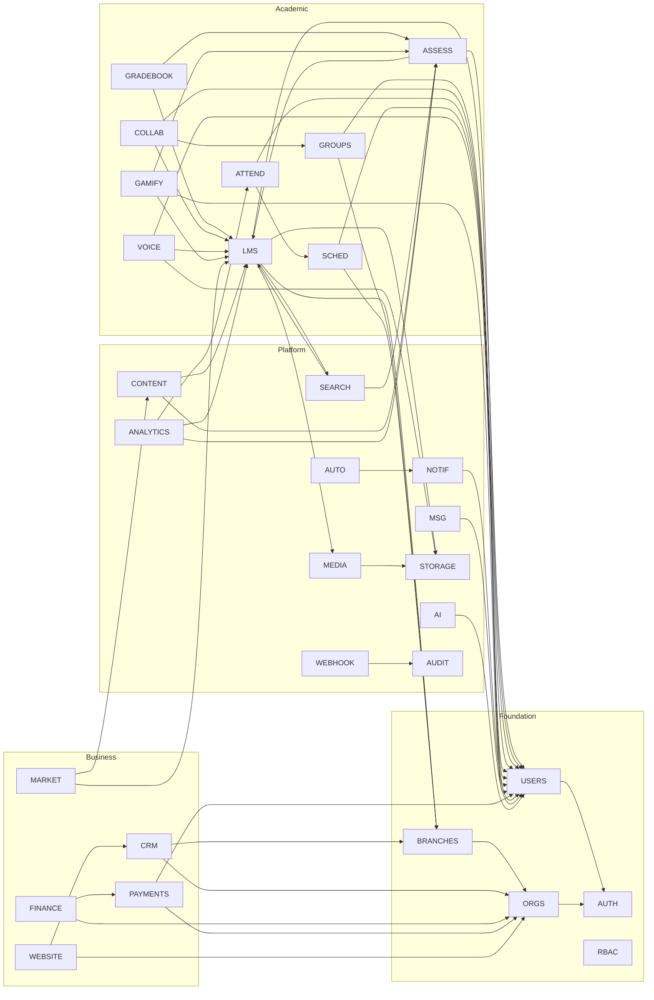

**Dependency rules:**

1. **Core modules** have zero dependencies on Academic, Business, or Platform modules.
2. **Academic modules** depend on Core and Platform modules, never on Business modules.
3. **Business modules** depend on Core and Platform modules. They may reference Academic modules read-only via events.
4. **Platform modules** depend only on Core modules. They expose interfaces consumed by all layers.
5. **All inter-module communication** crosses module boundaries via published interfaces (service contracts) or events, never via direct repository access.

## 2.4 Module Boundaries

Each module is a NestJS module with the following boundary rules:

```
┌─────────────────────────────────────────────────────────────┐
│ MODULE BOUNDARY CONTRACT                                     │
├─────────────────────────────────────────────────────────────┤
│                                                             │
│  ALLOWED ACROSS BOUNDARIES:                                 │
│  ✓ Injecting exported services from other modules           │
│  ✓ Consuming events published by other modules              │
│  ✓ Importing DTOs/interfaces from other modules             │
│  ✓ Calling public API methods on exported services          │
│                                                             │
│  PROHIBITED ACROSS BOUNDARIES:                              │
│  ✗ Importing repositories from other modules                │
│  ✗ Importing entities/ORM models from other modules         │
│  ✗ Direct database queries against other module's tables    │
│  ✗ Importing internal services (non-exported)               │
│  ✗ Circular dependencies between modules                    │
│                                                             │
└─────────────────────────────────────────────────────────────┘
```

## 2.5 Shared Services

The following services are shared infrastructure available to all modules:

### Event Bus

- **Technology:** NestJS EventEmitter (in-process) + Redis Streams (durable)
- **Pattern:** Events are published in-process for immediate subscribers and simultaneously written to Redis Streams for durable consumers (background jobs, analytics, webhooks)
- **Serialization:** JSON with schema version header
- **Ordering:** Per-stream ordering guaranteed by Redis Streams consumer groups

### Redis

- **Caching:** Application-level caching with configurable TTL per key pattern
- **Sessions:** JWT blacklist for token revocation
- **Rate limiting:** Sliding window counters per tenant and per user
- **Distributed locks:** Redlock algorithm for distributed mutex (exam submissions, grade finalization)
- **Job queues:** BullMQ backed by Redis for all background job processing
- **Pub/Sub:** Real-time event fanout for WebSocket notifications

### Object Storage (S3)

- **Buckets:** Separate buckets per content type (uploads, media, exports, certificates, temp)
- **Access:** Pre-signed URLs for direct client uploads and downloads
- **Lifecycle:** Automatic expiry for temp uploads (24 hours), archival for old media (90 days → Glacier)
- **Replication:** Cross-region replication for enterprise tier

### Search Engine (OpenSearch)

- **Indices:** One index per searchable entity type, tenant-scoped via field-level filtering
- **Sync:** Change Data Capture (CDC) from PostgreSQL via Debezium or application-level event handlers
- **Queries:** Full-text, autocomplete, faceted, filtered, boosted
- **Updates:** Near-real-time (< 5 second lag)

### Media Services

- **Transcoding:** FFmpeg workers consuming from BullMQ media queue
- **Thumbnails:** Auto-generated for videos and images on upload
- **Streaming:** HLS adaptive bitrate streaming for video content
- **CDN:** CloudFront distribution for all media assets

### Speech Services

- **Provider abstraction:** Adapter pattern wrapping Azure Speech, Google Cloud Speech, Deepgram, AssemblyAI
- **Routing:** Per-tenant provider configuration with fallback chain
- **Metering:** Usage tracking per tenant per provider for billing

### AI Orchestration

- **LLM Gateway:** Custom gateway abstracting OpenAI, Anthropic, Google, and local models
- **Prompt Management:** Versioned prompts stored in PostgreSQL, loaded at runtime
- **RAG Pipeline:** Embeddings stored in PostgreSQL pgvector, similarity search for context retrieval
- **Tool Calling:** Registered tools that LLMs can invoke (grade calculation, schedule lookup, content search)
- **Moderation:** Content safety filtering on all LLM inputs and outputs

## 2.6 Request Flow Diagram

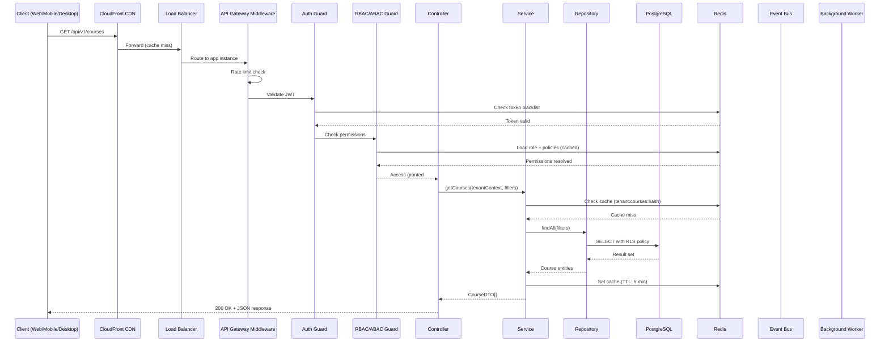

## 2.7 Component Interaction Diagram

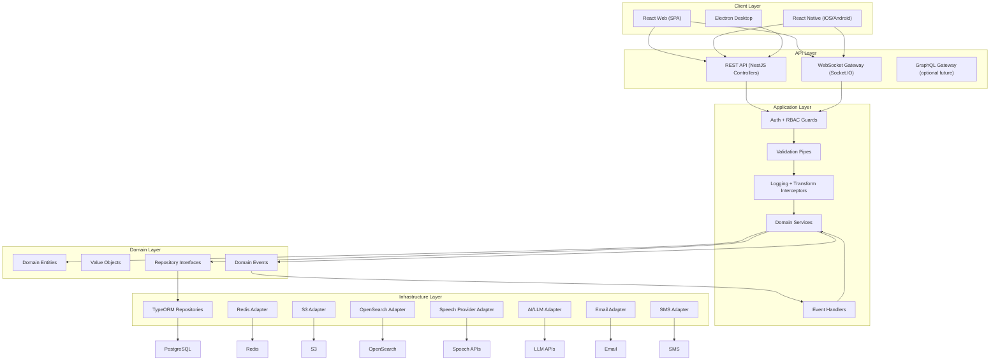

---

# 3. Domain-Driven Design

## 3.1 Bounded Context Map

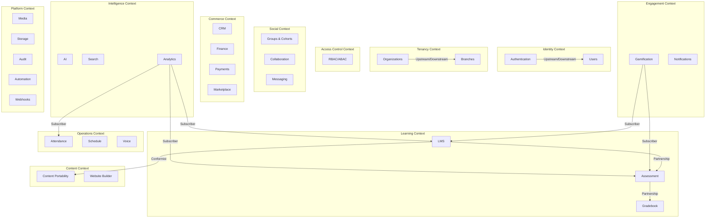

## 3.2 Bounded Context Definitions

### 3.2.1 Authentication Context

**Responsibilities:**
- User login/logout across all authentication methods (email/password, phone, OAuth, SSO, LDAP, SAML)
- JWT access token and refresh token lifecycle management
- Multi-factor authentication (TOTP, SMS-based)
- Session management and revocation
- Invitation flow (email/SMS invite → registration)
- Password reset and account recovery
- Token blacklisting for immediate revocation
- Pluggable identity provider integration

**Entities:**

| Entity | Description |
|--------|-------------|
| `AuthCredential` | Stores hashed password, OAuth tokens, or SAML assertion references per user |
| `RefreshToken` | Stores refresh token metadata (token hash, device info, expiry, revocation status) |
| `MFAConfig` | MFA method configuration per user (TOTP secret, backup codes, phone number) |
| `AuthSession` | Active session record (device, IP, location, last activity, revocation status) |
| `Invitation` | Pending invitation with token, role, expiry, and acceptance status |
| `IdentityProvider` | SSO/LDAP/SAML provider configuration per organization |
| `LoginAttempt` | Failed/successful login attempt log for brute-force detection |

**Services:**

| Service | Responsibility |
|---------|---------------|
| `AuthService` | Core authentication logic: login, logout, token refresh, password reset |
| `MFAService` | MFA setup, verification, backup code management |
| `TokenService` | JWT generation, validation, refresh, blacklisting |
| `InvitationService` | Create, send, validate, and accept invitations |
| `IdentityProviderService` | SSO/LDAP/SAML integration management |
| `SessionService` | Session listing, revocation, activity tracking |

**Repositories:**

| Repository | Backing Store |
|------------|--------------|
| `AuthCredentialRepository` | PostgreSQL |
| `RefreshTokenRepository` | PostgreSQL + Redis (active tokens cached) |
| `MFAConfigRepository` | PostgreSQL |
| `AuthSessionRepository` | PostgreSQL + Redis (active sessions cached) |
| `InvitationRepository` | PostgreSQL |
| `IdentityProviderRepository` | PostgreSQL |
| `LoginAttemptRepository` | PostgreSQL |

**Events Published:**

| Event | Payload | Consumers |
|-------|---------|-----------|
| `UserLoggedIn` | `{ userId, method, deviceInfo, ip, timestamp }` | Audit, Analytics, Session |
| `UserLoggedOut` | `{ userId, sessionId, timestamp }` | Session, Audit |
| `UserRegistered` | `{ userId, method, organizationId, timestamp }` | Users, Notifications, Analytics |
| `PasswordChanged` | `{ userId, timestamp }` | Audit, Notifications |
| `MFAEnabled` | `{ userId, method, timestamp }` | Audit |
| `MFADisabled` | `{ userId, method, timestamp }` | Audit |
| `InvitationCreated` | `{ invitationId, email, role, organizationId }` | Notifications |
| `InvitationAccepted` | `{ invitationId, userId, timestamp }` | Users, Audit |
| `SessionRevoked` | `{ userId, sessionId, reason, timestamp }` | Audit |
| `LoginFailed` | `{ email, ip, reason, timestamp }` | Audit, Security |
| `AccountLocked` | `{ userId, reason, timestamp }` | Audit, Notifications |

**External Interfaces:**
- OAuth 2.0 providers (Google, Microsoft, Apple)
- SAML 2.0 Identity Providers
- LDAP directories
- SMS providers (for MFA codes)

**Dependencies:**
- Redis (token blacklist, session cache, rate limiting)
- Notifications Module (sending invitation emails, MFA codes)

---

### 3.2.2 Users Context

**Responsibilities:**
- User profile management (create, read, update, soft-delete)
- User role assignment and membership management
- Parent-child account linking
- Teacher profile and assignment management
- Student profile, enrollment tracking, and learning progress
- Assistant teacher capability configuration
- User search and filtering
- Profile photo management
- Account status lifecycle (active, suspended, archived)

**Entities:**

| Entity | Description |
|--------|-------------|
| `User` | Core user record: id, email, phone, name, avatar, status, locale, timezone |
| `UserProfile` | Extended profile: bio, address, emergency contact, custom fields |
| `Membership` | Links user to organization + branch + role(s) |
| `Role` | Named role with associated permissions (Platform Admin, Org Admin, Branch Admin, Teacher, Assistant Teacher, Student, Parent) |
| `Permission` | Granular permission definition (resource + action) |
| `ParentLink` | Links a parent user to one or more student users |
| `TeacherAssignment` | Links a teacher to classes, courses, and branches |
| `AssistantTeacherCapability` | Per-organization capability grants for assistant teachers |

**Services:**

| Service | Responsibility |
|---------|---------------|
| `UserService` | CRUD operations on users, profile management |
| `MembershipService` | Assign/remove memberships, role changes |
| `ParentLinkService` | Create/manage parent-child relationships |
| `TeacherAssignmentService` | Assign teachers to classes and courses |
| `UserSearchService` | Search users with filters (role, branch, status, enrollment) |

**Repositories:**

| Repository | Backing Store |
|------------|--------------|
| `UserRepository` | PostgreSQL |
| `UserProfileRepository` | PostgreSQL |
| `MembershipRepository` | PostgreSQL |
| `RoleRepository` | PostgreSQL + Redis (cached) |
| `PermissionRepository` | PostgreSQL + Redis (cached) |
| `ParentLinkRepository` | PostgreSQL |
| `TeacherAssignmentRepository` | PostgreSQL |

**Events Published:**

| Event | Payload | Consumers |
|-------|---------|-----------|
| `UserCreated` | `{ userId, role, organizationId, branchId }` | Notifications, Analytics, Search, Gamification |
| `UserUpdated` | `{ userId, changedFields }` | Search, Audit |
| `UserSuspended` | `{ userId, reason, timestamp }` | Auth (revoke sessions), Notifications, Audit |
| `UserArchived` | `{ userId, timestamp }` | Auth, Search, Audit |
| `StudentCreated` | `{ userId, organizationId, branchId }` | CRM, Analytics, Gamification |
| `ParentLinked` | `{ parentId, studentId }` | Notifications |
| `MembershipChanged` | `{ userId, organizationId, oldRole, newRole }` | RBAC, Audit |
| `TeacherAssigned` | `{ teacherId, classId, courseId }` | LMS, Schedule, Notifications |

**External Interfaces:**
- Storage Module (avatar uploads)
- Auth Module (credential management)

**Dependencies:**
- Auth Module (user registration triggers credential creation)
- RBAC Module (permission resolution)
- Storage Module (profile photos)

---

### 3.2.3 Organizations Context

**Responsibilities:**
- Organization lifecycle (create, update, suspend, archive)
- Subscription management and tier enforcement
- Feature flag and module licensing per tenant
- White-label branding configuration (logo, colors, fonts, custom domain)
- Consolidated billing across branches
- Organization-level settings and preferences
- API key management for webhook consumers

**Entities:**

| Entity | Description |
|--------|-------------|
| `Organization` | Core tenant record: id, name, slug, status, billing plan, created_at |
| `OrganizationSettings` | JSON configuration: branding, locale, timezone, default policies |
| `Subscription` | Active subscription: plan, start date, renewal date, status |
| `FeatureFlag` | Feature/module toggle per organization |
| `ModuleLicense` | Module-specific license with usage limits |
| `WhiteLabelConfig` | Branding configuration: logo URLs, color palette, fonts, custom domain |
| `APIKey` | API keys for webhook consumers and third-party integrations |

**Services:**

| Service | Responsibility |
|---------|---------------|
| `OrganizationService` | CRUD operations, suspension, archival |
| `SubscriptionService` | Plan management, upgrades, downgrades, renewal |
| `FeatureFlagService` | Feature flag evaluation, toggle management |
| `ModuleLicenseService` | License enforcement, usage limit checks |
| `WhiteLabelService` | Branding configuration management |
| `APIKeyService` | API key generation, rotation, revocation |

**Repositories:**

| Repository | Backing Store |
|------------|--------------|
| `OrganizationRepository` | PostgreSQL |
| `OrganizationSettingsRepository` | PostgreSQL |
| `SubscriptionRepository` | PostgreSQL |
| `FeatureFlagRepository` | PostgreSQL + Redis (cached for fast evaluation) |
| `ModuleLicenseRepository` | PostgreSQL + Redis (cached) |
| `WhiteLabelConfigRepository` | PostgreSQL + Redis (cached) |
| `APIKeyRepository` | PostgreSQL |

**Events Published:**

| Event | Payload | Consumers |
|-------|---------|-----------|
| `OrganizationCreated` | `{ organizationId, name, plan }` | Billing, Analytics, Audit |
| `OrganizationSuspended` | `{ organizationId, reason }` | Auth (block logins), Notifications, Audit |
| `OrganizationArchived` | `{ organizationId }` | Data retention, Audit |
| `SubscriptionChanged` | `{ organizationId, oldPlan, newPlan }` | FeatureFlags, Billing, Notifications |
| `FeatureFlagToggled` | `{ organizationId, flag, enabled }` | All modules (cache invalidation) |
| `ModuleLicenseUpdated` | `{ organizationId, module, limits }` | Affected module |

**External Interfaces:**
- Payment gateways (subscription billing)
- DNS providers (custom domain verification)

**Dependencies:**
- Auth Module (organization admin authentication)
- Payments Module (billing integration)

---

### 3.2.4 Branches Context

**Responsibilities:**
- Branch lifecycle management (create, update, deactivate)
- Branch-specific settings and configuration overrides
- Room and resource management (classrooms, equipment)
- Staff assignment to branches
- Branch-level reporting aggregation
- Branch operating hours and timezone configuration

**Entities:**

| Entity | Description |
|--------|-------------|
| `Branch` | Branch record: id, organization_id, name, address, timezone, status |
| `BranchSettings` | Branch-specific overrides: locale, operating hours, policies |
| `Room` | Physical room: name, capacity, equipment list, availability |
| `Resource` | Shared resource: projectors, labs, equipment |
| `RoomBooking` | Room reservation: room_id, event_id, start, end, booked_by |

**Services:**

| Service | Responsibility |
|---------|---------------|
| `BranchService` | CRUD, status management, settings |
| `RoomService` | Room management, availability queries |
| `ResourceService` | Resource tracking and allocation |
| `RoomBookingService` | Booking creation, conflict detection, cancellation |

**Events Published:**

| Event | Payload | Consumers |
|-------|---------|-----------|
| `BranchCreated` | `{ branchId, organizationId, name }` | Analytics, Audit |
| `BranchDeactivated` | `{ branchId, reason }` | Users, Schedule, Audit |
| `RoomBooked` | `{ roomId, branchId, eventId, timeSlot }` | Schedule |
| `RoomBookingCancelled` | `{ bookingId, roomId }` | Schedule |

**Dependencies:**
- Organizations Module (parent organization)
- Schedule Module (room booking integration)

---

### 3.2.5 RBAC/ABAC Context

**Responsibilities:**
- Role definition and permission assignment
- Attribute-based policy evaluation (branch scoping, class scoping, ownership)
- Permission caching and invalidation
- Guard integration for controller-level and service-level access control
- Custom capability configuration for Assistant Teacher role
- Tenant-scoped permission isolation

**Entities:**

| Entity | Description |
|--------|-------------|
| `Role` | Named role with description and hierarchy level |
| `Permission` | Resource + action pair (e.g., `course:create`, `grade:edit`) |
| `RolePermission` | Many-to-many: role ↔ permission |
| `ABACPolicy` | Attribute-based policy rule (condition, effect, scope) |
| `CapabilitySet` | Custom capability grants for configurable roles (Assistant Teacher) |

**Services:**

| Service | Responsibility |
|---------|---------------|
| `RBACService` | Role-based permission checks |
| `ABACService` | Attribute-based policy evaluation |
| `PermissionResolver` | Combines RBAC + ABAC into a unified access decision |
| `CapabilityService` | Manage custom capability sets per organization |

**Policy Examples:**

```typescript
// RBAC: Role-based check
@Permissions('course:create')
@UseGuards(AuthGuard, RBACGuard)
async createCourse(@Body() dto: CreateCourseDto) { ... }

// ABAC: Attribute-based check
// "Teachers can only view students in their assigned classes"
{
  effect: 'ALLOW',
  resource: 'student:read',
  condition: {
    type: 'ATTRIBUTE_MATCH',
    subject: 'user.assignedClassIds',
    object: 'student.classId',
    operator: 'CONTAINS'
  }
}

// ABAC: Branch scoping
// "Branch admins can only access their branch data"
{
  effect: 'ALLOW',
  resource: '*',
  condition: {
    type: 'ATTRIBUTE_MATCH',
    subject: 'user.branchId',
    object: 'resource.branchId',
    operator: 'EQUALS'
  }
}
```

**Events Published:**

| Event | Payload | Consumers |
|-------|---------|-----------|
| `RoleCreated` | `{ roleId, name, permissions }` | Audit |
| `RoleUpdated` | `{ roleId, changedPermissions }` | Cache invalidation, Audit |
| `PermissionGranted` | `{ userId, permission, grantedBy }` | Audit |
| `PermissionRevoked` | `{ userId, permission, revokedBy }` | Cache invalidation, Audit |
| `PolicyCreated` | `{ policyId, resource, condition }` | Audit |

**Dependencies:**
- Users Module (role assignments)
- Redis (permission cache)

---

### 3.2.6 LMS Context

**Responsibilities:**
- Complete course hierarchy management (Subject → Program → Course → Level → Curriculum → Module → Section → Lesson → Unit → Topic)
- Content block management with 20+ content types
- Homework assignment, submission, grading, and feedback
- Course format support (topic-based, week-based, semester-based, self-paced, instructor-led)
- Prerequisite and unlock condition evaluation
- Completion tracking at lesson, module, and course levels
- Course templates and template versioning
- Course operations (clone, duplicate, export, import)
- Drag-and-drop ordering with position management
- Reusable content blocks across courses

**Entities:**

| Entity | Description |
|--------|-------------|
| `Subject` | Broad discipline: name, description, icon |
| `Program` | Learning track: name, description, duration, subjects |
| `Course` | Structured learning experience: title, description, format, status, thumbnail |
| `Level` | Proficiency tier: name, ordinal, subject_id |
| `Curriculum` | Defined sequence for a program/level |
| `CurriculumVersion` | Versioned snapshot of a curriculum |
| `Module` | Thematic grouping within a course: title, position, parent_module_id (nesting) |
| `Section` | Subdivision within a module: title, position |
| `Lesson` | Single teaching session: title, content, duration, position |
| `Unit` | Grouping mechanism within sections: title, position |
| `Topic` | Most granular content element: title, description, position |
| `ContentBlock` | Atomic content element: type, data (JSONB), position, lesson_id |
| `ContentType` | Registry of supported content types with rendering metadata |
| `Homework` | Assignment: title, description, due_date, late_policy, max_attempts |
| `HomeworkSubmission` | Student submission: student_id, content, submitted_at, status |
| `HomeworkGrade` | Grade for submission: score, feedback, rubric_results, graded_by |
| `Rubric` | Grading rubric: name, type (analytic/holistic), criteria |
| `RubricCriterion` | Row in rubric: name, description, levels with points |
| `Prerequisite` | Unlock rule: source entity, target entity, condition type, threshold |
| `CompletionRecord` | Tracks completion: user_id, entity_type, entity_id, completed_at |
| `CourseTemplate` | Reusable template: name, version, structure snapshot |
| `ReusableBlock` | Shared content block with reference counting |
| `CourseEnrollment` | User enrollment in a course: user_id, course_id, status, enrolled_at |

**Services:**

| Service | Responsibility |
|---------|---------------|
| `CourseService` | Course CRUD, format management, status transitions |
| `ModuleService` | Module CRUD, nesting, reordering |
| `LessonService` | Lesson CRUD, content block management, reordering |
| `ContentBlockService` | Content block CRUD, type validation, reusable block linking |
| `HomeworkService` | Assignment creation, submission processing, grading workflow |
| `PrerequisiteService` | Prerequisite rule management and evaluation |
| `CompletionService` | Completion tracking, progress calculation, certificate triggering |
| `CourseTemplateService` | Template creation, versioning, application |
| `CourseOperationsService` | Clone, duplicate, export, import operations |
| `EnrollmentService` | Course enrollment management |
| `CurriculumService` | Curriculum management, versioning, synchronization |

**Repositories:**

| Repository | Backing Store |
|------------|--------------|
| `CourseRepository` | PostgreSQL |
| `ModuleRepository` | PostgreSQL |
| `LessonRepository` | PostgreSQL |
| `ContentBlockRepository` | PostgreSQL (JSONB data column) |
| `HomeworkRepository` | PostgreSQL |
| `HomeworkSubmissionRepository` | PostgreSQL |
| `PrerequisiteRepository` | PostgreSQL |
| `CompletionRecordRepository` | PostgreSQL |
| `CourseTemplateRepository` | PostgreSQL |
| `CourseEnrollmentRepository` | PostgreSQL |
| `CurriculumRepository` | PostgreSQL |

**Events Published:**

| Event | Payload | Consumers |
|-------|---------|-----------|
| `CourseCreated` | `{ courseId, organizationId, branchId, title }` | Search, Analytics, Audit |
| `CoursePublished` | `{ courseId, publishedAt }` | Notifications, Search |
| `CourseArchived` | `{ courseId }` | Search, Audit |
| `LessonCreated` | `{ lessonId, courseId, moduleId }` | Search |
| `LessonCompleted` | `{ userId, lessonId, courseId }` | Completion, Gamification, Analytics |
| `ModuleCompleted` | `{ userId, moduleId, courseId }` | Completion, Gamification, Analytics |
| `CourseCompleted` | `{ userId, courseId }` | Gamification, Certificates, Analytics, Notifications |
| `HomeworkAssigned` | `{ homeworkId, courseId, dueDate, studentIds }` | Notifications, Analytics |
| `HomeworkSubmitted` | `{ submissionId, homeworkId, studentId }` | Notifications (to teacher), Gamification |
| `HomeworkGraded` | `{ submissionId, score, gradedBy }` | Gradebook, Notifications, Analytics |
| `HomeworkOverdue` | `{ homeworkId, studentId }` | Notifications, Automation |
| `EnrollmentCreated` | `{ userId, courseId }` | Analytics, Gamification, Notifications |
| `EnrollmentDropped` | `{ userId, courseId, reason }` | Analytics, Gradebook, Audit |
| `ContentBlockCreated` | `{ blockId, lessonId, type }` | Search |
| `PrerequisiteUnlocked` | `{ userId, entityType, entityId }` | Notifications |

**External Interfaces:**
- Storage Module (content file uploads)
- Media Module (video/audio processing)
- Search Module (content indexing)
- Assessment Module (quiz/exam integration within courses)

**Dependencies:**
- Users, Branches, Storage, Media, Search modules

---

### 3.2.7 Assessment Context

**Responsibilities:**
- Question bank management with hierarchical categorization
- Support for 18 question types with type-specific validation
- Quiz/exam builder with randomization, time limits, and access controls
- Quiz delivery with anti-cheat measures (5 intensity levels)
- Auto-grading for objective questions, manual grading workflow for subjective questions
- Rubric-based grading with partial credit and negative marking
- Multiple graders and moderation workflow
- Feedback delivery (immediate, delayed, manual, per-question, per-attempt)
- Item analysis and assessment reliability metrics
- Practice mode and adaptive mode
- Time synchronization and server-side clock enforcement

**Entities:**

| Entity | Description |
|--------|-------------|
| `QuestionBank` | Collection of questions scoped to organization/branch |
| `QuestionCategory` | Hierarchical category tree for questions |
| `Question` | Question record: type, content (rich text + media), difficulty, points, version |
| `QuestionTag` | Freeform tag on a question |
| `QuestionVersion` | Immutable version snapshot of a question |
| `QuestionOption` | Answer option for MCQ/matching/ordering types |
| `Quiz` | Assessment configuration: title, type, time_limit, attempts, anti_cheat_level |
| `QuizConfiguration` | Detailed quiz settings: randomization, password, IP restrictions, availability window |
| `QuizQuestionLink` | Links quiz to questions with position and weight |
| `QuizAttempt` | Student attempt: start_time, end_time, status, score, violation_count |
| `QuizResponse` | Individual question response: answer_data, time_spent, score, feedback |
| `GradingRubric` | Reusable rubric: name, type, criteria |
| `RubricCriterion` | Criterion with levels and point values |
| `AntiCheatLog` | Violation record: attempt_id, event_type, timestamp, metadata |
| `AntiCheatConfiguration` | Per-quiz anti-cheat settings: intensity level, specific toggles |
| `QuestionPool` | Named pool for randomized question selection |

**Services:**

| Service | Responsibility |
|---------|---------------|
| `QuestionBankService` | Question CRUD, categorization, tagging, versioning |
| `QuizBuilderService` | Quiz construction, question selection, configuration |
| `QuizDeliveryService` | Quiz session management, question delivery, answer collection |
| `AutoGraderService` | Automatic grading for objective question types |
| `ManualGradingService` | Manual grading workflow, multiple graders, moderation |
| `AntiCheatService` | Violation detection, logging, automatic submission triggers |
| `FeedbackService` | Feedback composition and delivery scheduling |
| `ItemAnalysisService` | Difficulty index, discrimination index, reliability metrics |
| `AdaptiveQuizService` | Adaptive question selection based on response patterns |

**Events Published:**

| Event | Payload | Consumers |
|-------|---------|-----------|
| `QuizCreated` | `{ quizId, courseId, type }` | Search, Audit |
| `QuizPublished` | `{ quizId, availableFrom, availableTo }` | Notifications, Calendar |
| `QuizAttemptStarted` | `{ attemptId, quizId, studentId, startTime }` | Analytics, Anti-Cheat |
| `QuizAttemptSubmitted` | `{ attemptId, quizId, studentId, score }` | Gradebook, Gamification, Analytics, Notifications |
| `QuizAutoGraded` | `{ attemptId, score, maxScore }` | Gradebook, Notifications |
| `QuizManuallyGraded` | `{ attemptId, gradedBy, score }` | Gradebook, Notifications |
| `AntiCheatViolation` | `{ attemptId, eventType, severity }` | Audit, Notifications (to teacher) |
| `QuizAttemptAutoSubmitted` | `{ attemptId, reason }` | Gradebook, Audit |
| `QuestionCreated` | `{ questionId, bankId, type }` | Search |
| `QuestionUpdated` | `{ questionId, newVersion }` | Search, Audit |

**Dependencies:**
- LMS Module (quiz-course linking, prerequisite evaluation)
- Users Module (student/teacher identity)
- Gradebook Module (grade recording)
- Storage Module (file upload questions)
- Voice Module (spoken response questions)

---

### 3.2.8 Gradebook Context

**Responsibilities:**
- Grade entry, editing, and deletion with full audit trail
- Weighted category management and final grade calculation
- Multiple grade scale support (letter, percentage, GPA, pass/fail, custom)
- Rubric-based grading integration
- Grade history with revision tracking
- Grade approval workflow (optional admin/department head review)
- Report card generation (branded, printable)
- Transcript generation (cumulative GPA, course history)
- Grade analytics (distributions, averages, medians, trends)
- Excel/CSV export

**Entities:**

| Entity | Description |
|--------|-------------|
| `GradebookEntry` | Individual grade record: student_id, assignment_id, score, scale_value, status |
| `GradeCategory` | Category definition: name, weight, course_id |
| `GradeWeight` | Weight assignment for items within a category |
| `GradeScale` | Scale definition: type (letter/percentage/GPA/pass-fail/custom), mappings |
| `GradeScaleMapping` | Score range → scale value mapping |
| `GradeHistory` | Immutable change log: old_value, new_value, changed_by, reason, timestamp |
| `GradeApproval` | Approval workflow: gradebook_snapshot, approver, status, decision_at |
| `ReportCard` | Generated report card: student_id, term, content (JSONB), pdf_url |
| `Transcript` | Generated transcript: student_id, cumulative_gpa, course_history |

**Services:**

| Service | Responsibility |
|---------|---------------|
| `GradeEntryService` | Grade CRUD with audit trail |
| `GradeCalculationService` | Weighted average, running totals, projected finals |
| `GradeScaleService` | Scale management, score-to-scale conversion |
| `GradeApprovalService` | Approval workflow management |
| `ReportCardService` | Report card generation (PDF via Puppeteer) |
| `TranscriptService` | Transcript generation with cumulative GPA |
| `GradeExportService` | Excel/CSV export |
| `GradeAnalyticsService` | Distribution, average, median, trend calculations |

**Events Published:**

| Event | Payload | Consumers |
|-------|---------|-----------|
| `GradeRecorded` | `{ entryId, studentId, courseId, score }` | Analytics, Notifications (parent), Gamification |
| `GradeUpdated` | `{ entryId, oldScore, newScore, reason, changedBy }` | Audit, Analytics, Notifications |
| `GradeApproved` | `{ approvalId, courseId }` | Notifications (students, parents) |
| `GradeRejected` | `{ approvalId, reason }` | Notifications (teacher) |
| `ReportCardGenerated` | `{ reportCardId, studentId, term }` | Notifications, Storage |
| `TranscriptGenerated` | `{ transcriptId, studentId }` | Storage |

**Dependencies:**
- Assessment Module (quiz scores feed gradebook)
- LMS Module (homework scores feed gradebook)
- Users Module (student/teacher identity)
- Notifications Module (grade notifications)
- Storage Module (report card PDF storage)

---

### 3.2.9 Groups & Cohorts Context

**Responsibilities:**
- Group lifecycle (create, update, archive)
- Subgroup and project group management
- Learning cohort management with program progression
- Batch and bulk enrollment operations
- CSV/spreadsheet import for enrollment
- Bulk transfers between branches, courses, and cohorts
- Automatic enrollment rules based on criteria
- Group-scoped feature access (assignments, announcements, content, visibility)
- Group-level reporting aggregation

**Entities:**

| Entity | Description |
|--------|-------------|
| `Group` | Named group: name, type, branch_id, course_id, status |
| `Subgroup` | Child group: parent_group_id, name |
| `ProjectGroup` | Temporary group for collaborative work: name, assignment_id, members |
| `Cohort` | Named cohort: name, program_id, start_date, graduation_date |
| `GroupMembership` | User ↔ group linkage: user_id, group_id, joined_at |
| `EnrollmentRule` | Automatic rule: condition (level, tag, attribute), target_group, active |
| `BulkOperation` | Tracks bulk enrollment/transfer: type, status, row_count, errors |

**Services:**

| Service | Responsibility |
|---------|---------------|
| `GroupService` | Group CRUD, membership management |
| `CohortService` | Cohort lifecycle, program linkage |
| `EnrollmentRuleService` | Rule definition, evaluation, automatic enrollment triggers |
| `BulkOperationsService` | Batch enrollment, CSV import, bulk transfers |
| `GroupScopingService` | Resolve group-scoped access for assignments, content, announcements |

**Events Published:**

| Event | Payload | Consumers |
|-------|---------|-----------|
| `GroupCreated` | `{ groupId, type, branchId }` | Audit |
| `StudentAddedToGroup` | `{ userId, groupId }` | Notifications, Analytics |
| `StudentRemovedFromGroup` | `{ userId, groupId, reason }` | Notifications, Audit |
| `BulkEnrollmentCompleted` | `{ operationId, successCount, errorCount }` | Notifications (admin) |
| `StudentTransferred` | `{ userId, fromBranchId, toBranchId }` | Audit, Analytics, Gradebook |
| `CohortCreated` | `{ cohortId, programId }` | Analytics |

**Dependencies:**
- Users Module (student/user resolution)
- Branches Module (branch-scoped groups)
- LMS Module (course-scoped groups)

---

### 3.2.10 Collaboration Context

**Responsibilities:**
- Announcements (teacher, admin, branch-wide, organization-wide)
- Pinned and scheduled announcements with read receipts
- Threaded discussion forums within courses/classes
- Nested comments with attachments and reactions
- Content moderation (edit, delete, lock threads, flagging)
- Class Q&A board with upvoting and answered marking
- Anonymous question posting
- Office hours scheduling and booking
- Virtual office hours integration
- Queue management for office hours

**Entities:**

| Entity | Description |
|--------|-------------|
| `Announcement` | Title, body, scope (course/class/branch/org), pinned, scheduled_at, author |
| `AnnouncementReadReceipt` | Tracks read status: announcement_id, user_id, read_at |
| `DiscussionForum` | Forum scoped to course/class: title, description, status |
| `Thread` | Discussion thread: title, body, author_id, forum_id, locked, pinned |
| `Post` | Reply to thread: body, author_id, thread_id, parent_post_id (nesting) |
| `Comment` | Comment on post: body, author_id, post_id |
| `Reaction` | Emoji reaction: type, user_id, target_type, target_id |
| `ContentFlag` | Flagged content report: target_type, target_id, reason, reporter_id |
| `QAQuestion` | Q&A question: body, author_id, course_id, anonymous, upvote_count |
| `QAAnswer` | Answer: body, author_id, question_id, is_accepted |
| `QAVote` | Upvote record: user_id, question_id |
| `OfficeHoursSlot` | Availability slot: teacher_id, day_of_week, start_time, end_time, recurring |
| `OfficeHoursBooking` | Booking: slot_id, student_id, date, status, meeting_link |

**Services:**

| Service | Responsibility |
|---------|---------------|
| `AnnouncementService` | Announcement CRUD, scheduling, read tracking |
| `DiscussionService` | Forum/thread/post CRUD, moderation |
| `ReactionService` | Reaction management |
| `ModerationService` | Content flagging, review, enforcement actions |
| `QAService` | Q&A CRUD, voting, answer acceptance |
| `OfficeHoursService` | Slot management, booking, queue |

**Events Published:**

| Event | Payload | Consumers |
|-------|---------|-----------|
| `AnnouncementPublished` | `{ announcementId, scope, targetIds }` | Notifications |
| `ThreadCreated` | `{ threadId, forumId, authorId }` | Notifications, Search |
| `PostCreated` | `{ postId, threadId, authorId }` | Notifications |
| `ContentFlagged` | `{ flagId, targetType, targetId }` | Notifications (moderator) |
| `QAQuestionPosted` | `{ questionId, courseId }` | Notifications (teacher) |
| `QAAnswerAccepted` | `{ answerId, questionId }` | Notifications, Gamification |
| `OfficeHoursBooked` | `{ bookingId, teacherId, studentId }` | Calendar, Notifications |

**Dependencies:**
- Users, LMS, Groups, Notifications, Search, Storage (attachments)

---

### 3.2.11 Attendance Context

**Responsibilities:**
- Manual attendance recording per lesson/class/day
- Status tracking: present, absent, late, excused, custom statuses
- Immutable records with audited correction flows
- Attendance reporting and trend analytics
- Real-time parent notification on absences
- QR-based and biometric attendance (future add-ons, interface defined now)

**Entities:**

| Entity | Description |
|--------|-------------|
| `AttendanceRecord` | Immutable record: student_id, class_id, lesson_id, date, status, recorded_by |
| `AttendanceCorrection` | Audited correction: record_id, old_status, new_status, reason, approved_by |
| `AttendanceStatus` | Custom status definition: name, code, counts_as_absent (boolean) |
| `AttendanceSummary` | Materialized summary: student_id, period, present_count, absent_count, rate |

**Services:**

| Service | Responsibility |
|---------|---------------|
| `AttendanceService` | Record attendance, correction workflow |
| `AttendanceReportService` | Reports, trends, summaries |
| `AttendanceAlertService` | Threshold-based alerts (e.g., 3 consecutive absences) |

**Events Published:**

| Event | Payload | Consumers |
|-------|---------|-----------|
| `AttendanceRecorded` | `{ recordId, studentId, classId, status, date }` | Notifications (parent if absent), Analytics, Gamification |
| `AttendanceCorrected` | `{ recordId, oldStatus, newStatus, reason }` | Audit, Analytics |
| `AttendanceThresholdReached` | `{ studentId, threshold, period }` | Automation, Notifications |

**Dependencies:**
- Users, Schedule, Notifications, Audit modules

---

### 3.2.12 Schedule & Calendar Context

**Responsibilities:**
- Class timetable management with recurring patterns
- Exam calendar management
- Room and resource booking with conflict detection
- Calendar synchronization (Google Calendar, Microsoft Outlook)
- Recurring event support (weekly classes, office hours)
- Student personalized schedule view
- Teacher schedule management
- Conflict detection for teachers, rooms, and students

**Entities:**

| Entity | Description |
|--------|-------------|
| `ScheduleEvent` | Event: title, type, start, end, recurrence_rule, room_id, teacher_id, class_id |
| `RecurrenceRule` | RRULE definition for recurring events |
| `ScheduleException` | Exception/override for a recurrence instance |
| `CalendarSync` | Sync configuration: user_id, provider (google/microsoft), token, last_sync |
| `ScheduleConflict` | Detected conflict: event1_id, event2_id, resource_type, resource_id |

**Services:**

| Service | Responsibility |
|---------|---------------|
| `ScheduleService` | Event CRUD, recurrence expansion, exception handling |
| `ConflictDetectionService` | Real-time conflict checking for rooms, teachers, students |
| `CalendarSyncService` | Bidirectional sync with Google/Microsoft calendars |
| `TimetableService` | Timetable generation and display |

**Events Published:**

| Event | Payload | Consumers |
|-------|---------|-----------|
| `EventCreated` | `{ eventId, type, startTime, participants }` | Notifications, Calendar Sync |
| `EventCancelled` | `{ eventId, reason }` | Notifications, Attendance |
| `EventRescheduled` | `{ eventId, oldTime, newTime }` | Notifications, Calendar Sync |
| `ConflictDetected` | `{ eventId, conflictType, details }` | Notifications (admin) |

**Dependencies:**
- Branches (rooms), Users (teachers, students), Notifications, External Calendar APIs

---

### 3.2.13 Voice & Pronunciation Context

**Responsibilities:**
- Audio recording within platform (browser MediaRecorder API, mobile native recording)
- Speech-to-text transcription via provider abstraction
- Pronunciation scoring (fluency, completeness, accuracy)
- Word-level and phoneme-level highlighting
- Reading fluency assessment
- Oral exam and speaking assignment management
- Practice mode (unlimited, immediate feedback, no grade) and assessment mode (graded)
- Provider abstraction layer supporting Azure Speech, Google Cloud Speech, Deepgram, AssemblyAI
- Per-tenant provider configuration with failover
- Usage tracking and billing per tenant
- Audio file immutability for assessment submissions

**Entities:**

| Entity | Description |
|--------|-------------|
| `SpeechRecording` | Audio record: user_id, file_url, duration, transcript, status |
| `PronunciationResult` | Scoring result: recording_id, provider, overall_score, detailed_scores |
| `PronunciationScore` | Per-dimension score: fluency, completeness, accuracy |
| `WordScore` | Per-word score with correctness classification |
| `PhonemeScore` | Per-phoneme score (provider-dependent) |
| `SpeechProvider` | Provider definition: name, adapter_class, capabilities |
| `SpeechProviderConfig` | Per-tenant config: organization_id, provider_id, api_key, priority, active |
| `SpeakingAssignment` | Assignment: title, prompt, reference_audio_url, evaluation_criteria |
| `OralExam` | Exam configuration: questions, scoring rubric, time_limit |
| `SpeechUsageRecord` | Usage metering: organization_id, provider, seconds, timestamp |

**Services:**

| Service | Responsibility |
|---------|---------------|
| `SpeechRecordingService` | Upload, store, manage audio recordings |
| `PronunciationService` | Orchestrate pronunciation assessment via provider |
| `SpeechProviderGateway` | Provider abstraction, routing, failover |
| `SpeakingAssignmentService` | Assignment creation, submission, grading |
| `SpeechUsageService` | Usage tracking, quota enforcement, billing |

**Events Published:**

| Event | Payload | Consumers |
|-------|---------|-----------|
| `SpeechRecorded` | `{ recordingId, userId, assignmentId }` | Analytics |
| `PronunciationScored` | `{ recordingId, overallScore, provider }` | Gradebook (if assessment mode), Gamification |
| `SpeakingAssignmentSubmitted` | `{ assignmentId, studentId, recordingId }` | Notifications (teacher), Gradebook |
| `SpeechUsageThresholdReached` | `{ organizationId, usagePercent }` | Notifications (admin), Finance |

**Dependencies:**
- Storage Module (audio file storage)
- LMS Module (integration with lessons and courses)
- Gradebook Module (assessment mode grade recording)
- External Speech Providers (Azure, Google, Deepgram, AssemblyAI)

---

### 3.2.14 Gamification Context

**Responsibilities:**
- Badge definition and award logic
- Multi-step achievement tracking
- XP (Experience Points) calculation and award
- Points system (organization-defined, separate from XP)
- Leaderboard computation and display (class, course, branch, organization)
- Daily and weekly streak tracking
- Learning challenges with time limits and goals
- Milestone celebration triggers
- Digital certificate generation with QR codes and verification URLs
- Certificate template management
- Rewards system (organization-defined, parent-defined)
- Configurable leaderboard visibility and opt-in/opt-out

**Entities:**

| Entity | Description |
|--------|-------------|
| `Badge` | Badge definition: name, description, icon, criteria (JSONB), scope |
| `BadgeAward` | Award record: badge_id, user_id, awarded_at, trigger_event |
| `Achievement` | Multi-step achievement: name, steps (JSONB), icon |
| `AchievementProgress` | Progress tracker: achievement_id, user_id, current_step, completed |
| `XPRecord` | XP transaction: user_id, amount, source_type, source_id, timestamp |
| `PointRecord` | Points transaction: user_id, amount, source, timestamp |
| `Leaderboard` | Leaderboard config: scope (class/course/branch/org), metric, visibility |
| `LeaderboardEntry` | Computed entry: leaderboard_id, user_id, rank, score, period |
| `Streak` | Streak tracker: user_id, type (daily/weekly), current_count, longest, last_activity |
| `LearningChallenge` | Challenge: name, goal, start_date, end_date, reward |
| `ChallengeParticipation` | Participation: challenge_id, user_id, progress, completed |
| `Certificate` | Generated certificate: user_id, template_id, unique_id, qr_code_url, verification_url |
| `CertificateTemplate` | Template: name, design (HTML/CSS), variables, organization_id |
| `Reward` | Organization reward: name, description, point_cost |
| `ParentReward` | Parent-defined reward: name, badge_trigger, description |
| `RewardRedemption` | Redemption record: reward_id, user_id, redeemed_at |

**Services:**

| Service | Responsibility |
|---------|---------------|
| `BadgeService` | Badge definition, award evaluation, duplicate prevention |
| `AchievementService` | Achievement progress tracking, step completion |
| `XPService` | XP calculation, award, balance queries |
| `PointService` | Point management, balance, organization-scoped |
| `LeaderboardService` | Leaderboard computation, ranking, caching |
| `StreakService` | Streak tracking, break detection, recovery |
| `ChallengeService` | Challenge lifecycle, participation, completion |
| `CertificateService` | Certificate generation (PDF), QR code, verification endpoint |
| `RewardService` | Reward management, redemption |

**Events Published:**

| Event | Payload | Consumers |
|-------|---------|-----------|
| `BadgeAwarded` | `{ badgeId, userId, badgeName }` | Notifications, Analytics |
| `AchievementCompleted` | `{ achievementId, userId }` | Notifications |
| `XPAwarded` | `{ userId, amount, source }` | Leaderboard recalculation |
| `StreakUpdated` | `{ userId, streakType, count }` | Notifications (milestone), Analytics |
| `StreakBroken` | `{ userId, streakType, previousCount }` | Notifications |
| `ChallengeCompleted` | `{ challengeId, userId }` | Notifications, Rewards |
| `CertificateGenerated` | `{ certificateId, userId, type }` | Notifications, Storage |
| `RewardRedeemed` | `{ rewardId, userId }` | Notifications |

**Event Subscriptions (Consuming):**

| Event Consumed | Action |
|---------------|--------|
| `HomeworkSubmitted` | Award XP, check badge criteria, update streak |
| `QuizAttemptSubmitted` | Award XP based on score, check badges |
| `LessonCompleted` | Award XP, check lesson-based badges, update streak |
| `CourseCompleted` | Award completion badge, generate certificate, award XP |
| `AttendanceRecorded` | Update attendance streak, check streak badges |
| `QAAnswerAccepted` | Award "Helpful" badge, XP |

**Dependencies:**
- LMS, Assessment, Attendance (event sources)
- Notifications (award notifications)
- Storage (certificate PDFs)

---

### 3.2.15 CRM Context

**Responsibilities:**
- Lead capture from multiple sources (website, forms, manual entry, API)
- Lead source attribution and tracking
- Inquiry management with status pipeline
- Follow-up reminders and task assignment
- Conversion tracking (lead → enrolled student)
- Integration with Website Builder for lead capture forms
- Pipeline visualization and management

**Entities:**

| Entity | Description |
|--------|-------------|
| `Lead` | Prospect: name, email, phone, source, status, assigned_to, organization_id |
| `LeadSource` | Source definition: name, type (website, referral, ad, manual) |
| `Inquiry` | Inquiry record: lead_id, subject, message, status, priority |
| `FollowUp` | Scheduled follow-up: lead_id, assigned_to, due_date, notes, completed |
| `ConversionRecord` | Conversion: lead_id, student_id, converted_at, enrollment_id |
| `Pipeline` | Custom pipeline: stages (JSONB), organization_id |
| `PipelineStage` | Stage in pipeline: name, position, auto_actions |

**Services:**

| Service | Responsibility |
|---------|---------------|
| `LeadService` | Lead CRUD, assignment, status transitions |
| `InquiryService` | Inquiry management, prioritization |
| `FollowUpService` | Follow-up scheduling, reminders |
| `ConversionService` | Lead-to-student conversion workflow |
| `PipelineService` | Pipeline management, stage transitions |

**Events Published:**

| Event | Payload | Consumers |
|-------|---------|-----------|
| `LeadCaptured` | `{ leadId, source, organizationId }` | Analytics, Notifications |
| `LeadConverted` | `{ leadId, studentId }` | Analytics, Notifications |
| `FollowUpOverdue` | `{ followUpId, leadId, assignedTo }` | Notifications, Automation |

**Dependencies:**
- Organizations, Branches, Users, Website Builder, Notifications

---

### 3.2.16 Finance Context

**Responsibilities:**
- Revenue dashboards per branch and organization
- Accounts receivable and aging reports
- Usage-based billing for storage and communication credits
- Financial export (CSV, integration with accounting systems)
- Subscription billing reconciliation
- Multi-currency support foundation

**Entities:**

| Entity | Description |
|--------|-------------|
| `RevenueRecord` | Revenue entry: amount, currency, source, branch_id, period |
| `AccountsReceivable` | Outstanding balance: organization_id, student_id, amount, due_date |
| `UsageBillingRecord` | Usage charge: organization_id, resource_type, quantity, unit_price, period |
| `FinancialExport` | Export job: type, format, status, file_url |
| `BillingReconciliation` | Reconciliation record: payment_id, invoice_id, status |

**Services:**

| Service | Responsibility |
|---------|---------------|
| `RevenueService` | Revenue tracking, dashboard data |
| `AccountsReceivableService` | AR management, aging calculations |
| `UsageBillingService` | Usage metering, charge calculation |
| `FinancialExportService` | Export generation |
| `ReconciliationService` | Payment-invoice matching |

**Events Published:**

| Event | Payload | Consumers |
|-------|---------|-----------|
| `RevenueRecorded` | `{ amount, branchId, source }` | Analytics |
| `InvoiceOverdue` | `{ invoiceId, studentId, amount }` | Notifications, Automation |

**Dependencies:**
- Payments Module (payment data), Organizations, Branches

---

### 3.2.17 Payments Context

**Responsibilities:**
- Invoice generation with configurable schedules
- Payment collection via multiple payment gateways
- Payment method management
- Payment reminders and overdue notifications
- Payment history and receipt generation
- Refund and credit management
- Payment gateway abstraction (provider-agnostic)

**Entities:**

| Entity | Description |
|--------|-------------|
| `Invoice` | Invoice: number, student_id, items (JSONB), total, status, due_date |
| `Payment` | Payment record: invoice_id, amount, method, provider, transaction_id, status |
| `PaymentMethod` | Stored payment method: user_id, type, provider_token, last_four |
| `PaymentReminder` | Scheduled reminder: invoice_id, reminder_date, sent |
| `Refund` | Refund record: payment_id, amount, reason, status |
| `Credit` | Account credit: user_id, amount, reason, expiry |
| `PaymentSchedule` | Recurring schedule: student_id, amount, frequency, next_date |

**Services:**

| Service | Responsibility |
|---------|---------------|
| `InvoiceService` | Invoice generation, status management |
| `PaymentService` | Payment processing via gateway abstraction |
| `PaymentGateway` | Provider abstraction (Stripe, PayPal, local gateways) |
| `RefundService` | Refund processing |
| `CreditService` | Credit management |
| `PaymentReminderService` | Automated reminder scheduling |
| `PaymentScheduleService` | Recurring payment management |

**Events Published:**

| Event | Payload | Consumers |
|-------|---------|-----------|
| `InvoiceCreated` | `{ invoiceId, studentId, amount }` | Notifications |
| `PaymentReceived` | `{ paymentId, invoiceId, amount }` | Finance, Notifications, Audit |
| `PaymentFailed` | `{ paymentId, reason }` | Notifications, Audit |
| `RefundProcessed` | `{ refundId, amount }` | Finance, Notifications |
| `PaymentOverdue` | `{ invoiceId, daysPastDue }` | Notifications, Automation |

**Dependencies:**
- Users, Organizations, Notifications, External Payment Gateways

---

### 3.2.18 Messaging Context

**Responsibilities:**
- Direct messaging between permitted role pairs
- Group messaging for classes and cohorts
- Message threading and reply chains
- File and media attachments
- Message search and filtering
- Real-time delivery via WebSocket
- Unread count tracking
- Message archival

**Entities:**

| Entity | Description |
|--------|-------------|
| `Conversation` | Chat thread: type (direct/group), participants, created_at |
| `Message` | Message record: conversation_id, sender_id, body, attachments, sent_at |
| `MessageReceipt` | Delivery/read tracking: message_id, user_id, delivered_at, read_at |
| `ConversationParticipant` | Participant in conversation: user_id, joined_at, muted, archived |

**Services:**

| Service | Responsibility |
|---------|---------------|
| `ConversationService` | Conversation lifecycle, participant management |
| `MessageService` | Send, receive, search messages |
| `MessageDeliveryService` | WebSocket delivery, push notification fallback |

**Events Published:**

| Event | Payload | Consumers |
|-------|---------|-----------|
| `MessageSent` | `{ messageId, conversationId, senderId }` | Notifications (push), WebSocket delivery |
| `MessageRead` | `{ messageId, userId }` | WebSocket (read receipt) |

**Dependencies:**
- Users, Groups, Storage (attachments), Notifications

---

### 3.2.19 Notifications Context

**Responsibilities:**
- Multi-channel notification dispatch (push, email, SMS, in-app, WhatsApp, Telegram)
- Template-based notifications with variable substitution
- User notification preferences (opt-in/opt-out per channel and category)
- Delivery status tracking (sent, delivered, read, failed)
- Scheduled notifications and digest modes (daily/weekly)
- Notification batching to prevent flooding

**Entities:**

| Entity | Description |
|--------|-------------|
| `NotificationTemplate` | Template: type, channel, subject_template, body_template, variables |
| `Notification` | Instance: template_id, recipient_id, variables, status, channel |
| `NotificationDelivery` | Delivery record: notification_id, channel, provider, status, delivered_at |
| `NotificationPreference` | User pref: user_id, category, channel, enabled |
| `NotificationDigest` | Digest config: user_id, frequency, last_sent |

**Services:**

| Service | Responsibility |
|---------|---------------|
| `NotificationService` | Notification creation, template resolution, dispatch |
| `NotificationDispatcher` | Multi-channel routing and delivery |
| `EmailProvider` | Email delivery (AWS SES / SendGrid) |
| `SMSProvider` | SMS delivery (Twilio / equivalent) |
| `PushProvider` | Push notifications (FCM + APNs) |
| `WhatsAppProvider` | WhatsApp Business API integration |
| `TelegramProvider` | Telegram Bot API integration |
| `NotificationPreferenceService` | User preference management |
| `DigestService` | Digest compilation and delivery |

**Events Published:**

| Event | Payload | Consumers |
|-------|---------|-----------|
| `NotificationSent` | `{ notificationId, channel, recipientId }` | Analytics |
| `NotificationDelivered` | `{ notificationId, channel }` | Analytics |
| `NotificationFailed` | `{ notificationId, channel, reason }` | Retry queue, Audit |
| `NotificationRead` | `{ notificationId, recipientId }` | Analytics |

**Dependencies:**
- Users (recipient resolution), External providers (SES, Twilio, FCM, WhatsApp, Telegram)

---

### 3.2.20 Automation Context

**Responsibilities:**
- Rule-based automation triggers (if condition → then action)
- Scheduled job management (cron-like)
- Event-driven workflow execution
- Workflow template library for common scenarios
- Action execution (send notification, assign task, update status, enroll student)
- Condition evaluation (time-based, event-based, threshold-based)
- Execution logging and error handling

**Entities:**

| Entity | Description |
|--------|-------------|
| `AutomationRule` | Rule: name, trigger (event/schedule/condition), conditions (JSONB), actions (JSONB) |
| `AutomationExecution` | Execution log: rule_id, triggered_by, status, started_at, completed_at, error |
| `WorkflowTemplate` | Template: name, description, trigger, conditions, actions |
| `ScheduledJob` | Cron job: name, cron_expression, action, last_run, next_run, status |

**Services:**

| Service | Responsibility |
|---------|---------------|
| `AutomationEngine` | Rule evaluation, action execution, workflow orchestration |
| `RuleService` | Rule CRUD, validation |
| `SchedulerService` | Cron job management, execution scheduling |
| `ActionExecutor` | Execute actions (notification, status change, enrollment) |
| `WorkflowTemplateService` | Template management, instantiation |

**Events Published:**

| Event | Payload | Consumers |
|-------|---------|-----------|
| `AutomationExecuted` | `{ ruleId, status, result }` | Audit, Analytics |
| `AutomationFailed` | `{ ruleId, error }` | Audit, Notifications (admin) |

**Dependencies:**
- All modules (as action targets), Notifications, Event Bus

---

### 3.2.21 Content Portability Context

**Responsibilities:**
- Course export as portable packages (structure + content + assessments + rubrics)
- Lesson and question bank export
- Curriculum export
- Course import with conflict resolution
- Question bank import with merge and deduplication
- Validation of imported content before application
- Version history for courses, lessons, modules, question banks
- Change tracking (who, what, when)
- Rollback to previous versions
- Diff view between versions
- Cross-branch cloning
- Marketplace publishing integration

**Entities:**

| Entity | Description |
|--------|-------------|
| `ContentPackage` | Export package: type, source, version, manifest (JSONB), file_url |
| `ExportJob` | Export task: type, scope, status, progress, result_url |
| `ImportJob` | Import task: package_id, target_branch, status, progress, validation_results |
| `ImportValidation` | Validation result: job_id, issues (JSONB), can_proceed |
| `ContentVersion` | Version record: entity_type, entity_id, version_number, snapshot (JSONB), created_by |
| `ContentDiff` | Diff between versions: version_a, version_b, changes (JSONB) |

**Services:**

| Service | Responsibility |
|---------|---------------|
| `ExportService` | Package creation, serialization |
| `ImportService` | Package ingestion, validation, application |
| `VersioningService` | Version creation, diff computation, rollback |
| `CloningService` | Cross-branch and cross-org cloning |
| `ContentValidationService` | Import validation rules |

**Events Published:**

| Event | Payload | Consumers |
|-------|---------|-----------|
| `ContentExported` | `{ packageId, type, exportedBy }` | Audit |
| `ContentImported` | `{ packageId, targetBranch, importedBy }` | Audit, Search (reindex) |
| `ContentVersionCreated` | `{ entityType, entityId, version }` | Audit |
| `ContentRolledBack` | `{ entityType, entityId, fromVersion, toVersion }` | Audit, Search |

**Dependencies:**
- LMS, Assessment (content source), Storage (package files), Search (reindexing)

---

### 3.2.22 Analytics Context

**Responsibilities:**
- Business analytics (attendance trends, enrollment rates, revenue, branch performance)
- Student engagement analytics (completion rates, activity timelines, login frequency, time spent)
- Teacher engagement analytics (content creation, grading turnaround, communication)
- Assessment analytics (difficulty indices, discrimination, score distributions, item analysis, reliability)
- Learning outcome analytics (outcome achievement, competency mapping, curriculum coverage)
- Dashboard data aggregation and caching
- Report generation (PDF, Excel)

**Entities:**

| Entity | Description |
|--------|-------------|
| `AnalyticsEvent` | Raw event: type, entity_id, user_id, metadata (JSONB), timestamp |
| `AnalyticsAggregate` | Pre-computed aggregate: metric, scope, period, value |
| `DashboardWidget` | Dashboard configuration: type, query, filters, position |
| `Report` | Generated report: type, scope, parameters, file_url, status |
| `LearningOutcome` | Defined outcome: name, description, course/program mapping |
| `CompetencyMap` | Competency definition: name, skills, assessment mapping |
| `OutcomeAchievement` | Student outcome: outcome_id, student_id, status, evidence |

**Services:**

| Service | Responsibility |
|---------|---------------|
| `AnalyticsIngestionService` | Event collection from all modules |
| `AggregationService` | Pre-computation of metrics, materialized views |
| `DashboardService` | Dashboard data assembly |
| `ReportService` | Report generation (background job) |
| `LearningOutcomeService` | Outcome definition, mapping, achievement tracking |
| `ItemAnalysisService` | Assessment item statistics |

**Events Consumed (Not Published):** This context is primarily a consumer of events from all other contexts. It publishes no domain events of its own.

**Dependencies:**
- All other modules (event consumption), Storage (report files), Redis (dashboard caching)

---

### 3.2.23 Marketplace Context

**Responsibilities:**
- Content listing and discovery
- Pricing management (free, paid, subscription)
- Reviews and ratings
- Content preview
- License management for distributed content
- Revenue sharing for content creators
- Quality review process
- Category and tag-based browsing

**Entities:**

| Entity | Description |
|--------|-------------|
| `MarketplaceListing` | Listing: content_package_id, seller_org_id, title, description, price, status |
| `MarketplaceReview` | Review: listing_id, reviewer_id, rating, comment |
| `MarketplacePurchase` | Purchase: listing_id, buyer_org_id, price, transaction_id, licensed_at |
| `MarketplaceLicense` | License: purchase_id, content_type, usage_rights, expiry |
| `RevenueShare` | Revenue split: listing_id, seller_share, platform_share |
| `QualityReview` | Moderation: listing_id, reviewer_id, status, feedback |

**Services:**

| Service | Responsibility |
|---------|---------------|
| `ListingService` | Listing CRUD, discovery, search |
| `PurchaseService` | Purchase flow, license generation |
| `ReviewService` | Review/rating management |
| `RevenueShareService` | Revenue calculation and distribution |
| `QualityReviewService` | Content moderation workflow |

**Dependencies:**
- Content Portability (packages), Payments (transactions), Organizations, Search

---

### 3.2.24 Website Builder Context

**Responsibilities:**
- Drag-and-drop page builder with component library
- Branded templates with organization branding
- Course catalog pages with LMS integration
- Lead capture forms with CRM integration
- SEO-optimized HTML output
- Custom domain support with SSL
- Page publishing and versioning

**Entities:**

| Entity | Description |
|--------|-------------|
| `Website` | Organization website: domain, status, theme |
| `WebPage` | Page: website_id, slug, title, meta, content (JSONB), published |
| `PageTemplate` | Template: name, thumbnail, structure (JSONB) |
| `PageComponent` | Reusable component: type, props schema, default_props |
| `LeadCaptureForm` | Form config: page_id, fields (JSONB), crm_integration |
| `CustomDomain` | Domain: website_id, domain, ssl_status, verified |

**Services:**

| Service | Responsibility |
|---------|---------------|
| `WebsiteService` | Website lifecycle management |
| `PageBuilderService` | Page construction, component rendering |
| `TemplateService` | Template management |
| `LeadCaptureService` | Form submission handling, CRM push |
| `DomainService` | Custom domain verification, SSL provisioning |
| `SEOService` | Meta tag generation, sitemap, structured data |

**Dependencies:**
- Organizations (branding), CRM (lead capture), LMS (course catalog), Storage (media)

---

### 3.2.25 Search Context

**Responsibilities:**
- Full-text search across all academic content
- Tenant-scoped search results (organization_id + branch_id filtering)
- Faceted filtering (category, difficulty, content type, status)
- Autocomplete suggestions
- Search ranking and relevance tuning
- Near-real-time index updates
- Search analytics (popular queries, zero-result queries)

**Entities:**

OpenSearch indices (not PostgreSQL entities):

| Index | Source Entity | Key Fields |
|-------|--------------|------------|
| `courses` | Course | title, description, tags, subject, level, organization_id |
| `lessons` | Lesson | title, content_text, course_id, module_id, organization_id |
| `questions` | Question | text, category, tags, difficulty, type, organization_id |
| `discussions` | Thread, Post | title, body, forum_id, course_id, organization_id |
| `users` | User | name, email, role, branch_id, organization_id |
| `resources` | ContentBlock | text_content, type, lesson_id, organization_id |

**Services:**

| Service | Responsibility |
|---------|---------------|
| `SearchService` | Query execution, result ranking |
| `IndexingService` | Document indexing, bulk reindexing |
| `AutocompleteService` | Prefix-based suggestions |
| `SearchAnalyticsService` | Query tracking, zero-result detection |

**Dependencies:**
- OpenSearch cluster, LMS/Assessment/Collaboration (event-driven indexing)

---

### 3.2.26 Media Context

**Responsibilities:**
- Video transcoding (multiple resolutions, HLS adaptive bitrate)
- Audio processing (normalization, format conversion)
- Image processing (thumbnails, resizing, optimization)
- Presentation conversion (PDF slides)
- Streaming endpoint management
- Background processing via job queue
- CDN configuration and URL generation
- Processing status tracking

**Entities:**

| Entity | Description |
|--------|-------------|
| `MediaAsset` | Asset record: original_url, type, status, metadata (JSONB) |
| `MediaVariant` | Processed variant: asset_id, resolution, format, url, size |
| `TranscodingJob` | Job: asset_id, status, progress, started_at, completed_at, error |
| `StreamingConfig` | CDN config: asset_id, hls_url, dash_url, expiry |

**Services:**

| Service | Responsibility |
|---------|---------------|
| `MediaUploadService` | Upload handling, initial processing trigger |
| `TranscodingService` | FFmpeg job orchestration |
| `ThumbnailService` | Thumbnail generation for videos and images |
| `StreamingService` | HLS manifest generation, CDN URL signing |

**Dependencies:**
- Storage (file persistence), Redis/BullMQ (job queue), FFmpeg workers, CDN

---

### 3.2.27 Audit Context

**Responsibilities:**
- Immutable audit trail for all security-sensitive operations
- Structured audit records (timestamp, actor, action, target, old_value, new_value, IP)
- Grade change auditing
- Permission change auditing
- Content modification auditing
- Assessment access auditing
- Enrollment change auditing
- Administrative operations auditing
- Audit log querying and export
- Retention policy management

**Entities:**

| Entity | Description |
|--------|-------------|
| `AuditLog` | Immutable record: actor_id, action, resource_type, resource_id, old_value, new_value, ip, user_agent, timestamp |

**Services:**

| Service | Responsibility |
|---------|---------------|
| `AuditService` | Log creation, querying, export |
| `AuditRetentionService` | Retention policy enforcement, archival |

**Design Decision:** Audit logs are written to a separate PostgreSQL schema (`audit`) with append-only permissions. The application database user for the audit schema has INSERT and SELECT privileges only — no UPDATE or DELETE. This ensures immutability at the database level.

**Dependencies:**
- All modules publish audit events; Audit module is a universal consumer

---

### 3.2.28 Webhook Context

**Responsibilities:**
- Webhook endpoint registration per organization
- Event subscription management (which events trigger webhooks)
- Webhook dispatch with retry logic
- Delivery status tracking
- Webhook testing endpoint
- Signature verification (HMAC-SHA256)
- Rate limiting per organization

**Entities:**

| Entity | Description |
|--------|-------------|
| `WebhookEndpoint` | Endpoint: organization_id, url, secret, active, events (JSONB) |
| `WebhookDelivery` | Delivery record: endpoint_id, event, payload, status, attempts, response_code |

**Services:**

| Service | Responsibility |
|---------|---------------|
| `WebhookRegistrationService` | Endpoint CRUD, event subscription |
| `WebhookDispatchService` | Event → webhook payload mapping, HTTP delivery |
| `WebhookRetryService` | Exponential backoff retry logic |

**Dependencies:**
- Event Bus (event consumption), Organizations (tenant scope)

---

# 4. Module Design

## 4.1 Module Design Standards

Every NestJS module follows this standardized internal structure:

```
src/modules/{module-name}/
├── {module-name}.module.ts          # NestJS module definition
├── controllers/                      # HTTP controllers (REST endpoints)
│   ├── {resource}.controller.ts
│   └── {resource}.controller.spec.ts
├── services/                         # Business logic services
│   ├── {resource}.service.ts
│   └── {resource}.service.spec.ts
├── repositories/                     # Data access repositories
│   ├── {resource}.repository.ts
│   └── {resource}.repository.spec.ts
├── entities/                         # TypeORM entity definitions
│   └── {resource}.entity.ts
├── dto/                              # Data Transfer Objects
│   ├── create-{resource}.dto.ts
│   ├── update-{resource}.dto.ts
│   ├── {resource}-response.dto.ts
│   └── {resource}-query.dto.ts
├── validators/                       # Custom validation logic
│   └── {resource}.validator.ts
├── guards/                           # Module-specific guards
│   └── {resource}-access.guard.ts
├── events/                           # Event definitions and handlers
│   ├── {module-name}.events.ts       # Event class definitions
│   └── {module-name}.event-handlers.ts
├── jobs/                             # Background job processors
│   ├── {job-name}.processor.ts
│   └── {job-name}.processor.spec.ts
├── interfaces/                       # TypeScript interfaces
│   └── {resource}.interface.ts
├── constants/                        # Module constants
│   └── {module-name}.constants.ts
├── decorators/                       # Custom decorators
│   └── {decorator-name}.decorator.ts
├── pipes/                            # Custom validation pipes
│   └── {pipe-name}.pipe.ts
├── interceptors/                     # Module-specific interceptors
│   └── {interceptor-name}.interceptor.ts
└── __tests__/                        # Integration tests
    └── {module-name}.integration.spec.ts
```

## 4.2 Auth Module Design

**Purpose:** Handles all authentication concerns including login, registration, token management, MFA, SSO, and session management.

**Responsibilities:**
- Authenticate users via email/password, phone, OAuth, SSO, LDAP, SAML
- Issue and refresh JWT access tokens and refresh tokens
- Manage MFA enrollment and verification
- Handle invitation flows
- Manage active sessions and provide session revocation
- Integrate with external identity providers

**Folder Structure:**

```
src/modules/auth/
├── auth.module.ts
├── controllers/
│   ├── auth.controller.ts              # POST /auth/login, /auth/register, /auth/refresh, /auth/logout
│   ├── mfa.controller.ts               # POST /auth/mfa/setup, /auth/mfa/verify
│   ├── invitation.controller.ts        # POST /auth/invite, PUT /auth/invite/:token/accept
│   ├── session.controller.ts           # GET /auth/sessions, DELETE /auth/sessions/:id
│   └── identity-provider.controller.ts # CRUD /auth/identity-providers
├── services/
│   ├── auth.service.ts
│   ├── token.service.ts
│   ├── mfa.service.ts
│   ├── invitation.service.ts
│   ├── session.service.ts
│   ├── identity-provider.service.ts
│   └── password.service.ts
├── repositories/
│   ├── auth-credential.repository.ts
│   ├── refresh-token.repository.ts
│   ├── mfa-config.repository.ts
│   ├── auth-session.repository.ts
│   ├── invitation.repository.ts
│   ├── identity-provider.repository.ts
│   └── login-attempt.repository.ts
├── entities/
│   ├── auth-credential.entity.ts
│   ├── refresh-token.entity.ts
│   ├── mfa-config.entity.ts
│   ├── auth-session.entity.ts
│   ├── invitation.entity.ts
│   ├── identity-provider.entity.ts
│   └── login-attempt.entity.ts
├── dto/
│   ├── login.dto.ts
│   ├── register.dto.ts
│   ├── refresh-token.dto.ts
│   ├── mfa-setup.dto.ts
│   ├── mfa-verify.dto.ts
│   ├── invitation.dto.ts
│   ├── password-reset.dto.ts
│   └── auth-response.dto.ts
├── guards/
│   ├── jwt-auth.guard.ts
│   ├── mfa-required.guard.ts
│   └── local-auth.guard.ts
├── strategies/
│   ├── jwt.strategy.ts
│   ├── local.strategy.ts
│   ├── oauth.strategy.ts
│   └── saml.strategy.ts
├── events/
│   ├── auth.events.ts
│   └── auth.event-handlers.ts
├── jobs/
│   ├── session-cleanup.processor.ts
│   └── invitation-expiry.processor.ts
├── constants/
│   └── auth.constants.ts
└── __tests__/
    └── auth.integration.spec.ts
```

**Controllers:**

| Controller | Endpoints | Auth Required |
|-----------|-----------|---------------|
| `AuthController` | `POST /auth/login`, `POST /auth/register`, `POST /auth/refresh`, `POST /auth/logout`, `POST /auth/password/reset`, `POST /auth/password/reset/confirm` | No (login/register), Yes (logout) |
| `MFAController` | `POST /auth/mfa/setup`, `POST /auth/mfa/verify`, `DELETE /auth/mfa` | Yes |
| `InvitationController` | `POST /auth/invitations`, `GET /auth/invitations/:token`, `PUT /auth/invitations/:token/accept` | Yes (create), No (accept) |
| `SessionController` | `GET /auth/sessions`, `DELETE /auth/sessions/:id`, `DELETE /auth/sessions` | Yes |
| `IdentityProviderController` | CRUD `/auth/identity-providers` | Yes (Org Admin) |

**Services:**

```typescript
// auth.service.ts — Core authentication logic
class AuthService {
  async login(dto: LoginDto): Promise<AuthResponseDto>
  async register(dto: RegisterDto): Promise<AuthResponseDto>
  async refreshToken(dto: RefreshTokenDto): Promise<AuthResponseDto>
  async logout(userId: string, sessionId: string): Promise<void>
  async resetPassword(dto: PasswordResetDto): Promise<void>
  async confirmPasswordReset(dto: PasswordResetConfirmDto): Promise<void>
}

// token.service.ts — JWT lifecycle
class TokenService {
  generateAccessToken(payload: JwtPayload): string
  generateRefreshToken(userId: string, deviceInfo: DeviceInfo): Promise<string>
  validateAccessToken(token: string): JwtPayload
  blacklistToken(token: string, expiry: number): Promise<void>
  isTokenBlacklisted(token: string): Promise<boolean>
}
```

**Cache Usage:**
- Token blacklist: `auth:blacklist:{tokenHash}` → TTL matches token expiry
- Active sessions: `auth:sessions:{userId}` → SET of session IDs, TTL 30 days
- Login attempt tracking: `auth:attempts:{ip}:{email}` → counter with TTL 15 min

**Background Jobs:**
- `SessionCleanupProcessor`: Runs daily, removes expired sessions from PostgreSQL
- `InvitationExpiryProcessor`: Runs hourly, marks expired invitations

**Public Interfaces (Exported):**
- `AuthService.validateAccessToken()` — used by auth guards across all modules
- `TokenService.generateAccessToken()` — used by identity provider integration

**Dependencies:**
- Redis (token blacklist, session cache, rate limiting)
- Notifications Module (invitation emails, MFA codes)

**Future Microservice Extraction Strategy:**
Auth is a strong extraction candidate. To extract:
1. Move Auth module to its own NestJS application
2. Replace direct database access with its own PostgreSQL database
3. Expose REST + gRPC endpoints for token validation
4. Other services validate tokens via JWT signature verification (no network call for access tokens) and call Auth service only for refresh and session operations
5. Use shared JWT signing keys stored in secret manager

---

## 4.3 LMS Module Design

**Purpose:** Core academic module managing the entire course hierarchy, content delivery, homework, and completion tracking.

**Responsibilities:**
- Full course hierarchy management (Subject → Program → Course → Module → Section → Lesson → Unit → Topic)
- 20+ content type support via extensible content block system
- Homework lifecycle (assignment, submission, grading, feedback)
- Prerequisite evaluation and content unlocking
- Completion tracking across all hierarchy levels
- Course templates and operations (clone, duplicate, export, import)
- Drag-and-drop reordering with position management
- Reusable content blocks

**Folder Structure:**

```
src/modules/lms/
├── lms.module.ts
├── controllers/
│   ├── subject.controller.ts
│   ├── program.controller.ts
│   ├── course.controller.ts
│   ├── curriculum.controller.ts
│   ├── module.controller.ts
│   ├── lesson.controller.ts
│   ├── content-block.controller.ts
│   ├── homework.controller.ts
│   ├── homework-submission.controller.ts
│   ├── prerequisite.controller.ts
│   ├── completion.controller.ts
│   ├── course-template.controller.ts
│   ├── course-operations.controller.ts
│   └── enrollment.controller.ts
├── services/
│   ├── subject.service.ts
│   ├── program.service.ts
│   ├── course.service.ts
│   ├── curriculum.service.ts
│   ├── module.service.ts
│   ├── lesson.service.ts
│   ├── content-block.service.ts
│   ├── homework.service.ts
│   ├── homework-submission.service.ts
│   ├── homework-grading.service.ts
│   ├── prerequisite.service.ts
│   ├── completion.service.ts
│   ├── course-template.service.ts
│   ├── course-operations.service.ts
│   ├── enrollment.service.ts
│   └── position-manager.service.ts
├── repositories/
│   ├── subject.repository.ts
│   ├── program.repository.ts
│   ├── course.repository.ts
│   ├── curriculum.repository.ts
│   ├── module.repository.ts
│   ├── lesson.repository.ts
│   ├── content-block.repository.ts
│   ├── homework.repository.ts
│   ├── homework-submission.repository.ts
│   ├── prerequisite.repository.ts
│   ├── completion-record.repository.ts
│   ├── course-template.repository.ts
│   └── enrollment.repository.ts
├── entities/
│   ├── subject.entity.ts
│   ├── program.entity.ts
│   ├── course.entity.ts
│   ├── level.entity.ts
│   ├── curriculum.entity.ts
│   ├── curriculum-version.entity.ts
│   ├── module.entity.ts
│   ├── section.entity.ts
│   ├── lesson.entity.ts
│   ├── unit.entity.ts
│   ├── topic.entity.ts
│   ├── content-block.entity.ts
│   ├── content-type.entity.ts
│   ├── homework.entity.ts
│   ├── homework-submission.entity.ts
│   ├── homework-grade.entity.ts
│   ├── rubric.entity.ts
│   ├── rubric-criterion.entity.ts
│   ├── prerequisite.entity.ts
│   ├── completion-record.entity.ts
│   ├── course-template.entity.ts
│   ├── reusable-block.entity.ts
│   └── course-enrollment.entity.ts
├── dto/
│   ├── course/
│   │   ├── create-course.dto.ts
│   │   ├── update-course.dto.ts
│   │   ├── course-response.dto.ts
│   │   └── course-query.dto.ts
│   ├── lesson/
│   │   ├── create-lesson.dto.ts
│   │   ├── update-lesson.dto.ts
│   │   └── lesson-response.dto.ts
│   ├── homework/
│   │   ├── create-homework.dto.ts
│   │   ├── submit-homework.dto.ts
│   │   ├── grade-homework.dto.ts
│   │   └── homework-response.dto.ts
│   ├── content-block/
│   │   ├── create-content-block.dto.ts
│   │   ├── update-content-block.dto.ts
│   │   └── content-block-response.dto.ts
│   └── reorder.dto.ts
├── validators/
│   ├── content-block.validator.ts      # Validates content block data against type schema
│   ├── prerequisite.validator.ts       # Validates prerequisite rules for cycles
│   └── course-format.validator.ts      # Validates format-specific constraints
├── events/
│   ├── lms.events.ts
│   └── lms.event-handlers.ts
├── jobs/
│   ├── homework-reminder.processor.ts
│   ├── homework-overdue.processor.ts
│   ├── completion-recalculation.processor.ts
│   └── course-clone.processor.ts
├── constants/
│   ├── content-types.constants.ts
│   ├── course-formats.constants.ts
│   └── completion-rules.constants.ts
└── __tests__/
    ├── course.integration.spec.ts
    ├── homework.integration.spec.ts
    └── completion.integration.spec.ts
```

**Key Service Implementation — Prerequisite Evaluation:**

```typescript
// prerequisite.service.ts
class PrerequisiteService {
  /**
   * Evaluates whether a user has met all prerequisites for a given entity.
   * Called in real-time when student views course content.
   *
   * Prerequisite types:
   * - COMPLETION: Target entity must be completed
   * - MINIMUM_GRADE: Target entity must have >= threshold grade
   * - TIME_ELAPSED: Specified time must have passed since target completion
   * - DATE: Current date must be >= specified date
   * - MANUAL_UNLOCK: Teacher has manually unlocked for this student
   */
  async evaluatePrerequisites(
    userId: string,
    entityType: 'lesson' | 'module' | 'quiz' | 'exam',
    entityId: string,
  ): Promise<PrerequisiteResult> {
    const prerequisites = await this.prerequisiteRepo.findByTarget(entityType, entityId);

    const results = await Promise.all(
      prerequisites.map(prereq => this.evaluateSingle(userId, prereq))
    );

    return {
      unlocked: results.every(r => r.met),
      prerequisites: results,
    };
  }
}
```

**Key Service Implementation — Completion Tracking:**

```typescript
// completion.service.ts
class CompletionService {
  /**
   * Records completion and cascades upward.
   * Lesson completion → check Module completion → check Course completion.
   * Each level checks if ALL required children are complete.
   */
  async markLessonComplete(userId: string, lessonId: string): Promise<void> {
    // 1. Create completion record for lesson
    await this.completionRepo.create({ userId, entityType: 'lesson', entityId: lessonId });

    // 2. Publish event
    this.eventBus.emit(new LessonCompletedEvent({ userId, lessonId }));

    // 3. Check if module is now complete
    const lesson = await this.lessonRepo.findById(lessonId);
    const moduleComplete = await this.isModuleComplete(userId, lesson.moduleId);

    if (moduleComplete) {
      await this.markModuleComplete(userId, lesson.moduleId);
    }
  }
}
```

**Cache Usage:**
- Course list per branch: `lms:courses:{branchId}:list` → TTL 5 min
- Course detail: `lms:course:{courseId}` → TTL 10 min
- Prerequisite status: `lms:prereq:{userId}:{entityType}:{entityId}` → TTL 1 min (short, real-time critical)
- Completion progress: `lms:progress:{userId}:{courseId}` → TTL 2 min

**Background Jobs:**
- `HomeworkReminderProcessor`: Sends reminders for upcoming due dates (24h, 2h before)
- `HomeworkOverdueProcessor`: Marks overdue homework, triggers notifications and automation
- `CompletionRecalculationProcessor`: Bulk recalculates completion when curriculum changes
- `CourseCloneProcessor`: Handles large course cloning operations asynchronously

**Public Interfaces (Exported):**
- `CourseService.getCourse()` — used by Assessment, Gradebook, Analytics
- `EnrollmentService.getEnrollments()` — used by Groups, Analytics
- `CompletionService.getProgress()` — used by Gamification, Analytics
- `HomeworkService.getHomeworkByCourse()` — used by Gradebook

**Future Microservice Extraction Strategy:**
LMS is the largest module and a strong extraction candidate. To extract:
1. Move to independent NestJS service with its own database
2. Replicate user/branch data via events (eventually consistent)
3. Assessment and Gradebook communicate via events and lightweight REST calls
4. Content blocks with media reference Storage/Media services via URLs (already decoupled)
5. Search indexing continues via events → OpenSearch

---

## 4.4 Assessment Module Design

**Purpose:** Comprehensive assessment subsystem for creating, delivering, grading, and analyzing quizzes and exams.

**Folder Structure:**

```
src/modules/assessment/
├── assessment.module.ts
├── controllers/
│   ├── question-bank.controller.ts
│   ├── question.controller.ts
│   ├── quiz.controller.ts
│   ├── quiz-delivery.controller.ts
│   ├── quiz-grading.controller.ts
│   ├── rubric.controller.ts
│   └── item-analysis.controller.ts
├── services/
│   ├── question-bank.service.ts
│   ├── question.service.ts
│   ├── quiz-builder.service.ts
│   ├── quiz-delivery.service.ts
│   ├── auto-grader.service.ts
│   ├── manual-grading.service.ts
│   ├── anti-cheat.service.ts
│   ├── feedback.service.ts
│   ├── item-analysis.service.ts
│   ├── adaptive-quiz.service.ts
│   └── rubric.service.ts
├── repositories/
│   ├── question-bank.repository.ts
│   ├── question.repository.ts
│   ├── quiz.repository.ts
│   ├── quiz-attempt.repository.ts
│   ├── quiz-response.repository.ts
│   ├── anti-cheat-log.repository.ts
│   └── rubric.repository.ts
├── entities/
│   ├── question-bank.entity.ts
│   ├── question-category.entity.ts
│   ├── question.entity.ts
│   ├── question-tag.entity.ts
│   ├── question-version.entity.ts
│   ├── question-option.entity.ts
│   ├── quiz.entity.ts
│   ├── quiz-configuration.entity.ts
│   ├── quiz-question-link.entity.ts
│   ├── quiz-attempt.entity.ts
│   ├── quiz-response.entity.ts
│   ├── grading-rubric.entity.ts
│   ├── rubric-criterion.entity.ts
│   ├── anti-cheat-log.entity.ts
│   ├── anti-cheat-configuration.entity.ts
│   └── question-pool.entity.ts
├── dto/
│   ├── question/
│   │   ├── create-question.dto.ts
│   │   ├── update-question.dto.ts
│   │   └── question-response.dto.ts
│   ├── quiz/
│   │   ├── create-quiz.dto.ts
│   │   ├── quiz-config.dto.ts
│   │   ├── start-attempt.dto.ts
│   │   ├── submit-response.dto.ts
│   │   ├── submit-attempt.dto.ts
│   │   └── quiz-result.dto.ts
│   └── grading/
│       ├── manual-grade.dto.ts
│       └── rubric.dto.ts
├── graders/                            # Type-specific auto-grading strategies
│   ├── grader.interface.ts
│   ├── multiple-choice.grader.ts
│   ├── true-false.grader.ts
│   ├── matching.grader.ts
│   ├── ordering.grader.ts
│   ├── fill-blank.grader.ts
│   ├── numeric.grader.ts
│   ├── formula.grader.ts
│   ├── code-submission.grader.ts
│   └── grader.factory.ts
├── anti-cheat/
│   ├── anti-cheat.interface.ts
│   ├── tab-switch.detector.ts
│   ├── window-blur.detector.ts
│   ├── clipboard.detector.ts
│   ├── fullscreen.detector.ts
│   └── statistical.detector.ts
├── events/
│   ├── assessment.events.ts
│   └── assessment.event-handlers.ts
├── jobs/
│   ├── auto-grade.processor.ts
│   ├── auto-submit.processor.ts
│   └── item-analysis.processor.ts
├── validators/
│   ├── quiz-config.validator.ts
│   └── question-answer.validator.ts
└── __tests__/
    ├── quiz-delivery.integration.spec.ts
    ├── auto-grading.integration.spec.ts
    └── anti-cheat.integration.spec.ts
```

**Auto-Grader Factory Pattern:**

```typescript
// grader.factory.ts
@Injectable()
class GraderFactory {
  private graders: Map<QuestionType, Grader> = new Map();

  constructor(
    multipleChoiceGrader: MultipleChoiceGrader,
    trueFalseGrader: TrueFalseGrader,
    matchingGrader: MatchingGrader,
    orderingGrader: OrderingGrader,
    fillBlankGrader: FillBlankGrader,
    numericGrader: NumericGrader,
    formulaGrader: FormulaGrader,
    codeSubmissionGrader: CodeSubmissionGrader,
  ) {
    this.graders.set(QuestionType.MULTIPLE_CHOICE, multipleChoiceGrader);
    this.graders.set(QuestionType.TRUE_FALSE, trueFalseGrader);
    this.graders.set(QuestionType.MATCHING, matchingGrader);
    this.graders.set(QuestionType.ORDERING, orderingGrader);
    this.graders.set(QuestionType.FILL_BLANK, fillBlankGrader);
    this.graders.set(QuestionType.NUMERIC, numericGrader);
    this.graders.set(QuestionType.FORMULA, formulaGrader);
    this.graders.set(QuestionType.CODE_SUBMISSION, codeSubmissionGrader);
  }

  getGrader(type: QuestionType): Grader {
    const grader = this.graders.get(type);
    if (!grader) throw new UnsupportedQuestionTypeError(type);
    return grader;
  }
}

// grader.interface.ts
interface Grader {
  grade(question: Question, response: QuizResponse): GradeResult;
}

interface GradeResult {
  score: number;
  maxScore: number;
  partialCredit: boolean;
  feedback?: string;
  details?: Record<string, any>;
}
```

**Anti-Cheat Sequence Diagram:**

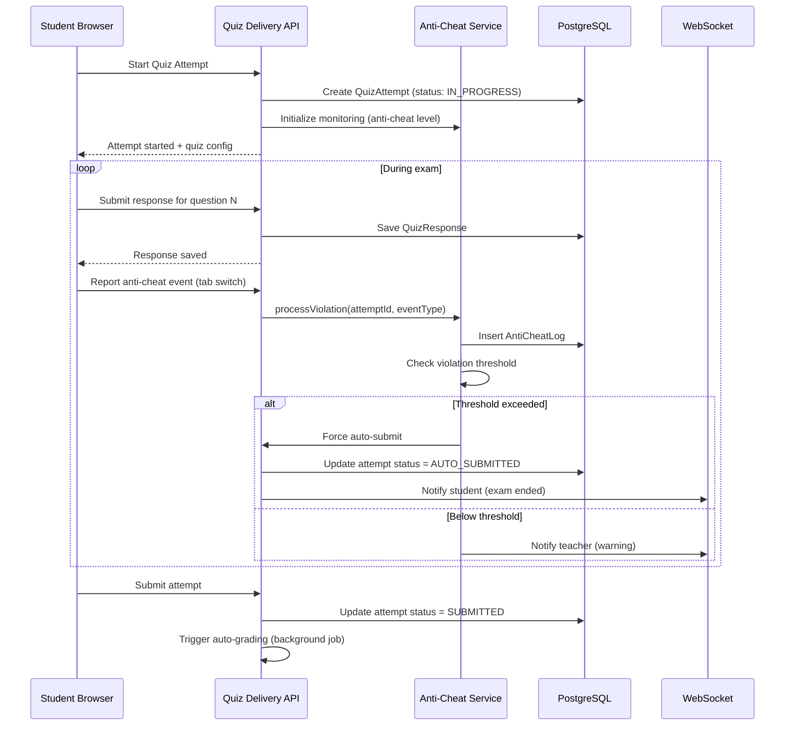

**Cache Usage:**
- Active quiz attempt: `assess:attempt:{attemptId}` → HASH with responses, TTL matches quiz time limit + 10 min buffer
- Question bank metadata: `assess:bank:{bankId}:meta` → TTL 10 min
- Anti-cheat violation count: `assess:violations:{attemptId}` → counter, TTL matches attempt

**Future Microservice Extraction Strategy:**
Assessment Engine is the second-strongest extraction candidate (after Auth). High traffic during exam periods with concurrent sessions. To extract:
1. Independent NestJS service with dedicated PostgreSQL
2. Question banks replicated independently
3. Grade results pushed to Gradebook via events
4. Anti-cheat monitoring via WebSocket on dedicated gateway
5. Auto-grading workers scale independently

---

## 4.5 Gradebook Module Design

**Purpose:** Central grade management, calculation, reporting, and export.

**Folder Structure:**

```
src/modules/gradebook/
├── gradebook.module.ts
├── controllers/
│   ├── grade-entry.controller.ts
│   ├── grade-category.controller.ts
│   ├── grade-scale.controller.ts
│   ├── grade-approval.controller.ts
│   ├── report-card.controller.ts
│   └── transcript.controller.ts
├── services/
│   ├── grade-entry.service.ts
│   ├── grade-calculation.service.ts
│   ├── grade-scale.service.ts
│   ├── grade-category.service.ts
│   ├── grade-approval.service.ts
│   ├── report-card.service.ts
│   ├── transcript.service.ts
│   ├── grade-export.service.ts
│   └── grade-analytics.service.ts
├── repositories/
│   ├── grade-entry.repository.ts
│   ├── grade-category.repository.ts
│   ├── grade-scale.repository.ts
│   ├── grade-history.repository.ts
│   ├── grade-approval.repository.ts
│   ├── report-card.repository.ts
│   └── transcript.repository.ts
├── entities/
│   ├── gradebook-entry.entity.ts
│   ├── grade-category.entity.ts
│   ├── grade-weight.entity.ts
│   ├── grade-scale.entity.ts
│   ├── grade-scale-mapping.entity.ts
│   ├── grade-history.entity.ts
│   ├── grade-approval.entity.ts
│   ├── report-card.entity.ts
│   └── transcript.entity.ts
├── dto/
│   ├── create-grade-entry.dto.ts
│   ├── update-grade-entry.dto.ts
│   ├── grade-entry-response.dto.ts
│   ├── grade-calculation-result.dto.ts
│   ├── report-card-request.dto.ts
│   └── transcript-request.dto.ts
├── calculators/
│   ├── weighted-average.calculator.ts
│   ├── gpa.calculator.ts
│   └── grade-scale-converter.ts
├── events/
│   ├── gradebook.events.ts
│   └── gradebook.event-handlers.ts
├── jobs/
│   ├── report-card-generation.processor.ts
│   ├── transcript-generation.processor.ts
│   └── grade-export.processor.ts
└── __tests__/
    ├── grade-calculation.integration.spec.ts
    └── report-card.integration.spec.ts
```

**Grade Calculation Flow:**

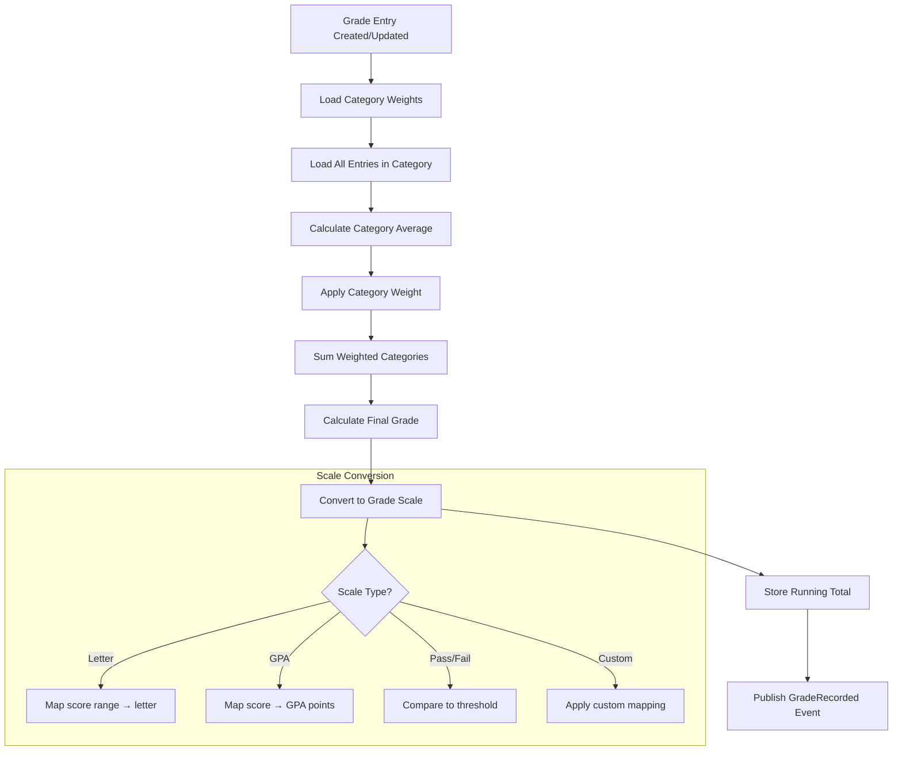

**Cache Usage:**
- Grade summary per student-course: `gradebook:summary:{studentId}:{courseId}` → TTL 5 min, invalidated on grade change
- Grade scale mappings: `gradebook:scale:{scaleId}` → TTL 1 hour

**Future Microservice Extraction:** Lower priority. Extraction would follow Assessment module since they are tightly coupled. Communication via events (grade entries from assessment scores).

---

## 4.6 Remaining Module Designs

The following modules follow the same structural pattern defined in §4.1. Key differentiators are noted:

### Groups & Cohorts Module

```
src/modules/groups/
├── controllers/: group, cohort, enrollment-rule, bulk-operations
├── services/: group, cohort, enrollment-rule, bulk-operations, group-scoping
├── jobs/: bulk-enrollment.processor, auto-enrollment.processor
```
- **Key service:** `BulkOperationsService` — handles CSV import with streaming parser (csv-parse), validation, and batch insert via TypeORM bulk operations
- **Cache:** Group membership lists cached per user: `groups:user:{userId}:memberships` → TTL 5 min

### Collaboration Module

```
src/modules/collaboration/
├── controllers/: announcement, discussion, thread, post, qa, office-hours
├── services/: announcement, discussion, moderation, qa, office-hours, reaction
├── gateways/: collaboration.gateway.ts (WebSocket for real-time thread updates)
```
- **Key feature:** WebSocket gateway for real-time discussion updates using Socket.IO with Redis adapter for multi-instance support
- **Cache:** Pinned announcements: `collab:pinned:{courseId}` → TTL 10 min

### Attendance Module

```
src/modules/attendance/
├── controllers/: attendance, attendance-report
├── services/: attendance, attendance-report, attendance-alert
├── validators/: attendance-correction.validator (requires reason + approval)
```
- **Key constraint:** Records are immutable at the database level (no UPDATE on attendance_records). Corrections create new records linked to originals.
- **Cache:** Daily attendance status per class: `attend:daily:{classId}:{date}` → TTL 30 min

### Schedule & Calendar Module

```
src/modules/schedule/
├── controllers/: schedule, timetable, calendar-sync
├── services/: schedule, conflict-detection, calendar-sync, timetable
├── adapters/: google-calendar.adapter.ts, microsoft-calendar.adapter.ts
├── jobs/: calendar-sync.processor (bidirectional sync every 15 min)
```
- **Recurrence:** Uses RRULE (RFC 5545) format. Recurrences are expanded on-demand for display but stored as rules.
- **Conflict detection:** On every event create/update, queries for overlapping events on same room/teacher/student.

### Voice & Pronunciation Module

```
src/modules/voice/
├── controllers/: speech-recording, pronunciation, speaking-assignment, oral-exam
├── services/: speech-recording, pronunciation, speech-provider-gateway, speaking-assignment, speech-usage
├── adapters/: azure-speech.adapter.ts, google-speech.adapter.ts, deepgram.adapter.ts, assemblyai.adapter.ts
├── jobs/: pronunciation-scoring.processor, usage-aggregation.processor
```
- **Provider Gateway Pattern:** See §12 for full details
- **Immutability:** Assessment-mode recordings are stored with immutable flag in S3 (Object Lock)

### Gamification Module

```
src/modules/gamification/
├── controllers/: badge, achievement, xp, leaderboard, streak, challenge, certificate, reward
├── services/: badge, achievement, xp, point, leaderboard, streak, challenge, certificate, reward
├── jobs/: leaderboard-recalculation.processor, streak-check.processor, certificate-generation.processor
├── templates/: certificate templates (HTML/CSS)
```
- **Leaderboard recalculation:** Runs every 5 minutes via cron job. Uses Redis sorted sets for real-time ranking: `gamify:leaderboard:{scope}:{scopeId}`
- **Certificate generation:** Uses Puppeteer to render HTML template → PDF. QR code generated with `qrcode` npm package.

### CRM Module

```
src/modules/crm/
├── controllers/: lead, inquiry, follow-up, pipeline, conversion
├── services/: lead, inquiry, follow-up, pipeline, conversion
├── jobs/: follow-up-reminder.processor
```

### Finance Module

```
src/modules/finance/
├── controllers/: revenue, accounts-receivable, usage-billing, financial-export
├── services/: revenue, accounts-receivable, usage-billing, financial-export, reconciliation
├── jobs/: usage-aggregation.processor, aging-calculation.processor
```

### Payments Module

```
src/modules/payments/
├── controllers/: invoice, payment, refund, credit, payment-schedule
├── services/: invoice, payment, payment-gateway, refund, credit, payment-schedule, payment-reminder
├── adapters/: stripe.adapter.ts, paypal.adapter.ts
├── jobs/: payment-reminder.processor, recurring-payment.processor
```
- **Gateway abstraction:** Adapter pattern identical to speech providers. See §17 for integration details.
- **Idempotency:** Payment operations use idempotency keys stored in Redis: `payment:idempotency:{key}` → TTL 24h

### Website Builder Module

```
src/modules/website-builder/
├── controllers/: website, page, template, lead-capture, domain
├── services/: website, page-builder, template, lead-capture, domain, seo
├── renderers/: page-renderer.service.ts (server-side rendering for SEO)
├── jobs/: domain-verification.processor, ssl-provisioning.processor
```

### Marketplace Module

```
src/modules/marketplace/
├── controllers/: listing, purchase, review, quality-review
├── services/: listing, purchase, review, revenue-share, quality-review
```

### Notifications Module

```
src/modules/notifications/
├── controllers/: notification, notification-preference
├── services/: notification, notification-dispatcher, notification-preference, digest
├── providers/: email.provider.ts, sms.provider.ts, push.provider.ts, whatsapp.provider.ts, telegram.provider.ts
├── jobs/: notification-dispatch.processor, digest-compilation.processor, delivery-status-check.processor
├── templates/: notification templates (organized by category)
```

### Messaging Module

```
src/modules/messaging/
├── controllers/: conversation, message
├── services/: conversation, message, message-delivery
├── gateways/: messaging.gateway.ts (WebSocket for real-time messaging)
```

### Media Module

```
src/modules/media/
├── controllers/: media-upload, media-asset, streaming
├── services/: media-upload, transcoding, thumbnail, streaming
├── workers/: ffmpeg.worker.ts (runs in separate container)
├── jobs/: transcoding.processor, thumbnail.processor
```

### Storage Module

```
src/modules/storage/
├── controllers/: upload, download
├── services/: upload, download, file-scanner, lifecycle
├── adapters/: s3.adapter.ts, local.adapter.ts (dev)
```

### AI Module

```
src/modules/ai/
├── controllers/: ai-chat, ai-tools
├── services/: ai-gateway, prompt-manager, conversation-history, rag, embedding, moderation, evaluation
├── adapters/: openai.adapter.ts, anthropic.adapter.ts, google.adapter.ts
├── tools/: grade-calculator.tool.ts, schedule-lookup.tool.ts, content-search.tool.ts
├── prompts/: system prompts organized by use case
```

### Automation Module

```
src/modules/automation/
├── controllers/: automation-rule, workflow-template, scheduled-job
├── services/: automation-engine, rule, scheduler, action-executor, workflow-template
├── actions/: send-notification.action.ts, update-status.action.ts, enroll-student.action.ts
├── jobs/: automation-execution.processor, scheduled-job.processor
```

### Content Portability Module

```
src/modules/content-portability/
├── controllers/: export, import, version, clone
├── services/: export, import, versioning, cloning, content-validation
├── serializers/: course.serializer.ts, question-bank.serializer.ts
├── jobs/: export.processor, import.processor, version-snapshot.processor
```

### Analytics Module

```
src/modules/analytics/
├── controllers/: dashboard, report, learning-outcome
├── services/: analytics-ingestion, aggregation, dashboard, report, learning-outcome, item-analysis
├── materializers/: engagement.materializer.ts, attendance.materializer.ts
├── jobs/: aggregation.processor, report-generation.processor
```

### Audit Module

```
src/modules/audit/
├── controllers/: audit-log
├── services/: audit, audit-retention
├── interceptors/: audit-logging.interceptor.ts (auto-logs all mutations)
```

### Webhook Module

```
src/modules/webhook/
├── controllers/: webhook-endpoint
├── services/: webhook-registration, webhook-dispatch, webhook-retry
├── jobs/: webhook-delivery.processor, webhook-retry.processor
```

### Search Module

```
src/modules/search/
├── controllers/: search
├── services/: search, indexing, autocomplete, search-analytics
├── indices/: course.index.ts, lesson.index.ts, question.index.ts, discussion.index.ts, user.index.ts
├── jobs/: reindex.processor, sync.processor
```

---

# 5. Shared Infrastructure

## 5.1 Authentication Infrastructure

### JWT Architecture

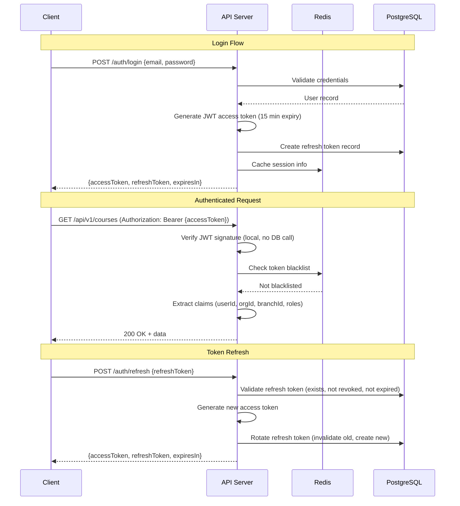

**JWT Payload Structure:**

```typescript
interface JwtPayload {
  sub: string;          // userId (UUID)
  orgId: string;        // organizationId (UUID)
  branchId: string;     // active branchId (UUID)
  roles: string[];      // ['teacher', 'branch_admin']
  permissions: string[];// ['course:create', 'grade:edit'] — cached subset
  iat: number;          // issued at
  exp: number;          // expiry (15 minutes from iat)
  jti: string;          // JWT ID for blacklisting
  mfa: boolean;         // MFA completed
  sessionId: string;    // session identifier
}
```

**Token Configuration:**

| Parameter | Value | Rationale |
|-----------|-------|-----------|
| Access token expiry | 15 minutes | Short-lived to limit damage from token theft |
| Refresh token expiry | 30 days | Convenient for mobile users, rotated on use |
| Refresh token rotation | Enabled | Each refresh invalidates the old token |
| Token algorithm | RS256 | Asymmetric keys allow verification without sharing signing key |
| Token blacklist TTL | Matches access token remaining TTL | Memory-efficient, expired tokens don't need blacklisting |

## 5.2 Authorization Infrastructure

### RBAC + ABAC Combined Flow

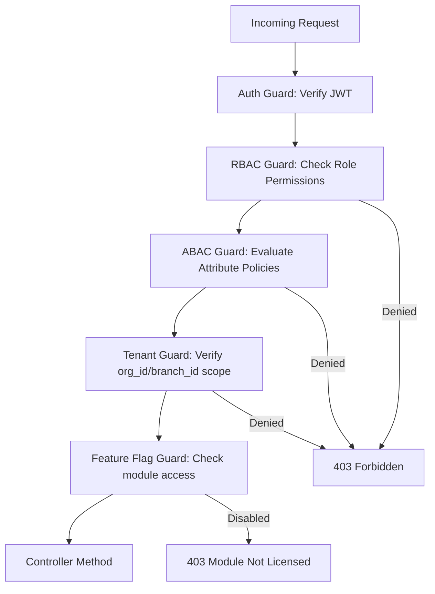

### Permission Matrix

| Role | Scope | Example Permissions |
|------|-------|-------------------|
| Platform Admin | Global | `*:*` (all resources, all actions) |
| Organization Admin | Organization-wide | `organization:*`, `branch:*`, `user:*`, `course:*`, `finance:*` |
| Branch Admin | Single branch | `branch:read`, `branch:update`, `user:manage` (within branch), `course:*` |
| Teacher | Assigned classes/courses | `course:read`, `lesson:*`, `homework:*`, `grade:*`, `attendance:*` (within assignments) |
| Assistant Teacher | Configurable per org | Custom subset of teacher permissions defined by org admin |
| Student | Own data + enrolled courses | `course:read`, `homework:submit`, `quiz:attempt`, `profile:read` (own) |
| Parent | Linked children | `student:read` (linked children), `grade:read`, `attendance:read`, `message:send` |

### Guard Implementation

```typescript
// rbac.guard.ts
@Injectable()
export class RBACGuard implements CanActivate {
  constructor(
    private reflector: Reflector,
    private rbacService: RBACService,
    private cacheManager: CacheManager,
  ) {}

  async canActivate(context: ExecutionContext): Promise<boolean> {
    const requiredPermissions = this.reflector.get<string[]>(
      'permissions',
      context.getHandler(),
    );
    if (!requiredPermissions?.length) return true;

    const request = context.switchToHttp().getRequest();
    const user = request.user as JwtPayload;

    // Check cached permissions first
    const cacheKey = `rbac:${user.sub}:permissions`;
    let userPermissions = await this.cacheManager.get<string[]>(cacheKey);

    if (!userPermissions) {
      userPermissions = await this.rbacService.getUserPermissions(user.sub);
      await this.cacheManager.set(cacheKey, userPermissions, 300); // 5 min TTL
    }

    return requiredPermissions.every(p => userPermissions.includes(p) || userPermissions.includes('*:*'));
  }
}
```

## 5.3 Feature Flags

**Implementation:** Feature flags are stored in PostgreSQL per organization and cached in Redis with a 60-second TTL. The `FeatureFlagGuard` decorator checks module access before controller method execution.

**Flag Categories:**

| Category | Example Flags | Enforcement |
|----------|--------------|-------------|
| Module Access | `module:gamification`, `module:voice`, `module:crm`, `module:marketplace` | FeatureFlagGuard on controller |
| Feature Toggle | `feature:anti_cheat_proctored`, `feature:adaptive_quiz`, `feature:offline_mode` | Service-level check |
| Usage Limits | `limit:storage_gb`, `limit:sms_credits`, `limit:ai_tokens` | Usage tracking + enforcement |
| Rollout | `rollout:new_quiz_ui`, `rollout:ai_grading_assistant` | Percentage-based or org-list |

```typescript
// feature-flag.guard.ts
@Injectable()
export class FeatureFlagGuard implements CanActivate {
  constructor(private featureFlagService: FeatureFlagService) {}

  async canActivate(context: ExecutionContext): Promise<boolean> {
    const requiredFlags = this.reflector.get<string[]>('feature-flags', context.getHandler());
    if (!requiredFlags?.length) return true;

    const request = context.switchToHttp().getRequest();
    const orgId = request.user.orgId;

    const flagStates = await this.featureFlagService.evaluateFlags(orgId, requiredFlags);
    return requiredFlags.every(flag => flagStates[flag] === true);
  }
}

// Usage in controller
@Post()
@Permissions('course:create')
@FeatureFlags('module:lms')
async createCourse(@Body() dto: CreateCourseDto) { ... }
```

## 5.4 Audit Logs

**Architecture:**

- Audit logs are stored in the `audit` PostgreSQL schema
- The audit schema uses a dedicated database role with INSERT + SELECT only (no UPDATE/DELETE)
- An `AuditInterceptor` automatically logs all mutation operations (POST, PUT, PATCH, DELETE)
- Sensitive operations (grade changes, permission changes, data deletion) include before/after snapshots
- Audit logs are indexed by `organization_id`, `actor_id`, `resource_type`, and `timestamp`
- Retention: 7 years for financial/grade audits, 2 years for operational audits

**Audit Record Structure:**

```typescript
interface AuditRecord {
  id: string;                  // UUID
  organizationId: string;      // tenant scope
  actorId: string;             // user who performed the action
  actorRole: string;           // role at time of action
  action: string;              // 'CREATE' | 'UPDATE' | 'DELETE' | 'ACCESS' | 'LOGIN' | 'EXPORT'
  resourceType: string;        // 'grade' | 'user' | 'course' | 'quiz_attempt' etc.
  resourceId: string;          // ID of affected resource
  oldValue: Record<string, any> | null;  // previous state (for updates/deletes)
  newValue: Record<string, any> | null;  // new state (for creates/updates)
  metadata: Record<string, any>;         // additional context
  ipAddress: string;
  userAgent: string;
  timestamp: Date;
}
```

## 5.5 Notification Infrastructure

**Multi-Channel Dispatch Architecture:**

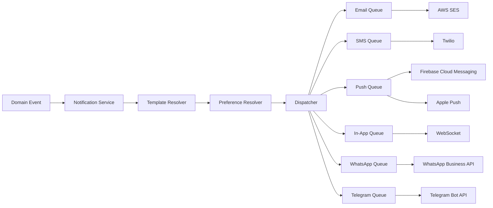

## 5.6 Search Infrastructure

See §10 for full OpenSearch architecture.

## 5.7 Storage Infrastructure

See §9 for full file storage architecture.

## 5.8 Media Services

See §11 for full media pipeline architecture.

## 5.9 AI Gateway

See §13 for full AI architecture.

## 5.10 Caching Infrastructure

See §15 for full caching strategy.

## 5.11 Rate Limiting

**Implementation:** Sliding window rate limiting using Redis.

**Rate Limit Tiers:**

| Endpoint Category | Rate Limit | Window | Key |
|-------------------|-----------|--------|-----|
| Authentication (login) | 10 requests | 15 min | `rl:auth:{ip}:{email}` |
| API (standard) | 100 requests | 1 min | `rl:api:{orgId}:{userId}` |
| API (heavy: export, import) | 5 requests | 1 min | `rl:api:heavy:{orgId}:{userId}` |
| File upload | 20 requests | 1 min | `rl:upload:{orgId}:{userId}` |
| Search | 30 requests | 1 min | `rl:search:{orgId}:{userId}` |
| AI endpoints | 20 requests | 1 min | `rl:ai:{orgId}:{userId}` |
| Webhook dispatch (per org) | 1000 events | 1 hour | `rl:webhook:{orgId}` |

**Response Headers:**

```
X-RateLimit-Limit: 100
X-RateLimit-Remaining: 95
X-RateLimit-Reset: 1720972800
Retry-After: 30  (only on 429 responses)
```

---

# 6. Event Architecture

## 6.1 Event Bus Design

### Architecture Decision

**Choice:** Hybrid in-process EventEmitter + Redis Streams

**Rationale:**
- In-process EventEmitter provides zero-latency synchronous event handling within the monolith
- Redis Streams provide durability, replay capability, and consumer group support for background processing
- This combination avoids the operational overhead of a full message broker (Kafka, RabbitMQ) while maintaining reliability
- When extracting microservices, Redis Streams naturally evolve into the inter-service communication layer

### Event Flow

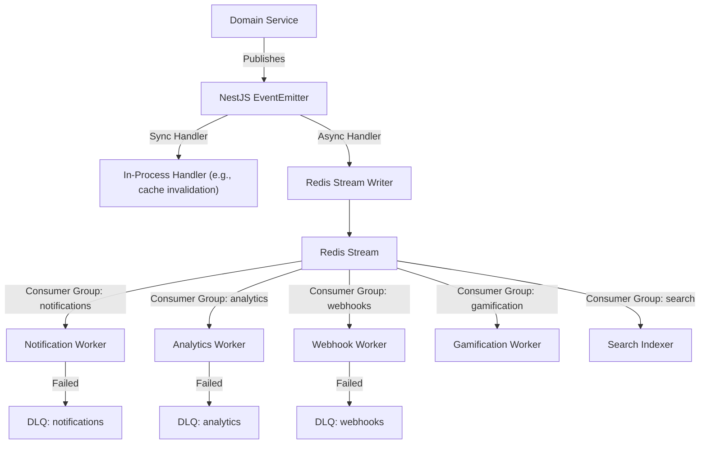

### Event Base Class

```typescript
// shared/events/base.event.ts
export abstract class DomainEvent {
  readonly eventId: string;          // UUID v4
  readonly eventType: string;        // 'student.created', 'homework.submitted'
  readonly aggregateId: string;      // ID of the aggregate that produced the event
  readonly aggregateType: string;    // 'Student', 'Homework'
  readonly organizationId: string;   // tenant scope
  readonly occurredAt: Date;         // event timestamp
  readonly version: number;          // schema version for backward compatibility
  readonly metadata: {
    correlationId: string;           // request trace ID
    causationId: string;             // ID of event that caused this event
    actorId: string;                 // user who triggered the action
  };

  constructor(partial: Partial<DomainEvent>) {
    this.eventId = partial.eventId ?? uuidv4();
    this.occurredAt = partial.occurredAt ?? new Date();
    this.version = partial.version ?? 1;
    Object.assign(this, partial);
  }
}
```

## 6.2 Complete Event Catalog

### Authentication Events

| Event | Publisher | Consumers | Payload | Retry | DLQ |
|-------|----------|-----------|---------|-------|-----|
| `user.logged_in` | Auth | Audit, Analytics | `{ userId, method, deviceInfo, ip }` | 3x exponential | audit-dlq |
| `user.logged_out` | Auth | Audit, Session | `{ userId, sessionId }` | 3x | audit-dlq |
| `user.registered` | Auth | Users, Notifications, Analytics, Gamification | `{ userId, method, orgId }` | 5x | critical-dlq |
| `password.changed` | Auth | Audit, Notifications | `{ userId }` | 3x | audit-dlq |
| `mfa.enabled` | Auth | Audit | `{ userId, method }` | 3x | audit-dlq |
| `mfa.disabled` | Auth | Audit | `{ userId, method }` | 3x | audit-dlq |
| `invitation.created` | Auth | Notifications | `{ invitationId, email, role, orgId }` | 5x | notification-dlq |
| `invitation.accepted` | Auth | Users, Audit | `{ invitationId, userId }` | 5x | critical-dlq |
| `session.revoked` | Auth | Audit | `{ userId, sessionId, reason }` | 3x | audit-dlq |
| `login.failed` | Auth | Audit, Security | `{ email, ip, reason }` | 3x | audit-dlq |
| `account.locked` | Auth | Audit, Notifications | `{ userId, reason }` | 5x | critical-dlq |

### User Events

| Event | Publisher | Consumers | Payload | Retry | DLQ |
|-------|----------|-----------|---------|-------|-----|
| `user.created` | Users | Notifications, Analytics, Search, Gamification | `{ userId, role, orgId, branchId }` | 5x | critical-dlq |
| `user.updated` | Users | Search, Audit | `{ userId, changedFields }` | 3x | search-dlq |
| `user.suspended` | Users | Auth, Notifications, Audit | `{ userId, reason }` | 5x | critical-dlq |
| `user.archived` | Users | Auth, Search, Audit | `{ userId }` | 5x | critical-dlq |
| `student.created` | Users | CRM, Analytics, Gamification | `{ userId, orgId, branchId }` | 3x | analytics-dlq |
| `parent.linked` | Users | Notifications | `{ parentId, studentId }` | 3x | notification-dlq |
| `membership.changed` | Users | RBAC, Audit | `{ userId, orgId, oldRole, newRole }` | 5x | critical-dlq |
| `teacher.assigned` | Users | LMS, Schedule, Notifications | `{ teacherId, classId, courseId }` | 5x | critical-dlq |

### Organization Events

| Event | Publisher | Consumers | Payload | Retry | DLQ |
|-------|----------|-----------|---------|-------|-----|
| `organization.created` | Organizations | Billing, Analytics, Audit | `{ orgId, name, plan }` | 5x | critical-dlq |
| `organization.suspended` | Organizations | Auth, Notifications, Audit | `{ orgId, reason }` | 5x | critical-dlq |
| `organization.archived` | Organizations | Data Retention, Audit | `{ orgId }` | 5x | critical-dlq |
| `subscription.changed` | Organizations | FeatureFlags, Billing, Notifications | `{ orgId, oldPlan, newPlan }` | 5x | critical-dlq |
| `feature_flag.toggled` | Organizations | All Modules (cache invalidation) | `{ orgId, flag, enabled }` | 5x | critical-dlq |

### LMS Events

| Event | Publisher | Consumers | Payload | Retry | DLQ |
|-------|----------|-----------|---------|-------|-----|
| `course.created` | LMS | Search, Analytics, Audit | `{ courseId, orgId, branchId, title }` | 3x | search-dlq |
| `course.published` | LMS | Notifications, Search | `{ courseId, publishedAt }` | 3x | search-dlq |
| `course.archived` | LMS | Search, Audit | `{ courseId }` | 3x | search-dlq |
| `lesson.created` | LMS | Search | `{ lessonId, courseId, moduleId }` | 3x | search-dlq |
| `lesson.completed` | LMS | Completion, Gamification, Analytics | `{ userId, lessonId, courseId }` | 5x | critical-dlq |
| `module.completed` | LMS | Completion, Gamification, Analytics | `{ userId, moduleId, courseId }` | 5x | critical-dlq |
| `course.completed` | LMS | Gamification, Certificates, Analytics, Notifications | `{ userId, courseId }` | 5x | critical-dlq |
| `homework.assigned` | LMS | Notifications, Analytics | `{ homeworkId, courseId, dueDate, studentIds[] }` | 5x | notification-dlq |
| `homework.submitted` | LMS | Notifications, Gamification | `{ submissionId, homeworkId, studentId }` | 5x | notification-dlq |
| `homework.graded` | LMS | Gradebook, Notifications, Analytics | `{ submissionId, score, gradedBy }` | 5x | critical-dlq |
| `homework.overdue` | LMS | Notifications, Automation | `{ homeworkId, studentId }` | 3x | notification-dlq |
| `enrollment.created` | LMS | Analytics, Gamification, Notifications | `{ userId, courseId }` | 5x | critical-dlq |
| `enrollment.dropped` | LMS | Analytics, Gradebook, Audit | `{ userId, courseId, reason }` | 5x | critical-dlq |
| `prerequisite.unlocked` | LMS | Notifications | `{ userId, entityType, entityId }` | 3x | notification-dlq |

### Assessment Events

| Event | Publisher | Consumers | Payload | Retry | DLQ |
|-------|----------|-----------|---------|-------|-----|
| `quiz.created` | Assessment | Search, Audit | `{ quizId, courseId, type }` | 3x | search-dlq |
| `quiz.published` | Assessment | Notifications, Calendar | `{ quizId, availableFrom, availableTo }` | 3x | notification-dlq |
| `quiz_attempt.started` | Assessment | Analytics, Anti-Cheat | `{ attemptId, quizId, studentId, startTime }` | 3x | analytics-dlq |
| `quiz_attempt.submitted` | Assessment | Gradebook, Gamification, Analytics, Notifications | `{ attemptId, quizId, studentId, score }` | 5x | critical-dlq |
| `quiz.auto_graded` | Assessment | Gradebook, Notifications | `{ attemptId, score, maxScore }` | 5x | critical-dlq |
| `quiz.manually_graded` | Assessment | Gradebook, Notifications | `{ attemptId, gradedBy, score }` | 5x | critical-dlq |
| `anti_cheat.violation` | Assessment | Audit, Notifications | `{ attemptId, eventType, severity }` | 5x | audit-dlq |
| `quiz_attempt.auto_submitted` | Assessment | Gradebook, Audit | `{ attemptId, reason }` | 5x | critical-dlq |

### Gradebook Events

| Event | Publisher | Consumers | Payload | Retry | DLQ |
|-------|----------|-----------|---------|-------|-----|
| `grade.recorded` | Gradebook | Analytics, Notifications, Gamification | `{ entryId, studentId, courseId, score }` | 5x | critical-dlq |
| `grade.updated` | Gradebook | Audit, Analytics, Notifications | `{ entryId, oldScore, newScore, reason, changedBy }` | 5x | critical-dlq |
| `grade.approved` | Gradebook | Notifications | `{ approvalId, courseId }` | 3x | notification-dlq |
| `grade.rejected` | Gradebook | Notifications | `{ approvalId, reason }` | 3x | notification-dlq |
| `report_card.generated` | Gradebook | Notifications, Storage | `{ reportCardId, studentId, term }` | 3x | notification-dlq |

### Attendance Events

| Event | Publisher | Consumers | Payload | Retry | DLQ |
|-------|----------|-----------|---------|-------|-----|
| `attendance.recorded` | Attendance | Notifications, Analytics, Gamification | `{ recordId, studentId, classId, status, date }` | 5x | critical-dlq |
| `attendance.corrected` | Attendance | Audit, Analytics | `{ recordId, oldStatus, newStatus, reason }` | 3x | audit-dlq |
| `attendance.threshold_reached` | Attendance | Automation, Notifications | `{ studentId, threshold, period }` | 3x | notification-dlq |

### Gamification Events

| Event | Publisher | Consumers | Payload | Retry | DLQ |
|-------|----------|-----------|---------|-------|-----|
| `badge.awarded` | Gamification | Notifications, Analytics | `{ badgeId, userId, badgeName }` | 3x | notification-dlq |
| `achievement.completed` | Gamification | Notifications | `{ achievementId, userId }` | 3x | notification-dlq |
| `xp.awarded` | Gamification | Leaderboard recalculation | `{ userId, amount, source }` | 3x | gamification-dlq |
| `streak.updated` | Gamification | Notifications, Analytics | `{ userId, streakType, count }` | 3x | notification-dlq |
| `streak.broken` | Gamification | Notifications | `{ userId, streakType, previousCount }` | 3x | notification-dlq |
| `certificate.generated` | Gamification | Notifications, Storage | `{ certificateId, userId, type }` | 5x | critical-dlq |

### Payment Events

| Event | Publisher | Consumers | Payload | Retry | DLQ |
|-------|----------|-----------|---------|-------|-----|
| `invoice.created` | Payments | Notifications | `{ invoiceId, studentId, amount }` | 3x | notification-dlq |
| `payment.received` | Payments | Finance, Notifications, Audit | `{ paymentId, invoiceId, amount }` | 5x | critical-dlq |
| `payment.failed` | Payments | Notifications, Audit | `{ paymentId, reason }` | 5x | critical-dlq |
| `refund.processed` | Payments | Finance, Notifications | `{ refundId, amount }` | 5x | critical-dlq |
| `payment.overdue` | Payments | Notifications, Automation | `{ invoiceId, daysPastDue }` | 3x | notification-dlq |

### Voice Events

| Event | Publisher | Consumers | Payload | Retry | DLQ |
|-------|----------|-----------|---------|-------|-----|
| `speech.recorded` | Voice | Analytics | `{ recordingId, userId, assignmentId }` | 3x | analytics-dlq |
| `pronunciation.scored` | Voice | Gradebook, Gamification | `{ recordingId, overallScore, provider }` | 5x | critical-dlq |
| `speaking_assignment.submitted` | Voice | Notifications, Gradebook | `{ assignmentId, studentId, recordingId }` | 5x | critical-dlq |

### CRM Events

| Event | Publisher | Consumers | Payload | Retry | DLQ |
|-------|----------|-----------|---------|-------|-----|
| `lead.captured` | CRM | Analytics, Notifications | `{ leadId, source, orgId }` | 3x | analytics-dlq |
| `lead.converted` | CRM | Analytics, Notifications | `{ leadId, studentId }` | 3x | analytics-dlq |

### Collaboration Events

| Event | Publisher | Consumers | Payload | Retry | DLQ |
|-------|----------|-----------|---------|-------|-----|
| `announcement.published` | Collaboration | Notifications | `{ announcementId, scope, targetIds }` | 3x | notification-dlq |
| `thread.created` | Collaboration | Notifications, Search | `{ threadId, forumId, authorId }` | 3x | search-dlq |
| `content.flagged` | Collaboration | Notifications | `{ flagId, targetType, targetId }` | 3x | notification-dlq |
| `qa_answer.accepted` | Collaboration | Notifications, Gamification | `{ answerId, questionId }` | 3x | notification-dlq |
| `office_hours.booked` | Collaboration | Calendar, Notifications | `{ bookingId, teacherId, studentId }` | 3x | notification-dlq |

### Messaging Events

| Event | Publisher | Consumers | Payload | Retry | DLQ |
|-------|----------|-----------|---------|-------|-----|
| `message.sent` | Messaging | Notifications, WebSocket | `{ messageId, conversationId, senderId }` | 3x | notification-dlq |

### Content Portability Events

| Event | Publisher | Consumers | Payload | Retry | DLQ |
|-------|----------|-----------|---------|-------|-----|
| `content.exported` | Content Portability | Audit | `{ packageId, type, exportedBy }` | 3x | audit-dlq |
| `content.imported` | Content Portability | Audit, Search | `{ packageId, targetBranch, importedBy }` | 5x | critical-dlq |
| `content.version_created` | Content Portability | Audit | `{ entityType, entityId, version }` | 3x | audit-dlq |
| `content.rolled_back` | Content Portability | Audit, Search | `{ entityType, entityId, fromVersion, toVersion }` | 5x | critical-dlq |

### Automation Events

| Event | Publisher | Consumers | Payload | Retry | DLQ |
|-------|----------|-----------|---------|-------|-----|
| `automation.executed` | Automation | Audit, Analytics | `{ ruleId, status, result }` | 3x | audit-dlq |
| `automation.failed` | Automation | Audit, Notifications | `{ ruleId, error }` | 3x | audit-dlq |

## 6.3 Retry Strategy

**Exponential Backoff Configuration:**

```typescript
// Retry delays: attempt 1 = 1s, attempt 2 = 4s, attempt 3 = 16s, attempt 4 = 64s, attempt 5 = 256s
const retryConfig = {
  maxRetries: 5,           // critical events
  maxRetriesStandard: 3,   // non-critical events
  baseDelay: 1000,         // 1 second
  multiplier: 4,           // exponential factor
  maxDelay: 300000,        // 5 minutes max
  jitter: true,            // ±20% random jitter to prevent thundering herd
};
```

## 6.4 Dead Letter Queue (DLQ) Behavior

**DLQ Buckets:**

| DLQ Name | Contents | Alert Threshold | Action |
|----------|----------|-----------------|--------|
| `critical-dlq` | Grade records, enrollment changes, payment events | > 0 messages | Immediate PagerDuty alert + manual review |
| `notification-dlq` | Failed notifications | > 100 messages/hour | Alert to ops channel |
| `search-dlq` | Failed search index updates | > 500 messages/hour | Alert + auto-reindex job |
| `analytics-dlq` | Failed analytics events | > 1000 messages/hour | Alert, data may be stale |
| `audit-dlq` | Failed audit log writes | > 0 messages | High-priority alert (compliance risk) |
| `gamification-dlq` | Failed XP/badge awards | > 100 messages/hour | Alert, manual reconciliation |
| `webhook-dlq` | Failed webhook deliveries | > 50 messages/hour | Alert, webhook retry scheduled |

**DLQ Processing:**
1. Failed events land in DLQ after max retries exhausted
2. DLQ monitor checks queue depth every 60 seconds
3. Alerts triggered based on thresholds above
4. Ops team reviews DLQ via admin dashboard
5. Events can be replayed (reprocessed), acknowledged (discarded), or escalated

---

# 7. Database Architecture

## 7.1 Database Strategy

**Database Engine:** PostgreSQL 16+

**Key Features Used:**
- JSONB columns for flexible schema (content blocks, quiz config, automation rules)
- Row-Level Security (RLS) for tenant isolation
- Table partitioning for high-volume tables (audit logs, analytics events)
- Partial indexes for common query patterns
- Generated columns for computed values
- Full-text search (GIN indexes) for in-database text search (supplementing OpenSearch)
- pgvector extension for AI embeddings

## 7.2 Schema Organization

```
PostgreSQL Database: campusos
├── public schema        — Core business tables
├── audit schema         — Immutable audit log tables
├── analytics schema     — Analytics aggregates and materialized views
├── search schema        — Full-text search materialized views
└── extensions
    ├── uuid-ossp        — UUID generation
    ├── pgcrypto         — Cryptographic functions
    ├── pg_trgm          — Trigram matching for fuzzy search
    └── vector           — pgvector for AI embeddings
```

## 7.3 Tenant Isolation via Row-Level Security

```sql
-- Enable RLS on tenant-scoped tables
ALTER TABLE courses ENABLE ROW LEVEL SECURITY;

-- Policy: Users can only see data from their organization
CREATE POLICY tenant_isolation_policy ON courses
  USING (organization_id = current_setting('app.current_organization_id')::uuid);

-- Set tenant context at the start of each request
-- This is done by the TenantMiddleware in NestJS
SET LOCAL app.current_organization_id = 'org-uuid-here';
SET LOCAL app.current_branch_id = 'branch-uuid-here';
SET LOCAL app.current_user_id = 'user-uuid-here';
```

**Implementation in NestJS:**

```typescript
// tenant.middleware.ts
@Injectable()
export class TenantMiddleware implements NestMiddleware {
  constructor(private dataSource: DataSource) {}

  async use(req: Request, res: Response, next: NextFunction) {
    const user = req.user as JwtPayload;
    if (!user) return next();

    const queryRunner = this.dataSource.createQueryRunner();
    await queryRunner.query(`SET LOCAL app.current_organization_id = '${user.orgId}'`);
    await queryRunner.query(`SET LOCAL app.current_branch_id = '${user.branchId}'`);
    await queryRunner.query(`SET LOCAL app.current_user_id = '${user.sub}'`);

    req['queryRunner'] = queryRunner;
    next();
  }
}
```

## 7.4 Table Design Conventions

### Standard Columns

Every business table includes:

```sql
CREATE TABLE example (
  id UUID PRIMARY KEY DEFAULT gen_random_uuid(),
  organization_id UUID NOT NULL REFERENCES organizations(id),
  branch_id UUID REFERENCES branches(id),            -- NULL for org-wide records
  -- ... domain columns ...
  created_at TIMESTAMPTZ NOT NULL DEFAULT NOW(),
  updated_at TIMESTAMPTZ NOT NULL DEFAULT NOW(),
  deleted_at TIMESTAMPTZ,                             -- soft delete
  created_by UUID NOT NULL REFERENCES users(id),
  updated_by UUID NOT NULL REFERENCES users(id),
  version INTEGER NOT NULL DEFAULT 1                  -- optimistic locking
);

-- Standard indexes
CREATE INDEX idx_example_org_id ON example(organization_id);
CREATE INDEX idx_example_branch_id ON example(branch_id) WHERE branch_id IS NOT NULL;
CREATE INDEX idx_example_created_at ON example(created_at);
CREATE INDEX idx_example_deleted_at ON example(deleted_at) WHERE deleted_at IS NULL;
```

### Soft Deletes

- All user-facing records use soft deletes (`deleted_at TIMESTAMPTZ`)
- Queries exclude soft-deleted records by default (TypeORM `@DeleteDateColumn`)
- Hard deletes allowed only for: temp uploads, expired sessions, DLQ entries
- Soft-deleted records are purged after retention period (configurable per entity type, default 90 days)

## 7.5 Core Tables

### Organizations and Tenancy

```sql
CREATE TABLE organizations (
  id UUID PRIMARY KEY DEFAULT gen_random_uuid(),
  name VARCHAR(255) NOT NULL,
  slug VARCHAR(100) UNIQUE NOT NULL,
  status VARCHAR(20) NOT NULL DEFAULT 'active',  -- active, suspended, archived
  billing_plan VARCHAR(50) NOT NULL DEFAULT 'free',
  settings JSONB NOT NULL DEFAULT '{}',
  white_label_config JSONB NOT NULL DEFAULT '{}',
  created_at TIMESTAMPTZ NOT NULL DEFAULT NOW(),
  updated_at TIMESTAMPTZ NOT NULL DEFAULT NOW(),
  deleted_at TIMESTAMPTZ
);

CREATE TABLE branches (
  id UUID PRIMARY KEY DEFAULT gen_random_uuid(),
  organization_id UUID NOT NULL REFERENCES organizations(id),
  name VARCHAR(255) NOT NULL,
  slug VARCHAR(100) NOT NULL,
  address TEXT,
  timezone VARCHAR(50) NOT NULL DEFAULT 'UTC',
  status VARCHAR(20) NOT NULL DEFAULT 'active',
  settings JSONB NOT NULL DEFAULT '{}',
  created_at TIMESTAMPTZ NOT NULL DEFAULT NOW(),
  updated_at TIMESTAMPTZ NOT NULL DEFAULT NOW(),
  deleted_at TIMESTAMPTZ,
  UNIQUE(organization_id, slug)
);

CREATE TABLE feature_flags (
  id UUID PRIMARY KEY DEFAULT gen_random_uuid(),
  organization_id UUID NOT NULL REFERENCES organizations(id),
  flag_key VARCHAR(100) NOT NULL,
  enabled BOOLEAN NOT NULL DEFAULT false,
  config JSONB NOT NULL DEFAULT '{}',  -- usage limits, percentage rollout
  UNIQUE(organization_id, flag_key)
);
```

### Users and Access

```sql
CREATE TABLE users (
  id UUID PRIMARY KEY DEFAULT gen_random_uuid(),
  email VARCHAR(255),
  phone VARCHAR(50),
  first_name VARCHAR(100) NOT NULL,
  last_name VARCHAR(100) NOT NULL,
  avatar_url TEXT,
  status VARCHAR(20) NOT NULL DEFAULT 'active',
  locale VARCHAR(10) NOT NULL DEFAULT 'en',
  timezone VARCHAR(50) NOT NULL DEFAULT 'UTC',
  created_at TIMESTAMPTZ NOT NULL DEFAULT NOW(),
  updated_at TIMESTAMPTZ NOT NULL DEFAULT NOW(),
  deleted_at TIMESTAMPTZ,
  CONSTRAINT email_or_phone CHECK (email IS NOT NULL OR phone IS NOT NULL)
);

CREATE TABLE memberships (
  id UUID PRIMARY KEY DEFAULT gen_random_uuid(),
  user_id UUID NOT NULL REFERENCES users(id),
  organization_id UUID NOT NULL REFERENCES organizations(id),
  branch_id UUID REFERENCES branches(id),
  status VARCHAR(20) NOT NULL DEFAULT 'active',
  created_at TIMESTAMPTZ NOT NULL DEFAULT NOW(),
  UNIQUE(user_id, organization_id, branch_id)
);

CREATE TABLE roles (
  id UUID PRIMARY KEY DEFAULT gen_random_uuid(),
  name VARCHAR(100) NOT NULL,
  description TEXT,
  is_system BOOLEAN NOT NULL DEFAULT false,  -- system roles cannot be deleted
  organization_id UUID REFERENCES organizations(id),  -- NULL for platform-level roles
  UNIQUE(name, organization_id)
);

CREATE TABLE permissions (
  id UUID PRIMARY KEY DEFAULT gen_random_uuid(),
  resource VARCHAR(100) NOT NULL,   -- 'course', 'grade', 'user'
  action VARCHAR(50) NOT NULL,      -- 'create', 'read', 'update', 'delete', 'manage'
  description TEXT,
  UNIQUE(resource, action)
);

CREATE TABLE membership_roles (
  membership_id UUID NOT NULL REFERENCES memberships(id),
  role_id UUID NOT NULL REFERENCES roles(id),
  PRIMARY KEY(membership_id, role_id)
);

CREATE TABLE role_permissions (
  role_id UUID NOT NULL REFERENCES roles(id),
  permission_id UUID NOT NULL REFERENCES permissions(id),
  PRIMARY KEY(role_id, permission_id)
);

CREATE TABLE parent_links (
  id UUID PRIMARY KEY DEFAULT gen_random_uuid(),
  parent_id UUID NOT NULL REFERENCES users(id),
  student_id UUID NOT NULL REFERENCES users(id),
  created_at TIMESTAMPTZ NOT NULL DEFAULT NOW(),
  UNIQUE(parent_id, student_id)
);
```

### LMS Tables (Selected)

```sql
CREATE TABLE courses (
  id UUID PRIMARY KEY DEFAULT gen_random_uuid(),
  organization_id UUID NOT NULL REFERENCES organizations(id),
  branch_id UUID REFERENCES branches(id),
  subject_id UUID REFERENCES subjects(id),
  title VARCHAR(500) NOT NULL,
  description TEXT,
  format VARCHAR(50) NOT NULL DEFAULT 'topic_based',
  status VARCHAR(20) NOT NULL DEFAULT 'draft',
  thumbnail_url TEXT,
  estimated_duration_hours DECIMAL(5,1),
  difficulty_level VARCHAR(20),
  tags TEXT[],
  custom_fields JSONB NOT NULL DEFAULT '{}',
  created_at TIMESTAMPTZ NOT NULL DEFAULT NOW(),
  updated_at TIMESTAMPTZ NOT NULL DEFAULT NOW(),
  deleted_at TIMESTAMPTZ,
  created_by UUID NOT NULL REFERENCES users(id),
  updated_by UUID NOT NULL REFERENCES users(id),
  version INTEGER NOT NULL DEFAULT 1
);

CREATE INDEX idx_courses_org_branch ON courses(organization_id, branch_id);
CREATE INDEX idx_courses_subject ON courses(subject_id);
CREATE INDEX idx_courses_status ON courses(status) WHERE deleted_at IS NULL;
CREATE INDEX idx_courses_tags ON courses USING GIN(tags);

CREATE TABLE modules (
  id UUID PRIMARY KEY DEFAULT gen_random_uuid(),
  organization_id UUID NOT NULL REFERENCES organizations(id),
  course_id UUID NOT NULL REFERENCES courses(id) ON DELETE CASCADE,
  parent_module_id UUID REFERENCES modules(id),  -- for nesting
  title VARCHAR(500) NOT NULL,
  description TEXT,
  position INTEGER NOT NULL,
  status VARCHAR(20) NOT NULL DEFAULT 'draft',
  created_at TIMESTAMPTZ NOT NULL DEFAULT NOW(),
  updated_at TIMESTAMPTZ NOT NULL DEFAULT NOW(),
  deleted_at TIMESTAMPTZ
);

CREATE INDEX idx_modules_course_position ON modules(course_id, position) WHERE deleted_at IS NULL;

CREATE TABLE lessons (
  id UUID PRIMARY KEY DEFAULT gen_random_uuid(),
  organization_id UUID NOT NULL REFERENCES organizations(id),
  module_id UUID NOT NULL REFERENCES modules(id) ON DELETE CASCADE,
  title VARCHAR(500) NOT NULL,
  description TEXT,
  position INTEGER NOT NULL,
  estimated_duration_minutes INTEGER,
  status VARCHAR(20) NOT NULL DEFAULT 'draft',
  created_at TIMESTAMPTZ NOT NULL DEFAULT NOW(),
  updated_at TIMESTAMPTZ NOT NULL DEFAULT NOW(),
  deleted_at TIMESTAMPTZ
);

CREATE TABLE content_blocks (
  id UUID PRIMARY KEY DEFAULT gen_random_uuid(),
  organization_id UUID NOT NULL REFERENCES organizations(id),
  lesson_id UUID NOT NULL REFERENCES lessons(id) ON DELETE CASCADE,
  type VARCHAR(50) NOT NULL,           -- 'rich_text', 'video', 'pdf', 'code', 'latex', etc.
  data JSONB NOT NULL,                 -- type-specific content data
  position INTEGER NOT NULL,
  reusable_block_id UUID REFERENCES reusable_blocks(id),  -- NULL if inline
  created_at TIMESTAMPTZ NOT NULL DEFAULT NOW(),
  updated_at TIMESTAMPTZ NOT NULL DEFAULT NOW()
);

CREATE INDEX idx_content_blocks_lesson_position ON content_blocks(lesson_id, position);

CREATE TABLE homework (
  id UUID PRIMARY KEY DEFAULT gen_random_uuid(),
  organization_id UUID NOT NULL REFERENCES organizations(id),
  course_id UUID NOT NULL REFERENCES courses(id),
  lesson_id UUID REFERENCES lessons(id),
  module_id UUID REFERENCES modules(id),
  title VARCHAR(500) NOT NULL,
  description TEXT,
  due_date TIMESTAMPTZ,
  late_policy VARCHAR(20) NOT NULL DEFAULT 'accept',  -- accept, deduct, reject
  late_deduction_percent DECIMAL(5,2),
  max_attempts INTEGER NOT NULL DEFAULT 1,
  rubric_id UUID REFERENCES grading_rubrics(id),
  peer_review_enabled BOOLEAN NOT NULL DEFAULT false,
  created_at TIMESTAMPTZ NOT NULL DEFAULT NOW(),
  updated_at TIMESTAMPTZ NOT NULL DEFAULT NOW(),
  deleted_at TIMESTAMPTZ,
  created_by UUID NOT NULL REFERENCES users(id)
);

CREATE TABLE homework_submissions (
  id UUID PRIMARY KEY DEFAULT gen_random_uuid(),
  organization_id UUID NOT NULL REFERENCES organizations(id),
  homework_id UUID NOT NULL REFERENCES homework(id),
  student_id UUID NOT NULL REFERENCES users(id),
  content TEXT,
  attachments JSONB NOT NULL DEFAULT '[]',
  attempt_number INTEGER NOT NULL DEFAULT 1,
  status VARCHAR(20) NOT NULL DEFAULT 'submitted',
  submitted_at TIMESTAMPTZ NOT NULL DEFAULT NOW(),
  is_late BOOLEAN NOT NULL DEFAULT false,
  created_at TIMESTAMPTZ NOT NULL DEFAULT NOW()
);

CREATE TABLE completion_records (
  id UUID PRIMARY KEY DEFAULT gen_random_uuid(),
  organization_id UUID NOT NULL REFERENCES organizations(id),
  user_id UUID NOT NULL REFERENCES users(id),
  entity_type VARCHAR(20) NOT NULL,   -- 'lesson', 'module', 'course'
  entity_id UUID NOT NULL,
  completed_at TIMESTAMPTZ NOT NULL DEFAULT NOW(),
  UNIQUE(user_id, entity_type, entity_id)
);

CREATE INDEX idx_completion_user_course ON completion_records(user_id, entity_type) WHERE entity_type = 'course';
```

### Assessment Tables (Selected)

```sql
CREATE TABLE questions (
  id UUID PRIMARY KEY DEFAULT gen_random_uuid(),
  organization_id UUID NOT NULL REFERENCES organizations(id),
  question_bank_id UUID NOT NULL REFERENCES question_banks(id),
  type VARCHAR(30) NOT NULL,           -- 'multiple_choice', 'essay', 'code_submission', etc.
  content JSONB NOT NULL,              -- rich content with media
  difficulty VARCHAR(20) NOT NULL DEFAULT 'medium',
  points DECIMAL(6,2) NOT NULL DEFAULT 1.0,
  partial_credit BOOLEAN NOT NULL DEFAULT false,
  negative_marking BOOLEAN NOT NULL DEFAULT false,
  negative_mark_value DECIMAL(6,2),
  explanation JSONB,                   -- shown after answering
  hints JSONB NOT NULL DEFAULT '[]',
  answer_data JSONB NOT NULL,          -- correct answer(s), varies by type
  tags TEXT[],
  subject_id UUID REFERENCES subjects(id),
  learning_outcomes UUID[],
  version INTEGER NOT NULL DEFAULT 1,
  created_at TIMESTAMPTZ NOT NULL DEFAULT NOW(),
  updated_at TIMESTAMPTZ NOT NULL DEFAULT NOW(),
  deleted_at TIMESTAMPTZ,
  created_by UUID NOT NULL REFERENCES users(id)
);

CREATE INDEX idx_questions_bank ON questions(question_bank_id) WHERE deleted_at IS NULL;
CREATE INDEX idx_questions_type ON questions(type);
CREATE INDEX idx_questions_difficulty ON questions(difficulty);
CREATE INDEX idx_questions_tags ON questions USING GIN(tags);

CREATE TABLE quizzes (
  id UUID PRIMARY KEY DEFAULT gen_random_uuid(),
  organization_id UUID NOT NULL REFERENCES organizations(id),
  course_id UUID REFERENCES courses(id),
  title VARCHAR(500) NOT NULL,
  description TEXT,
  type VARCHAR(20) NOT NULL DEFAULT 'quiz',  -- quiz, exam, practice, adaptive
  time_limit_minutes INTEGER,
  max_attempts INTEGER NOT NULL DEFAULT 1,
  scoring_method VARCHAR(20) NOT NULL DEFAULT 'best',  -- best, average, last
  shuffle_questions BOOLEAN NOT NULL DEFAULT false,
  shuffle_options BOOLEAN NOT NULL DEFAULT false,
  show_results VARCHAR(20) NOT NULL DEFAULT 'after_submit',
  anti_cheat_level VARCHAR(20) NOT NULL DEFAULT 'none',  -- none, basic, standard, strict, proctored
  password VARCHAR(100),
  ip_restrictions JSONB,
  available_from TIMESTAMPTZ,
  available_to TIMESTAMPTZ,
  config JSONB NOT NULL DEFAULT '{}',
  created_at TIMESTAMPTZ NOT NULL DEFAULT NOW(),
  updated_at TIMESTAMPTZ NOT NULL DEFAULT NOW(),
  deleted_at TIMESTAMPTZ,
  created_by UUID NOT NULL REFERENCES users(id)
);

CREATE TABLE quiz_attempts (
  id UUID PRIMARY KEY DEFAULT gen_random_uuid(),
  organization_id UUID NOT NULL REFERENCES organizations(id),
  quiz_id UUID NOT NULL REFERENCES quizzes(id),
  student_id UUID NOT NULL REFERENCES users(id),
  attempt_number INTEGER NOT NULL DEFAULT 1,
  status VARCHAR(20) NOT NULL DEFAULT 'in_progress',  -- in_progress, submitted, auto_submitted, graded
  started_at TIMESTAMPTZ NOT NULL DEFAULT NOW(),
  submitted_at TIMESTAMPTZ,
  score DECIMAL(8,2),
  max_score DECIMAL(8,2),
  violation_count INTEGER NOT NULL DEFAULT 0,
  ip_address INET,
  user_agent TEXT,
  metadata JSONB NOT NULL DEFAULT '{}'
);

CREATE INDEX idx_quiz_attempts_quiz_student ON quiz_attempts(quiz_id, student_id);
CREATE INDEX idx_quiz_attempts_status ON quiz_attempts(status) WHERE status = 'in_progress';
```

### Gradebook Tables

```sql
CREATE TABLE grade_categories (
  id UUID PRIMARY KEY DEFAULT gen_random_uuid(),
  organization_id UUID NOT NULL REFERENCES organizations(id),
  course_id UUID NOT NULL REFERENCES courses(id),
  name VARCHAR(100) NOT NULL,
  weight DECIMAL(5,2) NOT NULL,       -- percentage weight
  drop_lowest INTEGER NOT NULL DEFAULT 0,
  position INTEGER NOT NULL,
  created_at TIMESTAMPTZ NOT NULL DEFAULT NOW()
);

CREATE TABLE gradebook_entries (
  id UUID PRIMARY KEY DEFAULT gen_random_uuid(),
  organization_id UUID NOT NULL REFERENCES organizations(id),
  student_id UUID NOT NULL REFERENCES users(id),
  course_id UUID NOT NULL REFERENCES courses(id),
  category_id UUID NOT NULL REFERENCES grade_categories(id),
  assignment_type VARCHAR(20) NOT NULL,  -- homework, quiz, exam, participation
  assignment_id UUID NOT NULL,            -- polymorphic reference
  score DECIMAL(8,2),
  max_score DECIMAL(8,2) NOT NULL,
  weight DECIMAL(5,2),
  status VARCHAR(20) NOT NULL DEFAULT 'pending',  -- pending, graded, approved
  graded_by UUID REFERENCES users(id),
  graded_at TIMESTAMPTZ,
  created_at TIMESTAMPTZ NOT NULL DEFAULT NOW(),
  updated_at TIMESTAMPTZ NOT NULL DEFAULT NOW(),
  version INTEGER NOT NULL DEFAULT 1
);

CREATE INDEX idx_gradebook_student_course ON gradebook_entries(student_id, course_id);
CREATE INDEX idx_gradebook_assignment ON gradebook_entries(assignment_type, assignment_id);

CREATE TABLE grade_history (
  id UUID PRIMARY KEY DEFAULT gen_random_uuid(),
  gradebook_entry_id UUID NOT NULL REFERENCES gradebook_entries(id),
  old_score DECIMAL(8,2),
  new_score DECIMAL(8,2),
  reason TEXT NOT NULL,
  changed_by UUID NOT NULL REFERENCES users(id),
  changed_at TIMESTAMPTZ NOT NULL DEFAULT NOW()
);
-- No UPDATE/DELETE on this table; append-only
```

### Audit Tables

```sql
-- Schema: audit (separate schema with restricted permissions)
CREATE SCHEMA IF NOT EXISTS audit;

CREATE TABLE audit.audit_logs (
  id UUID PRIMARY KEY DEFAULT gen_random_uuid(),
  organization_id UUID NOT NULL,
  actor_id UUID NOT NULL,
  actor_role VARCHAR(50),
  action VARCHAR(50) NOT NULL,
  resource_type VARCHAR(100) NOT NULL,
  resource_id UUID,
  old_value JSONB,
  new_value JSONB,
  metadata JSONB NOT NULL DEFAULT '{}',
  ip_address INET,
  user_agent TEXT,
  created_at TIMESTAMPTZ NOT NULL DEFAULT NOW()
) PARTITION BY RANGE (created_at);

-- Monthly partitions
CREATE TABLE audit.audit_logs_2026_07 PARTITION OF audit.audit_logs
  FOR VALUES FROM ('2026-07-01') TO ('2026-08-01');

CREATE INDEX idx_audit_org ON audit.audit_logs(organization_id, created_at);
CREATE INDEX idx_audit_actor ON audit.audit_logs(actor_id, created_at);
CREATE INDEX idx_audit_resource ON audit.audit_logs(resource_type, resource_id);
CREATE INDEX idx_audit_action ON audit.audit_logs(action, created_at);

-- Restrict permissions: INSERT + SELECT only
GRANT INSERT, SELECT ON audit.audit_logs TO campusos_app;
REVOKE UPDATE, DELETE ON audit.audit_logs FROM campusos_app;
```

## 7.6 Partitioning Strategy

| Table | Partition Strategy | Partition Key | Partition Size |
|-------|-------------------|---------------|----------------|
| `audit.audit_logs` | Range | `created_at` | Monthly |
| `analytics_events` | Range | `created_at` | Monthly |
| `notification_deliveries` | Range | `created_at` | Monthly |
| `quiz_attempts` | Range | `created_at` | Quarterly |
| `webhook_deliveries` | Range | `created_at` | Monthly |
| `login_attempts` | Range | `created_at` | Monthly |

## 7.7 Indexing Strategy

**Standard indexes on every tenant-scoped table:**
- `(organization_id)` — tenant filtering
- `(branch_id)` WHERE branch_id IS NOT NULL — branch filtering
- `(created_at)` — time-based queries
- `(deleted_at)` WHERE deleted_at IS NULL — soft delete filtering

**Composite indexes for common query patterns:**
- `(organization_id, status)` — filtered lists
- `(organization_id, branch_id, status)` — branch-scoped lists
- `(user_id, entity_type)` on completion_records — progress queries
- `(student_id, course_id)` on gradebook_entries — student grades
- `(quiz_id, student_id)` on quiz_attempts — attempt history

**GIN indexes for JSONB and array columns:**
- `tags` array columns on courses, questions
- `data` JSONB on content_blocks (for type-specific queries)

## 7.8 Backup Strategy

| Component | Method | Frequency | Retention | Storage |
|-----------|--------|-----------|-----------|---------|
| Full database backup | pg_dump / RDS automated | Daily at 02:00 UTC | 30 days | S3 (separate bucket, cross-region) |
| Incremental (WAL) | pg_basebackup + WAL archive | Continuous | 7 days | S3 |
| Point-in-time recovery | WAL replay | N/A (continuous) | 7-day window | WAL archive |
| Audit schema | Separate backup stream | Daily | 7 years | S3 Glacier |
| Test restore | Automated restore to staging | Weekly | N/A | Staging environment |

## 7.9 Search Indexing

OpenSearch indices are kept in sync via event-driven indexing:

1. Entity created/updated → Domain event published
2. Search event handler receives event → Constructs OpenSearch document
3. Document upserted to OpenSearch index

For bulk reindexing (schema changes, disaster recovery):
- Background job scans PostgreSQL tables in batches of 1,000
- Bulk indexes documents to OpenSearch
- Progress tracked via `reindex_jobs` table

---

# 8. API Architecture

## 8.1 REST Conventions

### URL Structure

```
{protocol}://{host}/api/v{version}/{resource}
```

**Examples:**

```
GET    /api/v1/courses                          # List courses
POST   /api/v1/courses                          # Create course
GET    /api/v1/courses/:id                      # Get course
PUT    /api/v1/courses/:id                      # Update course
DELETE /api/v1/courses/:id                      # Soft delete course
GET    /api/v1/courses/:id/modules              # List modules in course
POST   /api/v1/courses/:id/modules              # Create module in course
GET    /api/v1/courses/:id/enrollments          # List enrollments
POST   /api/v1/courses/:courseId/quizzes/:quizId/attempts  # Start quiz attempt
```

**Naming conventions:**
- Use plural nouns for resources: `/courses`, `/students`, `/quizzes`
- Use kebab-case for multi-word resources: `/question-banks`, `/content-blocks`
- Nest resources max 2 levels deep: `/courses/:id/modules` (not `/courses/:id/modules/:id/lessons/:id/blocks`)
- Use query parameters for filtering, not URL segments

## 8.2 API Versioning

**Strategy:** URL-based versioning (`/api/v1/`, `/api/v2/`)

**Rationale:** URL versioning is explicit, easy to route, and clear in documentation. Header-based versioning was rejected because it's harder to test in browsers and less obvious in logs.

**Version lifecycle:**
1. Current version (`v1`) receives all new features
2. When breaking changes are needed, `v2` is created
3. `v1` enters deprecation (6-month notice)
4. `v1` responses include `Deprecation` header
5. After deprecation period, `v1` returns 410 Gone

## 8.3 Authentication

Every API request (except login/register/public endpoints) must include:

```
Authorization: Bearer {accessToken}
```

**Tenant context** is derived entirely from the JWT token claims. The API never accepts `organization_id` or `branch_id` from request parameters for authorization purposes — only from the authenticated token.

## 8.4 Pagination

**Strategy:** Cursor-based pagination for lists, offset-based as fallback for admin queries.

**Cursor-based (default for all list endpoints):**

```json
// Request
GET /api/v1/courses?limit=20&cursor=eyJpZCI6ImFiYzEyMyJ9

// Response
{
  "data": [...],
  "pagination": {
    "limit": 20,
    "cursor": "eyJpZCI6ImFiYzEyMyJ9",
    "nextCursor": "eyJpZCI6ImRlZjQ1NiJ9",
    "hasMore": true
  }
}
```

**Offset-based (admin/reporting endpoints only):**

```json
// Request
GET /api/v1/admin/users?page=3&pageSize=50

// Response
{
  "data": [...],
  "pagination": {
    "page": 3,
    "pageSize": 50,
    "totalItems": 1250,
    "totalPages": 25
  }
}
```

**Default limit:** 20 items. **Max limit:** 100 items.

## 8.5 Sorting

```
GET /api/v1/courses?sort=createdAt:desc,title:asc
```

**Format:** `sort={field}:{direction}[,{field}:{direction}]`

**Allowed sort fields** are whitelisted per endpoint. Sorting on non-indexed columns is rejected with 400.

## 8.6 Filtering

```
GET /api/v1/courses?status=published&subject=mathematics&difficulty=beginner&createdAfter=2026-01-01
```

**Complex filters (search endpoints):**

```
GET /api/v1/search/courses?q=algebra&filters[subject]=math&filters[level]=intermediate&filters[format]=self_paced
```

## 8.7 Error Responses

**Standardized error envelope:**

```json
{
  "error": {
    "code": "VALIDATION_ERROR",
    "message": "Validation failed",
    "details": [
      {
        "field": "title",
        "message": "Title is required",
        "code": "REQUIRED"
      },
      {
        "field": "dueDate",
        "message": "Due date must be in the future",
        "code": "FUTURE_DATE"
      }
    ],
    "requestId": "req-abc123",
    "timestamp": "2026-07-14T12:00:00Z"
  }
}
```

**Error codes:**

| HTTP Status | Error Code | Description |
|-------------|-----------|-------------|
| 400 | `VALIDATION_ERROR` | Request body validation failed |
| 400 | `BAD_REQUEST` | Malformed request |
| 401 | `UNAUTHORIZED` | Missing or invalid token |
| 401 | `TOKEN_EXPIRED` | Access token expired |
| 401 | `MFA_REQUIRED` | MFA verification needed |
| 403 | `FORBIDDEN` | Insufficient permissions |
| 403 | `MODULE_NOT_LICENSED` | Organization doesn't have module access |
| 404 | `NOT_FOUND` | Resource not found |
| 409 | `CONFLICT` | Resource already exists or version conflict |
| 422 | `UNPROCESSABLE_ENTITY` | Business logic validation failed |
| 429 | `RATE_LIMIT_EXCEEDED` | Too many requests |
| 500 | `INTERNAL_ERROR` | Unexpected server error |

## 8.8 Validation

**Library:** `class-validator` + `class-transformer` (NestJS built-in pipe)

**Validation pipe configuration:**

```typescript
// main.ts
app.useGlobalPipes(new ValidationPipe({
  whitelist: true,           // Strip unknown properties
  forbidNonWhitelisted: true, // Throw error on unknown properties
  transform: true,           // Auto-transform payloads to DTO instances
  transformOptions: {
    enableImplicitConversion: true,
  },
}));
```

**DTO example:**

```typescript
// create-course.dto.ts
export class CreateCourseDto {
  @IsString()
  @MinLength(3)
  @MaxLength(500)
  title: string;

  @IsOptional()
  @IsString()
  @MaxLength(5000)
  description?: string;

  @IsEnum(CourseFormat)
  format: CourseFormat;

  @IsOptional()
  @IsUUID()
  subjectId?: string;

  @IsOptional()
  @IsArray()
  @IsString({ each: true })
  @MaxLength(50, { each: true })
  tags?: string[];
}
```

## 8.9 Idempotency

**Idempotency keys** are required for all state-changing operations that have side effects (payments, enrollments, grade entries).

```
POST /api/v1/payments
Idempotency-Key: idem-key-unique-12345
Content-Type: application/json

{ "invoiceId": "...", "amount": 500, "method": "card" }
```

**Implementation:**
1. Client generates a unique idempotency key (UUID recommended)
2. Server checks Redis: `idempotency:{key}` → if exists, return stored response
3. If not exists, process request, store response in Redis with 24h TTL
4. Return response with `Idempotency-Key` echoed in response header

## 8.10 Rate Limiting

See §5.11 for rate limit tiers and implementation.

## 8.11 OpenAPI / Swagger

- OpenAPI 3.0 spec generated from NestJS decorators (`@nestjs/swagger`)
- Swagger UI served at `/api/docs` (disabled in production, available in staging)
- API schema exported as `openapi.json` for client SDK generation
- All DTOs documented with `@ApiProperty()` decorators including descriptions, examples, and constraints

```typescript
// Example controller with OpenAPI decorators
@ApiTags('courses')
@ApiSecurity('bearer')
@Controller('api/v1/courses')
export class CourseController {
  @Post()
  @ApiOperation({ summary: 'Create a new course' })
  @ApiResponse({ status: 201, type: CourseResponseDto })
  @ApiResponse({ status: 400, description: 'Validation error' })
  @ApiResponse({ status: 403, description: 'Insufficient permissions' })
  async create(@Body() dto: CreateCourseDto): Promise<CourseResponseDto> { ... }
}
```

## 8.12 DTO Conventions

| DTO Type | Naming Pattern | Purpose |
|----------|---------------|---------|
| Create | `Create{Resource}Dto` | Request body for POST |
| Update | `Update{Resource}Dto` | Request body for PUT/PATCH |
| Query | `{Resource}QueryDto` | Query parameters for GET list |
| Response | `{Resource}ResponseDto` | Response body |
| Nested | `{Resource}{Nested}Dto` | Nested object within another DTO |

**All response DTOs use explicit mapping** — entities are never returned directly. This prevents accidental exposure of internal fields.

```typescript
// course-response.dto.ts
export class CourseResponseDto {
  @ApiProperty({ example: 'uuid-here' })
  id: string;

  @ApiProperty({ example: 'Introduction to Algebra' })
  title: string;

  @ApiProperty({ example: 'topic_based' })
  format: CourseFormat;

  @ApiProperty({ example: 'published' })
  status: CourseStatus;

  // Computed fields
  @ApiProperty({ example: 42 })
  lessonCount: number;

  @ApiProperty({ example: 0.75 })
  completionRate?: number;  // Only present when requesting user's view

  @ApiProperty({ example: '2026-07-14T12:00:00Z' })
  createdAt: string;

  // Internal fields NOT exposed:
  // organization_id, created_by UUID, version, deleted_at
}
```

---

# 9. File Storage

## 9.1 Storage Architecture

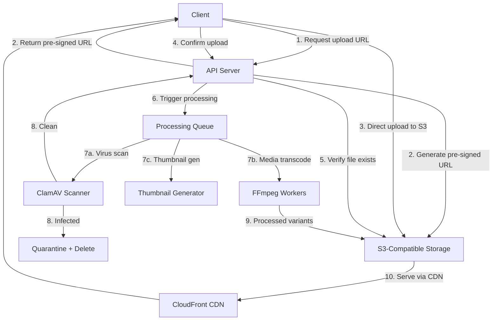

## 9.2 Bucket Organization

| Bucket | Purpose | Lifecycle | Access |
|--------|---------|-----------|--------|
| `campusos-uploads-temp` | Temporary uploads before processing | Auto-delete after 24h | Pre-signed PUT (upload), private |
| `campusos-uploads` | Confirmed user uploads (homework, documents) | Standard (no auto-delete) | Pre-signed GET (download) |
| `campusos-media` | Processed media (transcoded video, audio, thumbnails) | Standard | CDN distribution |
| `campusos-media-originals` | Original media files before transcoding | Archive to Glacier after 90 days | Private |
| `campusos-exports` | Export packages (courses, question banks) | Auto-delete after 7 days | Pre-signed GET |
| `campusos-certificates` | Generated certificate PDFs | Permanent | Public read (verification URLs) |
| `campusos-avatars` | User profile photos | Standard | CDN distribution |
| `campusos-website` | Website builder assets | Standard | CDN distribution |
| `campusos-backups` | Database backups | 30-day lifecycle | Private, cross-region replicated |

## 9.3 Upload Flow

**Pre-signed URL upload (recommended for files > 5MB):**

```typescript
// 1. Client requests upload URL
POST /api/v1/storage/upload-url
{
  "fileName": "homework_essay.pdf",
  "contentType": "application/pdf",
  "fileSize": 2048576,
  "context": "homework_submission",    // determines bucket and processing
  "metadata": {
    "homeworkId": "hw-uuid",
    "studentId": "student-uuid"
  }
}

// 2. Server responds with pre-signed URL
{
  "uploadUrl": "https://s3.amazonaws.com/campusos-uploads-temp/...",
  "fileId": "file-uuid",
  "expiresIn": 3600
}

// 3. Client uploads directly to S3 using the pre-signed URL
// 4. Client confirms upload
POST /api/v1/storage/confirm-upload
{
  "fileId": "file-uuid"
}

// 5. Server triggers processing pipeline
```

## 9.4 File Type Support

| Category | Extensions | Max Size | Processing |
|----------|-----------|----------|------------|
| Images | jpg, jpeg, png, gif, webp, svg | 25 MB | Resize, thumbnail, optimize |
| Documents | pdf, doc, docx, ppt, pptx, xls, xlsx | 50 MB | Virus scan, preview generation |
| Videos | mp4, mov, avi, webm, mkv | 2 GB | Transcode (HLS), thumbnail, preview |
| Audio | mp3, wav, ogg, m4a, flac | 100 MB | Normalize, format conversion |
| Voice recordings | webm, ogg, wav | 50 MB | Speech-to-text processing |
| Archives | zip | 500 MB | Virus scan, extraction (for imports) |
| Certificates | pdf (generated) | N/A | Generated server-side |

## 9.5 Processing Pipeline

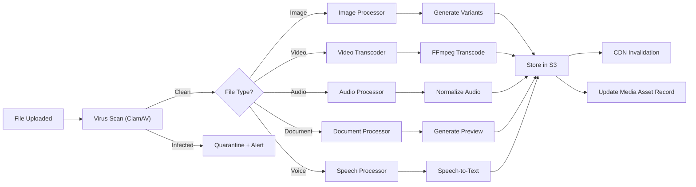

## 9.6 CDN Configuration

- **Provider:** CloudFront
- **Origins:** S3 buckets for media and static assets
- **Cache behavior:** Cache media assets for 30 days, static assets for 1 year
- **Signed URLs:** All media content served via CloudFront signed URLs with TTL = 4 hours
- **Geographic restrictions:** None (global distribution)
- **Compression:** Enabled for text-based content (HTML, CSS, JS, JSON)
- **HTTP/2:** Enabled

---

# 10. Search Architecture

## 10.1 OpenSearch Design

### Index Configuration

| Index Name | Source Entity | Fields | Refresh Interval |
|------------|-------------|--------|------------------|
| `courses` | Course | title, description, tags, subject, level, format, status, org_id, branch_id | 5s |
| `lessons` | Lesson | title, description, content_text (extracted from blocks), course_id, module_id, org_id | 5s |
| `questions` | Question | text (extracted from content JSONB), category, tags, difficulty, type, org_id | 5s |
| `discussions` | Thread + Post | title, body, forum_id, course_id, author_name, org_id | 10s |
| `users` | User | first_name, last_name, email, role, branch_id, org_id | 30s |
| `resources` | ContentBlock | text_content (extracted), type, lesson_title, course_title, org_id | 10s |

### Index Mapping Example

```json
{
  "mappings": {
    "properties": {
      "title": {
        "type": "text",
        "analyzer": "standard",
        "fields": {
          "keyword": { "type": "keyword" },
          "autocomplete": {
            "type": "text",
            "analyzer": "autocomplete_analyzer"
          }
        }
      },
      "description": { "type": "text", "analyzer": "standard" },
      "tags": { "type": "keyword" },
      "subject": { "type": "keyword" },
      "status": { "type": "keyword" },
      "organization_id": { "type": "keyword" },
      "branch_id": { "type": "keyword" },
      "created_at": { "type": "date" },
      "difficulty": { "type": "keyword" },
      "format": { "type": "keyword" }
    }
  },
  "settings": {
    "analysis": {
      "analyzer": {
        "autocomplete_analyzer": {
          "type": "custom",
          "tokenizer": "autocomplete_tokenizer",
          "filter": ["lowercase"]
        }
      },
      "tokenizer": {
        "autocomplete_tokenizer": {
          "type": "edge_ngram",
          "min_gram": 2,
          "max_gram": 20,
          "token_chars": ["letter", "digit"]
        }
      }
    }
  }
}
```

## 10.2 Query Strategy

**Full-text search with tenant scoping:**

```typescript
// search.service.ts
async search(orgId: string, branchId: string, query: SearchQueryDto): Promise<SearchResultDto> {
  const body = {
    query: {
      bool: {
        must: [
          { multi_match: { query: query.q, fields: ['title^3', 'description^2', 'tags^1.5', 'content_text'] } }
        ],
        filter: [
          { term: { organization_id: orgId } },
          ...(branchId ? [{ term: { branch_id: branchId } }] : []),
          ...(query.filters?.status ? [{ term: { status: query.filters.status } }] : []),
          ...(query.filters?.subject ? [{ term: { subject: query.filters.subject } }] : []),
        ]
      }
    },
    aggs: {
      subjects: { terms: { field: 'subject', size: 20 } },
      difficulty: { terms: { field: 'difficulty', size: 5 } },
      formats: { terms: { field: 'format', size: 10 } }
    },
    highlight: {
      fields: { title: {}, description: {}, content_text: {} }
    },
    from: query.offset || 0,
    size: query.limit || 20
  };

  return this.opensearchClient.search({ index: query.index, body });
}
```

## 10.3 Autocomplete

Edge ngram tokenizer provides prefix-based suggestions:

```
GET /api/v1/search/autocomplete?q=alg&type=courses

Response:
{
  "suggestions": [
    { "text": "Algebra I", "type": "course", "id": "..." },
    { "text": "Algorithms and Data Structures", "type": "course", "id": "..." },
    { "text": "Algebraic Geometry", "type": "course", "id": "..." }
  ]
}
```

## 10.4 Faceted Search

Aggregations return available filter values with counts:

```json
{
  "results": [...],
  "facets": {
    "subjects": [
      { "key": "mathematics", "count": 45 },
      { "key": "physics", "count": 23 }
    ],
    "difficulty": [
      { "key": "beginner", "count": 30 },
      { "key": "intermediate", "count": 28 },
      { "key": "advanced", "count": 10 }
    ]
  }
}
```

---

# 11. Media Pipeline

## 11.1 Architecture

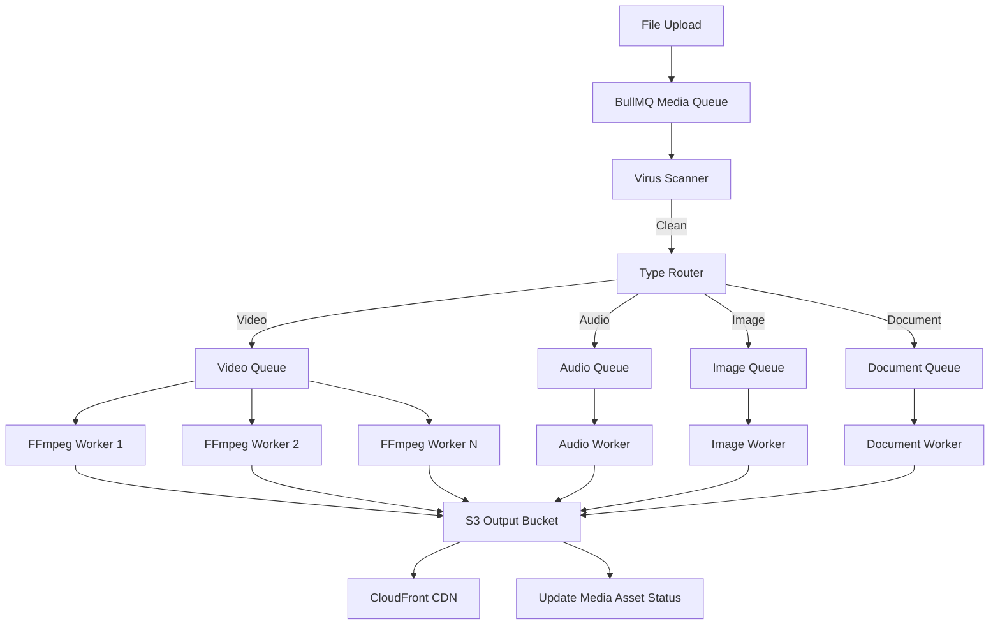

## 11.2 Video Transcoding

**Tool:** FFmpeg 6.x running in containerized workers

**Output profiles:**

| Profile | Resolution | Bitrate | Codec | Use Case |
|---------|-----------|---------|-------|----------|
| 1080p | 1920x1080 | 5 Mbps | H.264/AAC | Full quality |
| 720p | 1280x720 | 2.5 Mbps | H.264/AAC | Standard quality |
| 480p | 854x480 | 1 Mbps | H.264/AAC | Low bandwidth |
| 360p | 640x360 | 500 Kbps | H.264/AAC | Mobile/slow connection |
| audio_only | N/A | 128 Kbps | AAC | Audio-only mode |

**HLS Adaptive Bitrate Streaming:**

```bash
# FFmpeg command for HLS transcoding
ffmpeg -i input.mp4 \
  -filter_complex "[0:v]split=4[v1][v2][v3][v4]; \
    [v1]scale=1920:1080[v1out]; \
    [v2]scale=1280:720[v2out]; \
    [v3]scale=854:480[v3out]; \
    [v4]scale=640:360[v4out]" \
  -map "[v1out]" -c:v:0 libx264 -b:v:0 5M \
  -map "[v2out]" -c:v:1 libx264 -b:v:1 2.5M \
  -map "[v3out]" -c:v:2 libx264 -b:v:2 1M \
  -map "[v4out]" -c:v:3 libx264 -b:v:3 500K \
  -map 0:a -c:a aac -b:a 128k \
  -f hls -hls_time 6 -hls_playlist_type vod \
  -master_pl_name master.m3u8 \
  -var_stream_map "v:0,a:0 v:1,a:0 v:2,a:0 v:3,a:0" \
  output_%v/stream.m3u8
```

## 11.3 Audio Processing

- **Normalization:** Loudness normalization to -16 LUFS
- **Format conversion:** All audio converted to AAC (.m4a) for universal playback
- **Waveform generation:** Visual waveform data (JSON) generated for audio player UI

## 11.4 Thumbnail Generation

| Source | Thumbnail Specs | Generation Method |
|--------|----------------|-------------------|
| Video | 640x360 JPEG, quality 80 | FFmpeg frame extraction at 10% duration |
| Image | 300x300 JPEG, quality 75 (cover fit) | Sharp.js resize |
| PDF | 800x600 PNG of first page | pdf-to-img (Poppler) |
| Presentation | 800x600 PNG of first slide | LibreOffice headless conversion |

## 11.5 Queue Design

**Queue names and priority:**

| Queue | Priority | Concurrency | Purpose |
|-------|----------|-------------|---------|
| `media:virus-scan` | High | 4 | Virus scanning (must complete before processing) |
| `media:video-transcode` | Normal | 2 per worker | Video transcoding (CPU-intensive) |
| `media:audio-process` | Normal | 4 per worker | Audio processing |
| `media:image-process` | Low | 8 per worker | Image resizing and optimization |
| `media:document-process` | Low | 4 per worker | Document preview generation |
| `media:thumbnail` | Low | 8 per worker | Thumbnail generation |

---

# 12. Voice Architecture

## 12.1 Provider Abstraction

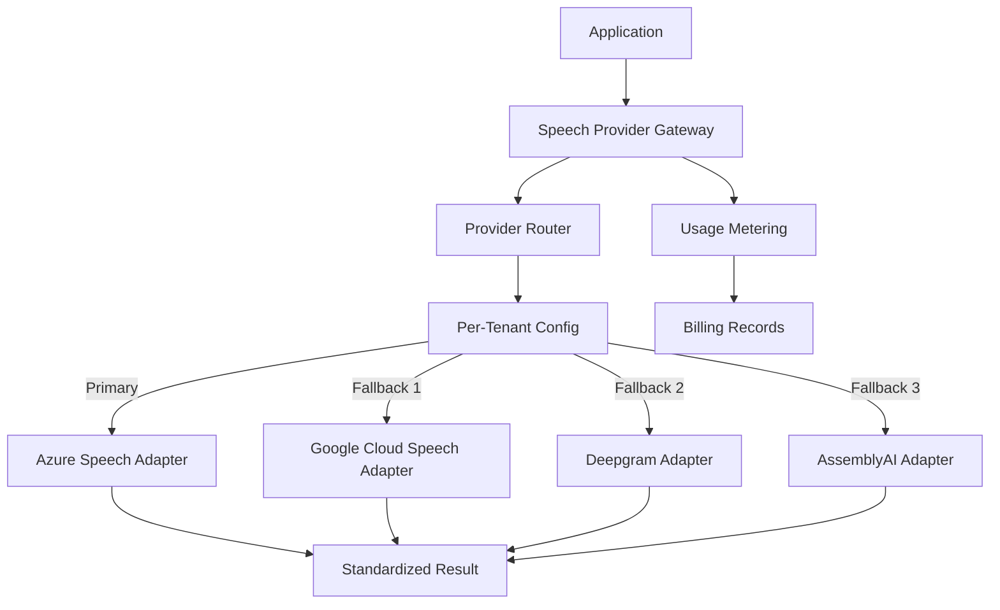

## 12.2 Provider Interface

```typescript
// speech-provider.interface.ts
export interface SpeechProvider {
  readonly name: string;
  readonly capabilities: SpeechCapabilities;

  transcribe(audio: AudioInput, config: TranscribeConfig): Promise<TranscriptionResult>;

  assessPronunciation(
    audio: AudioInput,
    referenceText: string,
    config: PronunciationConfig,
  ): Promise<PronunciationResult>;

  healthCheck(): Promise<boolean>;
}

export interface SpeechCapabilities {
  supportsTranscription: boolean;
  supportsPronunciationAssessment: boolean;
  supportsPhonemeScoring: boolean;
  supportsStreaming: boolean;
  supportedLanguages: string[];
}

export interface PronunciationResult {
  overallScore: number;        // 0-100
  fluencyScore: number;        // 0-100
  completenessScore: number;   // 0-100
  accuracyScore: number;       // 0-100
  transcript: string;
  words: WordScore[];
  phonemes?: PhonemeScore[];   // Provider-dependent
  provider: string;
  modelVersion: string;
  processingTimeMs: number;
}

export interface WordScore {
  word: string;
  score: number;               // 0-100
  errorType: 'none' | 'mispronunciation' | 'omission' | 'insertion';
  startOffset: number;         // milliseconds
  endOffset: number;
}
```

## 12.3 Pronunciation Scoring Flow

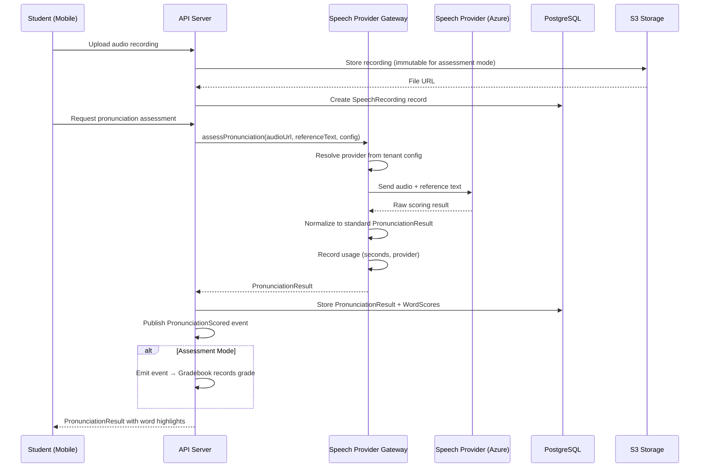

## 12.4 Failover Strategy

1. Gateway attempts primary provider for tenant
2. On failure (HTTP error, timeout > 10s), falls back to next provider in priority chain
3. Fallback providers must support the same capability (e.g., pronunciation assessment)
4. If all providers fail, return 503 Service Unavailable with retry header
5. Provider health is checked every 60 seconds via health check endpoint
6. Degraded providers are temporarily removed from rotation for 5 minutes

## 12.5 Usage Metering

- Every provider call records: organization_id, provider, audio_duration_seconds, timestamp
- Usage aggregated hourly by background job
- Thresholds checked against organization's quota (from module license)
- Alert emitted at 80% and 95% of quota
- Service degraded (practice mode only) at 100% quota until reset or upgrade

## 12.6 Privacy and Retention

- Audio recordings for practice mode: retained for 7 days, then auto-deleted
- Audio recordings for assessment mode: retained for duration of enrollment + 1 year (immutable)
- Pronunciation scores: retained with gradebook data (same retention as grades)
- Audio is never shared across organizations
- S3 Object Lock used for assessment recordings (COMPLIANCE mode)

---

# 13. AI Architecture

## 13.1 AI Orchestration Layer

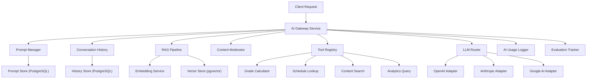

## 13.2 LLM Abstraction

```typescript
// llm-provider.interface.ts
export interface LLMProvider {
  readonly name: string;
  readonly models: string[];

  chat(request: ChatRequest): Promise<ChatResponse>;
  chatStream(request: ChatRequest): AsyncIterable<ChatChunk>;
  embed(texts: string[]): Promise<number[][]>;
  countTokens(text: string): number;
}

export interface ChatRequest {
  model: string;
  messages: ChatMessage[];
  temperature?: number;      // 0-2, default 0.7
  maxTokens?: number;
  tools?: ToolDefinition[];
  responseFormat?: 'text' | 'json';
}

export interface ChatMessage {
  role: 'system' | 'user' | 'assistant' | 'tool';
  content: string;
  toolCallId?: string;
  toolCalls?: ToolCall[];
}
```

## 13.3 Prompt Management

- Prompts stored in PostgreSQL with version history
- Each prompt has: name, version, template (with variables), model, temperature, max_tokens
- Active version per prompt is cached in Redis (TTL: 5 min)
- A/B testing supported via prompt variants with traffic allocation

```sql
CREATE TABLE ai_prompts (
  id UUID PRIMARY KEY DEFAULT gen_random_uuid(),
  name VARCHAR(200) NOT NULL UNIQUE,
  description TEXT,
  template TEXT NOT NULL,                -- Handlebars template with {{variables}}
  variables JSONB NOT NULL DEFAULT '[]', -- Variable definitions with types
  model VARCHAR(100) NOT NULL,
  temperature DECIMAL(2,1) NOT NULL DEFAULT 0.7,
  max_tokens INTEGER NOT NULL DEFAULT 1000,
  version INTEGER NOT NULL DEFAULT 1,
  is_active BOOLEAN NOT NULL DEFAULT false,
  created_at TIMESTAMPTZ NOT NULL DEFAULT NOW(),
  created_by UUID NOT NULL REFERENCES users(id)
);
```

## 13.4 RAG Pipeline

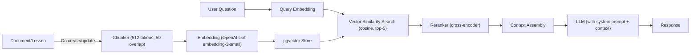

**pgvector table:**

```sql
CREATE TABLE ai_embeddings (
  id UUID PRIMARY KEY DEFAULT gen_random_uuid(),
  organization_id UUID NOT NULL,
  source_type VARCHAR(50) NOT NULL,     -- 'lesson', 'question', 'course'
  source_id UUID NOT NULL,
  chunk_index INTEGER NOT NULL,
  content TEXT NOT NULL,
  embedding vector(1536) NOT NULL,      -- OpenAI text-embedding-3-small dimension
  metadata JSONB NOT NULL DEFAULT '{}',
  created_at TIMESTAMPTZ NOT NULL DEFAULT NOW()
);

CREATE INDEX idx_embeddings_vector ON ai_embeddings
  USING ivfflat (embedding vector_cosine_ops) WITH (lists = 100);
CREATE INDEX idx_embeddings_source ON ai_embeddings(source_type, source_id);
CREATE INDEX idx_embeddings_org ON ai_embeddings(organization_id);
```

## 13.5 Tool Calling

Registered tools allow LLMs to query platform data:

```typescript
const tools: ToolDefinition[] = [
  {
    name: 'search_courses',
    description: 'Search for courses by keyword, subject, or level',
    parameters: {
      type: 'object',
      properties: {
        query: { type: 'string', description: 'Search query' },
        subject: { type: 'string', description: 'Subject filter' },
      },
      required: ['query'],
    },
    handler: async (params) => courseSearchService.search(tenantContext, params),
  },
  {
    name: 'get_student_progress',
    description: 'Get a student\'s progress in a course',
    parameters: {
      type: 'object',
      properties: {
        studentId: { type: 'string' },
        courseId: { type: 'string' },
      },
      required: ['studentId', 'courseId'],
    },
    handler: async (params) => completionService.getProgress(params.studentId, params.courseId),
  },
];
```

## 13.6 Content Moderation

- All user inputs to AI are screened for harmful content before LLM processing
- All LLM outputs are screened before returning to user
- Uses OpenAI Moderation API as primary filter
- Custom regex patterns for platform-specific prohibited content
- Moderation results logged for compliance review

## 13.7 AI Usage Logging

Every AI interaction is logged:

```sql
CREATE TABLE ai_usage_logs (
  id UUID PRIMARY KEY DEFAULT gen_random_uuid(),
  organization_id UUID NOT NULL,
  user_id UUID NOT NULL,
  prompt_name VARCHAR(200),
  model VARCHAR(100) NOT NULL,
  input_tokens INTEGER NOT NULL,
  output_tokens INTEGER NOT NULL,
  latency_ms INTEGER NOT NULL,
  status VARCHAR(20) NOT NULL,  -- 'success', 'error', 'moderated'
  cost_usd DECIMAL(10,6),
  created_at TIMESTAMPTZ NOT NULL DEFAULT NOW()
);
```

---

# 14. Security Architecture

## 14.1 Authentication Security

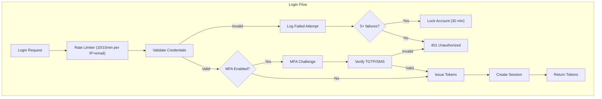

## 14.2 JWT Security

| Measure | Implementation |
|---------|---------------|
| Algorithm | RS256 (RSA-SHA256, asymmetric) |
| Key rotation | Automatic every 90 days, JWKS endpoint for verification |
| Token binding | Optional: bind access token to device fingerprint |
| Blacklisting | Redis-based blacklist for revoked tokens |
| Payload encryption | Sensitive claims encrypted with AES-256-GCM |
| JWKS endpoint | `/.well-known/jwks.json` for public key distribution |

## 14.3 MFA Implementation

**TOTP (Time-based One-Time Password):**
- Secret generated with `otpauth` library (160-bit secret)
- QR code generated for authenticator app enrollment
- 6-digit codes, 30-second window, ±1 window tolerance
- 10 backup codes generated on setup (bcrypt hashed, single-use)

**SMS-based MFA:**
- 6-digit code sent via SMS provider
- Code valid for 5 minutes
- Max 3 SMS codes per hour per user

## 14.4 Encryption

| Data Type | At Rest | In Transit |
|-----------|---------|------------|
| Database | AES-256 (managed service encryption) | TLS 1.3 (PostgreSQL SSL) |
| Object Storage | AES-256-SSE (S3 server-side encryption) | TLS 1.3 (HTTPS) |
| Redis | Not encrypted (in VPC, no sensitive data stored as values) | TLS 1.2+ |
| API traffic | N/A | TLS 1.3 (required, no fallback) |
| Passwords | bcrypt (cost factor 12) | N/A (never stored plaintext) |
| MFA secrets | AES-256-GCM (application-level) | TLS 1.3 |
| API keys | SHA-256 hash stored, full key shown once | TLS 1.3 |

## 14.5 OWASP Top 10 Mitigations

| Threat | Mitigation |
|--------|-----------|
| A01: Broken Access Control | RBAC + ABAC guards on every endpoint, RLS in PostgreSQL |
| A02: Cryptographic Failures | TLS 1.3 everywhere, AES-256 at rest, no custom crypto |
| A03: Injection | Parameterized queries (TypeORM), input validation (class-validator) |
| A04: Insecure Design | Threat modeling in design phase, principle of least privilege |
| A05: Security Misconfiguration | Hardened container images, security headers, no debug in prod |
| A06: Vulnerable Components | Automated dependency scanning (Snyk/Dependabot), weekly updates |
| A07: Auth Failures | JWT with RS256, refresh token rotation, MFA, account lockout |
| A08: Data Integrity Failures | Code signing, integrity checks on deployments, audit logs |
| A09: Logging Failures | Comprehensive audit logging, tamper-evident audit schema |
| A10: SSRF | URL validation, blocklist for internal IPs, no user-controlled URLs in server-side requests |

## 14.6 Security Headers

```typescript
// security-headers.middleware.ts
app.use(helmet({
  contentSecurityPolicy: {
    directives: {
      defaultSrc: ["'self'"],
      scriptSrc: ["'self'"],
      styleSrc: ["'self'", "'unsafe-inline'"],  // Required for some UI frameworks
      imgSrc: ["'self'", 'data:', 'https://*.cloudfront.net'],
      mediaSrc: ["'self'", 'https://*.cloudfront.net'],
      connectSrc: ["'self'", 'wss:', 'https://api.campusos.com'],
    },
  },
  hsts: { maxAge: 31536000, includeSubDomains: true, preload: true },
  frameguard: { action: 'deny' },
  referrerPolicy: { policy: 'strict-origin-when-cross-origin' },
}));
```

## 14.7 Exam Security

**Anti-cheat measures enforced server-side:**

| Measure | Client | Server |
|---------|--------|--------|
| Tab switch detection | Sends event | Logs violation, checks threshold |
| Window blur detection | Sends event | Logs violation |
| Full-screen exit | Detects, sends event | Logs violation |
| Clipboard monitoring | Detects copy/paste, sends event | Logs violation |
| Copy/paste restriction | Disables via JS | Validates no copy/paste in responses |
| Time enforcement | Client-side timer (display only) | **Server-side timer is authoritative** |
| Auto-submit on violations | N/A | Server triggers auto-submit at threshold |
| Webcam snapshots | Captures, uploads | Stores, available for proctor review |
| IP restrictions | N/A | Validates client IP against quiz config |
| Browser lockdown | Detects if in lockdown browser | Validates browser agent if required |

**Critical:** All anti-cheat decisions are made server-side. Client-side measures are defense-in-depth but the server is the authority.

## 14.8 File Scanning

- All uploaded files scanned by ClamAV before processing
- Scans run in isolated containers to prevent breakout
- Infected files quarantined in separate S3 bucket, original deleted
- Alert sent to ops team on any detection
- Scan results logged in audit trail

## 14.9 Secrets Management

- Application secrets stored in AWS Secrets Manager / HashiCorp Vault
- No secrets in environment variables, config files, or source code
- JWT signing keys stored in secret manager with automatic rotation
- Database credentials rotated every 90 days
- API keys for external services managed centrally

---

# 15. Caching Strategy

## 15.1 Redis Architecture

**Deployment:** Redis 7+ Cluster (3 primaries, 3 replicas in production)

**Data Segregation:** Redis key prefixes isolate concerns:

```
auth:*          — Authentication (blacklist, sessions, rate limits)
rbac:*          — Permission cache
ff:*            — Feature flags
lms:*           — LMS data cache
assess:*        — Assessment active data
gradebook:*     — Grade summaries
gamify:*        — Leaderboards, streaks
search:*        — Search suggestions
media:*         — Media processing status
ai:*            — AI conversation history, prompt cache
notify:*        — Notification delivery status
schedule:*      — Calendar cache
msg:*           — Messaging unread counts
crm:*           — CRM pipeline cache
```

## 15.2 Cache Key Patterns

| Key Pattern | Data | TTL | Invalidation |
|-------------|------|-----|-------------|
| `auth:blacklist:{tokenHash}` | Revoked token marker | Token remaining TTL | N/A (auto-expires) |
| `auth:sessions:{userId}` | Active session IDs | 30 days | On logout/revocation |
| `auth:attempts:{ip}:{email}` | Login attempt count | 15 min | N/A (auto-expires) |
| `rbac:{userId}:permissions` | User permission set | 5 min | On role/permission change event |
| `ff:{orgId}:flags` | Feature flag state map | 60s | On feature flag toggle event |
| `lms:courses:{branchId}:list` | Course list page | 5 min | On course create/update/delete |
| `lms:course:{courseId}` | Full course detail | 10 min | On course update |
| `lms:progress:{userId}:{courseId}` | Completion progress | 2 min | On completion event |
| `assess:attempt:{attemptId}` | Active quiz attempt data | Quiz TTL + 10 min | On submit |
| `gradebook:summary:{studentId}:{courseId}` | Grade summary | 5 min | On grade change |
| `gamify:leaderboard:{scope}:{scopeId}` | Sorted set of scores | 5 min | On leaderboard recalculation |
| `gamify:streak:{userId}:{type}` | Current streak count | 1 day | On activity |
| `schedule:timetable:{branchId}:{week}` | Weekly timetable | 30 min | On schedule change |
| `msg:unread:{userId}` | Unread message count | N/A (updated in real-time) | On message read |

## 15.3 Cache Invalidation Strategy

**Event-driven invalidation (primary):**

```typescript
// cache-invalidation.event-handler.ts
@OnEvent('course.updated')
async handleCourseUpdated(event: CourseUpdatedEvent) {
  const course = await this.courseRepo.findById(event.courseId);

  await Promise.all([
    this.cache.del(`lms:course:${event.courseId}`),
    this.cache.del(`lms:courses:${course.branchId}:list`),
  ]);
}

@OnEvent('membership.changed')
async handleMembershipChanged(event: MembershipChangedEvent) {
  await this.cache.del(`rbac:${event.userId}:permissions`);
}
```

**Pattern-based invalidation:** For bulk operations (course import, bulk enrollment), use pattern-based deletion:

```typescript
// Delete all cached course lists for a branch
await this.cache.delPattern(`lms:courses:${branchId}:*`);
```

## 15.4 Distributed Locks

**Use Redlock algorithm** for operations requiring mutual exclusion:

| Lock | Purpose | TTL | Retry |
|------|---------|-----|-------|
| `lock:quiz:submit:{attemptId}` | Prevent double-submit of quiz | 30s | 3x, 100ms delay |
| `lock:grade:finalize:{courseId}` | Grade finalization (approval workflow) | 60s | 3x, 200ms delay |
| `lock:leaderboard:recalc:{scope}` | Leaderboard recalculation | 120s | No retry |
| `lock:enrollment:bulk:{operationId}` | Bulk enrollment | 300s | No retry |
| `lock:payment:process:{invoiceId}` | Payment processing | 60s | 3x, 100ms delay |
| `lock:export:{jobId}` | Content export | 600s | No retry |

## 15.5 Session Storage

**JWT-based sessions with Redis blacklist:**
- Sessions are stateless via JWT (no server-side session storage for request authentication)
- Redis stores only: token blacklist, active session metadata (for admin session listing), and rate limit counters
- This approach scales horizontally without sticky sessions

---

# 16. Background Jobs

## 16.1 Queue Architecture

**Technology:** BullMQ (Redis-backed job queue for Node.js)

**Queue topology:**

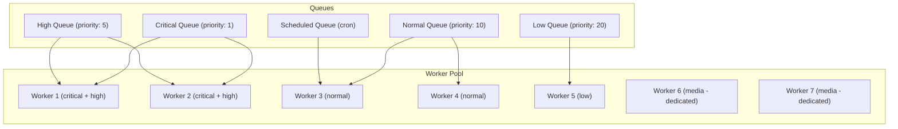

## 16.2 Queue Definitions

| Queue Name | Priority | Concurrency | Job Types |
|-----------|----------|-------------|-----------|
| `critical` | 1 | 4 | Payment processing, grade recording, enrollment changes |
| `notifications` | 5 | 8 | Email, SMS, push, WhatsApp, Telegram dispatch |
| `assessment` | 5 | 4 | Auto-grading, quiz auto-submit, anti-cheat processing |
| `media` | 10 | 2 per worker | Video transcode, audio processing, thumbnail generation |
| `search` | 10 | 4 | OpenSearch indexing, bulk reindex |
| `analytics` | 15 | 4 | Aggregation computation, report generation |
| `export-import` | 15 | 2 | Content export, content import, bulk enrollment |
| `maintenance` | 20 | 2 | Session cleanup, temp file cleanup, old data archival |
| `webhooks` | 10 | 4 | Webhook delivery and retry |
| `gamification` | 10 | 4 | Badge evaluation, leaderboard recalculation, certificate generation |
| `ai` | 10 | 4 | Embedding generation, RAG indexing |
| `scheduled` | 10 | 2 | Cron jobs: reminders, digests, sync tasks |

## 16.3 Retry Strategy

```typescript
// Default retry config for BullMQ
const defaultJobOptions: JobsOptions = {
  attempts: 3,
  backoff: {
    type: 'exponential',
    delay: 1000,    // 1s, 2s, 4s
  },
  removeOnComplete: {
    age: 86400,     // Keep completed jobs for 24h
    count: 1000,    // Keep last 1000 completed
  },
  removeOnFail: false,  // Failed jobs stay for inspection
};

// Critical jobs get more retries
const criticalJobOptions: JobsOptions = {
  attempts: 5,
  backoff: {
    type: 'exponential',
    delay: 2000,    // 2s, 4s, 8s, 16s, 32s
  },
  removeOnFail: false,
};
```

## 16.4 Scheduled Jobs

| Job | Schedule | Priority | Description |
|-----|----------|----------|-------------|
| Homework reminder | `0 */6 * * *` (every 6h) | Normal | Check for homework due within 24h, send reminders |
| Homework overdue check | `0 * * * *` (hourly) | Normal | Mark overdue homework, trigger notifications |
| Streak check | `0 2 * * *` (daily at 2 AM) | Low | Check and break inactive streaks |
| Leaderboard recalculation | `*/5 * * * *` (every 5 min) | Low | Recalculate all active leaderboards |
| Digest compilation | `0 8 * * *` (daily at 8 AM) | Normal | Compile and send daily notification digests |
| Calendar sync | `*/15 * * * *` (every 15 min) | Low | Sync with Google/Microsoft calendars |
| Usage aggregation | `0 */1 * * *` (hourly) | Low | Aggregate speech/AI usage for billing |
| Session cleanup | `0 3 * * *` (daily at 3 AM) | Low | Remove expired sessions from database |
| Temp file cleanup | `0 4 * * *` (daily at 4 AM) | Low | Delete expired temp uploads from S3 |
| Audit archival | `0 5 * * 0` (weekly Sunday 5 AM) | Low | Archive old audit logs to cold storage |
| Backup verification | `0 6 * * 1` (weekly Monday 6 AM) | Low | Restore backup to staging, verify |
| Follow-up reminders | `0 9 * * 1-5` (weekdays 9 AM) | Normal | CRM follow-up reminders |
| Payment reminders | `0 10 * * *` (daily 10 AM) | High | Payment due/overdue reminders |
| Recurring payments | `0 0 * * *` (daily midnight) | Critical | Process scheduled recurring payments |
| Analytics aggregation | `0 1 * * *` (daily 1 AM) | Low | Compute daily analytics aggregates |

## 16.5 Dead Letter Queue Handling

When a job exhausts all retries:
1. Job moved to DLQ (separate BullMQ queue: `{queueName}-dlq`)
2. Alert sent to monitoring channel (Slack/PagerDuty based on priority)
3. DLQ jobs inspectable via admin dashboard
4. Manual retry available with modified parameters
5. DLQ depth monitored, alerts at thresholds (see §6.4)

---

# 17. Integration Architecture

## 17.1 Integration Pattern

All external integrations follow the **Adapter Pattern**:

```typescript
// Generic integration interface
interface IntegrationAdapter<TConfig, TResult> {
  readonly name: string;
  initialize(config: TConfig): Promise<void>;
  healthCheck(): Promise<boolean>;
  execute(request: unknown): Promise<TResult>;
}
```

Each integration category has:
1. **Abstract interface** defining the contract
2. **Multiple adapter implementations** (one per provider)
3. **Factory** for adapter selection based on tenant configuration
4. **Fallback chain** for critical integrations

## 17.2 Payment Integrations

| Provider | Adapter | Capabilities |
|----------|---------|-------------|
| Stripe | `StripePaymentAdapter` | Cards, bank transfer, recurring, refunds |
| PayPal | `PayPalPaymentAdapter` | PayPal balance, cards, refunds |
| Payme (UZ) | `PaymePaymentAdapter` | Local payment (Uzbekistan) |
| Click (UZ) | `ClickPaymentAdapter` | Local payment (Uzbekistan) |

```typescript
// payment-gateway.interface.ts
export interface PaymentGateway {
  createPaymentIntent(amount: number, currency: string, metadata: Record<string, string>): Promise<PaymentIntent>;
  confirmPayment(intentId: string): Promise<PaymentResult>;
  refund(paymentId: string, amount?: number): Promise<RefundResult>;
  createSubscription(customerId: string, planId: string): Promise<SubscriptionResult>;
  handleWebhook(payload: Buffer, signature: string): Promise<WebhookEvent>;
}
```

## 17.3 Email Integration

**Provider:** AWS SES (primary), SendGrid (fallback)

- Template-based emails with Handlebars templates
- Bounce and complaint handling via SNS webhooks
- Email verification for new accounts
- Rate limiting: 50 emails/second per tenant
- Unsubscribe links mandatory (CAN-SPAM compliance)

## 17.4 SMS Integration

**Provider:** Twilio (primary)

- Template-based SMS with variable substitution
- Delivery status tracking via Twilio webhooks
- Usage-based billing per tenant (credits system)
- Country-specific routing rules
- Opt-out management (STOP keyword handling)

## 17.5 WhatsApp Integration

**Provider:** WhatsApp Business API (via Meta Cloud API)

- Template messages for notifications (pre-approved by WhatsApp)
- Session messages for conversations
- Media message support (images, documents)
- Delivery and read receipts

## 17.6 Telegram Integration

**Provider:** Telegram Bot API

- Bot per organization (optional)
- Notification delivery as Telegram messages
- Deep links to platform content
- Inline keyboard for quick actions

## 17.7 Calendar Integration

**Providers:** Google Calendar API, Microsoft Graph Calendar API

```typescript
// calendar-sync.interface.ts
export interface CalendarProvider {
  authorize(redirectUrl: string): string;
  handleCallback(code: string): Promise<CalendarTokens>;
  listEvents(calendarId: string, timeMin: Date, timeMax: Date): Promise<CalendarEvent[]>;
  createEvent(calendarId: string, event: CalendarEventInput): Promise<CalendarEvent>;
  updateEvent(calendarId: string, eventId: string, event: Partial<CalendarEventInput>): Promise<CalendarEvent>;
  deleteEvent(calendarId: string, eventId: string): Promise<void>;
}
```

**Sync strategy:**
- Bidirectional sync every 15 minutes (configurable)
- Webhook-based real-time sync (Google Push Notifications / Microsoft Graph subscriptions)
- Conflict resolution: platform is source of truth; external changes create notifications for user review

## 17.8 SSO / LDAP / SAML

**SSO Providers:**
- Google Workspace (OAuth 2.0)
- Microsoft Azure AD (OAuth 2.0 / SAML 2.0)
- Okta (SAML 2.0)
- Generic SAML 2.0 IdP
- Generic LDAP/LDAPS directory

**SAML flow:**

```mermaid
sequenceDiagram
    participant User
    participant SP as CampusOS (Service Provider)
    participant IdP as Identity Provider

    User->>SP: Access login page
    SP->>SP: Generate SAML AuthnRequest
    SP->>IdP: Redirect with AuthnRequest
    IdP->>User: Login form
    User->>IdP: Submit credentials
    IdP->>IdP: Authenticate, create SAML Assertion
    IdP->>SP: POST /auth/saml/callback with SAMLResponse
    SP->>SP: Validate signature, extract attributes
    SP->>SP: Create/update user, issue JWT
    SP->>User: Redirect to dashboard with JWT
```

---

# 18. Scalability Strategy

## 18.1 Horizontal Scaling

### Application Tier

```mermaid
graph TB
    LB["Load Balancer (ALB)"] --> APP1["App Instance 1"]
    LB --> APP2["App Instance 2"]
    LB --> APP3["App Instance 3"]
    LB --> APPN["App Instance N"]

    APP1 --> PG_POOL["PgBouncer Connection Pool"]
    APP2 --> PG_POOL
    APP3 --> PG_POOL
    APPN --> PG_POOL

    PG_POOL --> PG_PRIMARY["PostgreSQL Primary"]
    PG_POOL --> PG_REPLICA1["PostgreSQL Replica 1"]
    PG_POOL --> PG_REPLICA2["PostgreSQL Replica 2"]

    APP1 --> REDIS["Redis Cluster"]
    APP2 --> REDIS
    APP3 --> REDIS
    APPN --> REDIS
```

**Stateless application design:**
- No server-side sessions (JWT-based)
- No local file storage (S3 for all files)
- No in-memory caches beyond Redis
- WebSocket connections use Redis adapter for multi-instance pub/sub
- Any instance can handle any request

**Auto-scaling policy:**
- Scale up: CPU > 70% for 3 minutes OR memory > 80% for 3 minutes
- Scale down: CPU < 30% for 10 minutes AND memory < 50% for 10 minutes
- Min instances: 3 (production), 1 (staging)
- Max instances: 20 (adjustable)

## 18.2 Database Scaling

### Connection Pooling

**PgBouncer** sits between application instances and PostgreSQL:
- Pool mode: Transaction (default), Session (for LISTEN/NOTIFY)
- Max connections per pool: 100
- Default pool size: 20 per application instance
- Reserve pool: 5 connections for admin operations

### Read Replicas

- 2 read replicas in production
- Reads routed to replicas: analytics queries, search indexing, report generation, dashboard data
- Writes always go to primary
- Replication lag monitoring: alert if > 5 seconds

```typescript
// TypeORM configuration for read replicas
TypeOrmModule.forRoot({
  type: 'postgres',
  replication: {
    master: { host: 'pg-primary', port: 5432, username: '...', password: '...', database: 'campusos' },
    slaves: [
      { host: 'pg-replica-1', port: 5432, username: '...', password: '...', database: 'campusos' },
      { host: 'pg-replica-2', port: 5432, username: '...', password: '...', database: 'campusos' },
    ],
  },
});
```

## 18.3 Future Microservice Extraction

**Extraction Priority (when operational pressure justifies it):**

| Priority | Module | Trigger | Benefit |
|----------|--------|---------|---------|
| 1 | Auth | Token validation becomes bottleneck | Independent scaling, security isolation |
| 2 | Assessment Engine | Concurrent exam load spikes | Independent scaling during exam periods |
| 3 | Media Pipeline | Already isolated workers | Fully independent lifecycle |
| 4 | AI Gateway | Usage patterns differ from CRUD | Independent scaling, cost optimization |
| 5 | Notifications | High fanout during bulk operations | Independent scaling |
| 6 | Search | Index operations impact API latency | Isolation from core API |

**Extraction strategy:**
1. Module already has clear service interfaces (enforced by module boundary rules)
2. Extract module into independent NestJS application
3. Replace in-process service calls with REST/gRPC + events
4. Each extracted service gets its own database (where data isolation justifies it)
5. Shared data accessed via events (eventually consistent) or lightweight REST
6. Deploy as independent Kubernetes Deployment with its own HPA

## 18.4 CDN Strategy

| Content Type | CDN Caching | Cache Duration |
|-------------|-------------|----------------|
| Static assets (JS, CSS, fonts) | Edge cached | 1 year (versioned filenames) |
| Media (video, audio, images) | Edge cached | 30 days |
| API responses | Not cached at CDN | N/A (dynamic) |
| Public pages (website builder) | Edge cached | 5 minutes |
| Certificates (verification) | Edge cached | 1 hour |

---

# 19. Monitoring

## 19.1 Observability Stack

```mermaid
graph TB
    APP["Application"] -->|"Metrics"| OTEL["OpenTelemetry Collector"]
    APP -->|"Logs"| OTEL
    APP -->|"Traces"| OTEL

    OTEL -->|"Metrics"| PROM["Prometheus"]
    OTEL -->|"Logs"| LOKI["Grafana Loki"]
    OTEL -->|"Traces"| TEMPO["Grafana Tempo"]

    PROM --> GRAFANA["Grafana Dashboards"]
    LOKI --> GRAFANA
    TEMPO --> GRAFANA

    GRAFANA --> ALERTS["Alert Manager"]
    ALERTS --> PAGER["PagerDuty"]
    ALERTS --> SLACK["Slack"]
    ALERTS --> EMAIL_ALERT["Email"]

    APP -->|"Errors"| SENTRY["Sentry"]
```

## 19.2 Logging

**Structured JSON logging** via `pino` (NestJS native logger):

```typescript
// Log format
{
  "level": "info",
  "time": "2026-07-14T12:00:00.000Z",
  "msg": "Course created",
  "traceId": "abc123",
  "spanId": "def456",
  "organizationId": "org-uuid",
  "userId": "user-uuid",
  "resourceType": "course",
  "resourceId": "course-uuid",
  "duration": 45,
  "service": "lms"
}
```

**Log levels:**
- `error`: Application errors requiring attention
- `warn`: Unexpected conditions that don't prevent operation
- `info`: Business events (course created, payment received)
- `debug`: Technical details (query plans, cache hits/misses)
- `trace`: Detailed tracing (disabled in production)

## 19.3 Metrics

**Key metrics exported via OpenTelemetry:**

| Metric | Type | Labels | Alert Threshold |
|--------|------|--------|----------------|
| `http_request_duration_seconds` | Histogram | method, route, status | p95 > 300ms |
| `http_requests_total` | Counter | method, route, status | Error rate > 1% |
| `db_query_duration_seconds` | Histogram | operation, table | p95 > 100ms |
| `redis_operation_duration_seconds` | Histogram | operation | p95 > 10ms |
| `queue_job_duration_seconds` | Histogram | queue, job_type | Varies by queue |
| `queue_depth` | Gauge | queue | > 1000 (non-media) |
| `active_websocket_connections` | Gauge | — | > 10,000 |
| `auth_login_attempts_total` | Counter | method, status | Failed > 100/min |
| `search_query_duration_seconds` | Histogram | index | p95 > 500ms |
| `media_transcode_duration_seconds` | Histogram | profile | > 10min for 720p |
| `speech_provider_latency_seconds` | Histogram | provider | p95 > 5s |
| `ai_request_duration_seconds` | Histogram | model, prompt | p95 > 10s |
| `tenant_storage_bytes` | Gauge | organization_id | > quota |

## 19.4 Health Checks

```
GET /health              → 200 OK (basic liveness)
GET /health/ready        → 200 OK if all dependencies healthy
GET /health/detailed     → 200 OK with dependency status (admin only)
```

**Detailed health response:**

```json
{
  "status": "healthy",
  "uptime": 86400,
  "version": "1.2.3",
  "dependencies": {
    "postgresql": { "status": "healthy", "latency": 2 },
    "redis": { "status": "healthy", "latency": 1 },
    "opensearch": { "status": "healthy", "latency": 5 },
    "s3": { "status": "healthy", "latency": 15 },
    "bullmq": { "status": "healthy", "queued": 42 }
  }
}
```

## 19.5 Dashboards

| Dashboard | Purpose | Key Panels |
|-----------|---------|------------|
| Platform Overview | High-level health | Request rate, error rate, latency p50/p95/p99, active users |
| API Performance | Endpoint-level metrics | Slowest endpoints, error rates by endpoint, request distribution |
| Database | PostgreSQL health | Query latency, connections, replication lag, table sizes |
| Queue Health | BullMQ monitoring | Queue depth, processing rate, failed jobs, DLQ depth |
| Tenant Dashboard | Per-tenant metrics | Storage usage, API calls, user counts, module usage |
| Media Pipeline | Media processing | Transcode queue, processing time, failure rate |
| Auth & Security | Security monitoring | Login attempts, MFA usage, suspicious activity |
| AI Usage | AI feature monitoring | Token usage, latency, costs, moderation flags |

---

# 20. Disaster Recovery

## 20.1 Backup Strategy

| Component | RPO | RTO | Method |
|-----------|-----|-----|--------|
| PostgreSQL (primary) | 1 hour | 4 hours | WAL archiving + daily full backup |
| PostgreSQL (audit schema) | 1 hour | 8 hours | Separate backup stream, 7-year retention |
| Redis | N/A (reconstructable) | 15 minutes | RDB snapshots every 15 min, AOF enabled |
| S3 Objects | 0 (durable) | 0 (available) | Cross-region replication enabled |
| OpenSearch | N/A (reconstructable) | 2 hours | Snapshot to S3 daily, full reindex as fallback |
| Configuration | 0 | 30 minutes | Infrastructure as Code (Terraform), version controlled |

## 20.2 Recovery Procedures

### Database Recovery

```
1. Identify failure type (corruption, data loss, accidental deletion)
2. If point-in-time recovery needed:
   a. Restore latest base backup
   b. Replay WAL logs to target timestamp
   c. Validate data integrity
   d. Update application connection strings
3. If full restore needed:
   a. Provision new PostgreSQL instance from latest full backup
   b. Apply WAL replay
   c. Verify RLS policies
   d. Run data integrity checks
   e. Switch DNS to new instance
```

### Application Recovery

```
1. If application failure:
   a. Kubernetes auto-restarts pods (restartPolicy: Always)
   b. If persistent failure: rollback to previous deployment
   c. Argo Rollouts supports one-click rollback
2. If infrastructure failure:
   a. Kubernetes reschedules pods to healthy nodes
   b. If zone failure: multi-AZ deployment ensures availability
```

## 20.3 RPO / RTO Targets

| Tier | RPO | RTO | Scope |
|------|-----|-----|-------|
| Standard | 1 hour | 4 hours | All non-enterprise tenants |
| Enterprise | 15 minutes | 1 hour | Enterprise-tier tenants with SLA |
| Critical data (grades, payments) | 0 (synchronous replication) | 30 minutes | Specific tables |

## 20.4 Deployment Rollback

**Argo Rollouts Blue/Green deployment:**

```mermaid
graph LR
    LB["Load Balancer"] -->|"100% traffic"| BLUE["Blue (v1.2.2 - current)"]
    LB -.->|"0% traffic"| GREEN["Green (v1.2.3 - new)"]

    GREEN -->|"Health checks pass"| PROMOTE["Promote: shift traffic"]
    GREEN -->|"Health checks fail"| ROLLBACK["Auto-rollback: stay on Blue"]

    PROMOTE --> LB2["Load Balancer"]
    LB2 -->|"100% traffic"| GREEN2["Green (v1.2.3 - promoted)"]
```

- Health checks run for 5 minutes after deploy
- Automatic rollback if: error rate > 5%, p95 latency > 1s, health check failures
- Manual rollback available via `kubectl argo rollouts undo`
- Database migrations are forward-only; rollback requires separate migration

---

# 21. Folder Structure

## 21.1 Monorepo Structure

```
campusos/
├── .github/
│   └── workflows/
│       ├── ci.yml                           # Lint, type-check, unit tests on PR
│       ├── integration-tests.yml            # Integration + E2E tests on merge
│       ├── deploy-staging.yml               # Auto-deploy to staging
│       ├── deploy-production.yml            # Manual approval → production
│       └── dependency-scan.yml              # Weekly dependency security scan
│
├── apps/
│   ├── backend/                             # NestJS monolith
│   │   ├── src/
│   │   │   ├── main.ts                      # Application entry point
│   │   │   ├── app.module.ts                # Root module
│   │   │   ├── common/                      # Shared utilities
│   │   │   │   ├── decorators/
│   │   │   │   │   ├── permissions.decorator.ts
│   │   │   │   │   ├── feature-flags.decorator.ts
│   │   │   │   │   ├── tenant.decorator.ts
│   │   │   │   │   └── audit.decorator.ts
│   │   │   │   ├── guards/
│   │   │   │   │   ├── jwt-auth.guard.ts
│   │   │   │   │   ├── rbac.guard.ts
│   │   │   │   │   ├── abac.guard.ts
│   │   │   │   │   ├── feature-flag.guard.ts
│   │   │   │   │   └── tenant.guard.ts
│   │   │   │   ├── interceptors/
│   │   │   │   │   ├── logging.interceptor.ts
│   │   │   │   │   ├── transform.interceptor.ts
│   │   │   │   │   ├── timeout.interceptor.ts
│   │   │   │   │   └── audit.interceptor.ts
│   │   │   │   ├── pipes/
│   │   │   │   │   └── validation.pipe.ts
│   │   │   │   ├── filters/
│   │   │   │   │   ├── http-exception.filter.ts
│   │   │   │   │   └── all-exceptions.filter.ts
│   │   │   │   ├── middleware/
│   │   │   │   │   ├── tenant.middleware.ts
│   │   │   │   │   ├── rate-limit.middleware.ts
│   │   │   │   │   └── correlation-id.middleware.ts
│   │   │   │   ├── constants/
│   │   │   │   │   ├── error-codes.ts
│   │   │   │   │   └── defaults.ts
│   │   │   │   └── utils/
│   │   │   │       ├── pagination.util.ts
│   │   │   │       ├── hashing.util.ts
│   │   │   │       └── date.util.ts
│   │   │   │
│   │   │   ├── config/                      # Configuration
│   │   │   │   ├── database.config.ts
│   │   │   │   ├── redis.config.ts
│   │   │   │   ├── s3.config.ts
│   │   │   │   ├── opensearch.config.ts
│   │   │   │   ├── jwt.config.ts
│   │   │   │   ├── bull.config.ts
│   │   │   │   └── app.config.ts
│   │   │   │
│   │   │   ├── database/                    # Database infrastructure
│   │   │   │   ├── migrations/
│   │   │   │   ├── seeds/
│   │   │   │   └── ormconfig.ts
│   │   │   │
│   │   │   ├── modules/                     # Domain modules (see §4 for details)
│   │   │   │   ├── auth/
│   │   │   │   ├── users/
│   │   │   │   ├── organizations/
│   │   │   │   ├── branches/
│   │   │   │   ├── rbac/
│   │   │   │   ├── lms/
│   │   │   │   ├── assessment/
│   │   │   │   ├── gradebook/
│   │   │   │   ├── groups/
│   │   │   │   ├── collaboration/
│   │   │   │   ├── attendance/
│   │   │   │   ├── schedule/
│   │   │   │   ├── voice/
│   │   │   │   ├── gamification/
│   │   │   │   ├── crm/
│   │   │   │   ├── finance/
│   │   │   │   ├── payments/
│   │   │   │   ├── website-builder/
│   │   │   │   ├── marketplace/
│   │   │   │   ├── notifications/
│   │   │   │   ├── messaging/
│   │   │   │   ├── search/
│   │   │   │   ├── media/
│   │   │   │   ├── storage/
│   │   │   │   ├── ai/
│   │   │   │   ├── automation/
│   │   │   │   ├── audit/
│   │   │   │   ├── content-portability/
│   │   │   │   ├── analytics/
│   │   │   │   └── webhook/
│   │   │   │
│   │   │   └── shared/                      # Shared module (events, base classes)
│   │   │       ├── events/
│   │   │       │   ├── base.event.ts
│   │   │       │   └── event-bus.service.ts
│   │   │       ├── entities/
│   │   │       │   └── base.entity.ts
│   │   │       ├── repositories/
│   │   │       │   └── base.repository.ts
│   │   │       └── dto/
│   │   │           ├── pagination.dto.ts
│   │   │           └── base-response.dto.ts
│   │   │
│   │   ├── test/
│   │   │   ├── jest.config.ts
│   │   │   ├── setup.ts
│   │   │   ├── fixtures/
│   │   │   └── helpers/
│   │   ├── Dockerfile
│   │   ├── package.json
│   │   ├── tsconfig.json
│   │   ├── nest-cli.json
│   │   └── .env.example
│   │
│   ├── web/                                 # React web application
│   │   ├── src/
│   │   │   ├── app/
│   │   │   │   ├── routes/
│   │   │   │   ├── layouts/
│   │   │   │   └── providers/
│   │   │   ├── features/                    # Feature-based organization
│   │   │   │   ├── auth/
│   │   │   │   ├── dashboard/
│   │   │   │   ├── courses/
│   │   │   │   ├── assessment/
│   │   │   │   ├── gradebook/
│   │   │   │   ├── attendance/
│   │   │   │   ├── schedule/
│   │   │   │   ├── messaging/
│   │   │   │   ├── collaboration/
│   │   │   │   ├── gamification/
│   │   │   │   ├── voice/
│   │   │   │   ├── crm/
│   │   │   │   ├── finance/
│   │   │   │   ├── settings/
│   │   │   │   ├── analytics/
│   │   │   │   └── admin/
│   │   │   ├── components/                  # Shared UI components
│   │   │   │   ├── ui/                      # Primitives (Button, Input, Modal)
│   │   │   │   ├── forms/                   # Form components
│   │   │   │   ├── tables/                  # Data table components
│   │   │   │   ├── charts/                  # Chart components
│   │   │   │   └── layout/                  # Layout components
│   │   │   ├── hooks/                       # Custom React hooks
│   │   │   ├── services/                    # API service layer
│   │   │   ├── stores/                      # State management (Zustand)
│   │   │   ├── utils/                       # Utility functions
│   │   │   └── styles/                      # Global styles
│   │   ├── public/
│   │   ├── Dockerfile
│   │   ├── package.json
│   │   ├── tsconfig.json
│   │   └── vite.config.ts
│   │
│   ├── mobile/                              # React Native application
│   │   ├── src/
│   │   │   ├── app/
│   │   │   │   ├── navigation/
│   │   │   │   └── providers/
│   │   │   ├── features/                    # Same feature structure as web
│   │   │   │   ├── auth/
│   │   │   │   ├── dashboard/
│   │   │   │   ├── courses/
│   │   │   │   ├── assessment/
│   │   │   │   ├── homework/
│   │   │   │   ├── messaging/
│   │   │   │   ├── gamification/
│   │   │   │   ├── voice/
│   │   │   │   ├── schedule/
│   │   │   │   ├── notifications/
│   │   │   │   └── settings/
│   │   │   ├── components/
│   │   │   ├── hooks/
│   │   │   ├── services/
│   │   │   ├── stores/
│   │   │   ├── utils/
│   │   │   └── offline/                     # Offline storage and sync
│   │   │       ├── offline-storage.ts
│   │   │       ├── sync-manager.ts
│   │   │       └── queue.ts
│   │   ├── ios/
│   │   ├── android/
│   │   ├── package.json
│   │   └── tsconfig.json
│   │
│   └── desktop/                             # Electron wrapper
│       ├── src/
│       │   ├── main/
│       │   │   ├── main.ts
│       │   │   ├── menu.ts
│       │   │   └── updater.ts
│       │   └── preload/
│       │       └── preload.ts
│       ├── package.json
│       └── electron-builder.yml
│
├── packages/                                # Shared packages
│   ├── shared/                              # Shared TypeScript types and utilities
│   │   ├── src/
│   │   │   ├── types/
│   │   │   │   ├── auth.types.ts
│   │   │   │   ├── user.types.ts
│   │   │   │   ├── course.types.ts
│   │   │   │   ├── assessment.types.ts
│   │   │   │   ├── gradebook.types.ts
│   │   │   │   ├── gamification.types.ts
│   │   │   │   ├── voice.types.ts
│   │   │   │   ├── api.types.ts
│   │   │   │   └── events.types.ts
│   │   │   ├── constants/
│   │   │   │   ├── roles.ts
│   │   │   │   ├── permissions.ts
│   │   │   │   ├── content-types.ts
│   │   │   │   ├── question-types.ts
│   │   │   │   └── grade-scales.ts
│   │   │   ├── validators/
│   │   │   │   └── common.validators.ts
│   │   │   └── utils/
│   │   │       ├── date.utils.ts
│   │   │       └── formatting.utils.ts
│   │   ├── package.json
│   │   └── tsconfig.json
│   │
│   ├── ui/                                  # Shared UI component library
│   │   ├── src/
│   │   │   ├── primitives/
│   │   │   ├── composite/
│   │   │   ├── charts/
│   │   │   ├── forms/
│   │   │   └── themes/
│   │   ├── package.json
│   │   └── tsconfig.json
│   │
│   ├── sdk/                                 # API SDK (generated from OpenAPI)
│   │   ├── src/
│   │   │   ├── client.ts
│   │   │   ├── endpoints/
│   │   │   └── models/
│   │   ├── package.json
│   │   └── tsconfig.json
│   │
│   └── config/                              # Shared configuration
│       ├── eslint/
│       ├── tsconfig/
│       ├── prettier/
│       └── jest/
│
├── infrastructure/                          # Infrastructure as Code
│   ├── terraform/
│   │   ├── environments/
│   │   │   ├── development/
│   │   │   ├── staging/
│   │   │   └── production/
│   │   ├── modules/
│   │   │   ├── vpc/
│   │   │   ├── rds/
│   │   │   ├── elasticache/
│   │   │   ├── s3/
│   │   │   ├── eks/
│   │   │   ├── opensearch/
│   │   │   ├── cloudfront/
│   │   │   └── monitoring/
│   │   └── main.tf
│   ├── kubernetes/
│   │   ├── base/
│   │   │   ├── deployment.yaml
│   │   │   ├── service.yaml
│   │   │   ├── ingress.yaml
│   │   │   ├── hpa.yaml
│   │   │   ├── configmap.yaml
│   │   │   └── secrets.yaml
│   │   ├── overlays/
│   │   │   ├── staging/
│   │   │   └── production/
│   │   └── kustomization.yaml
│   └── docker/
│       ├── backend.Dockerfile
│       ├── media-worker.Dockerfile
│       ├── web.Dockerfile
│       └── docker-compose.yml               # Local development
│
├── docs/                                    # Documentation
│   ├── architecture/
│   ├── api/
│   ├── deployment/
│   ├── runbooks/
│   └── adr/                                 # Architecture Decision Records
│
├── scripts/                                 # Development and ops scripts
│   ├── setup.sh
│   ├── seed-database.sh
│   ├── generate-sdk.sh
│   └── run-migrations.sh
│
├── .agents/                                 # AI agent configuration
│   ├── AGENTS.md
│   └── skills/
│
├── package.json                             # Root package.json (workspace)
├── pnpm-workspace.yaml                      # PNPM workspace config
├── turbo.json                               # Turborepo build pipeline
├── .env.example
├── .gitignore
├── .prettierrc
├── .eslintrc.js
└── README.md
```

## 21.2 Package Manager

**Choice:** pnpm with workspaces

**Rationale:** pnpm is faster than npm/yarn for monorepos, uses hard links to save disk space, and has strict dependency resolution that prevents phantom dependencies.

## 21.3 Build System

**Choice:** Turborepo

**Rationale:** Turborepo provides incremental builds, remote caching, and task orchestration across workspace packages. It understands dependency graphs and only rebuilds what changed.

```json
// turbo.json
{
  "$schema": "https://turbo.build/schema.json",
  "pipeline": {
    "build": {
      "dependsOn": ["^build"],
      "outputs": ["dist/**"]
    },
    "test": {
      "dependsOn": ["build"]
    },
    "lint": {},
    "type-check": {
      "dependsOn": ["^build"]
    },
    "dev": {
      "cache": false,
      "persistent": true
    }
  }
}
```

---

# 22. Technology Decisions

## 22.1 Decision Matrix

| Technology | Category | Alternatives Considered | Selection Rationale |
|-----------|----------|------------------------|-------------------|
| **React 18+** | Frontend Framework | Vue.js, Angular, Svelte | Largest ecosystem, best hiring pool, excellent TypeScript support, React Server Components for future SSR, seamless sharing with React Native |
| **React Native** | Mobile Framework | Flutter, native (Swift/Kotlin) | Code sharing with React web (shared packages), single team skill set (TypeScript), near-native performance, Expo for rapid development |
| **NestJS** | Backend Framework | Express.js, Fastify, Django, FastAPI | Built-in DI container, modular architecture that mirrors DDD bounded contexts, excellent TypeScript support, built-in validation/guards/interceptors/pipes, OpenAPI generation, BullMQ integration |
| **PostgreSQL 16+** | Primary Database | MySQL, MongoDB, CockroachDB | RLS for tenant isolation, JSONB for flexible schema, table partitioning, pgvector for AI embeddings, mature ecosystem, ACID transactions, excellent indexing |
| **Redis 7+** | Cache / Queue / Pub-Sub | Memcached, RabbitMQ, Kafka | Multi-purpose: caching + BullMQ job queues + pub/sub + rate limiting + distributed locks. Eliminates need for separate message broker at current scale |
| **S3-compatible** | Object Storage | Azure Blob, GCS | Industry standard API, extensive tooling, lifecycle policies, cross-region replication, CDN integration, MinIO for local dev |
| **OpenSearch 2.x** | Search Engine | Elasticsearch, Typesense, Meilisearch | Open-source fork of Elasticsearch (no license concerns), full-text search, aggregations, tenant-scoped queries, managed service available on AWS |
| **FFmpeg** | Media Processing | AWS MediaConvert, Mux | Open source, all codec support, full control over transcoding profiles, can run in containers, no per-minute charges at scale |
| **Docker** | Containerization | Podman | Industry standard, largest ecosystem, native Kubernetes support, excellent local development experience with Docker Compose |
| **GitHub Actions** | CI/CD | GitLab CI, Jenkins, CircleCI | Native GitHub integration, YAML-based, matrix builds, extensive marketplace of reusable actions, easy secrets management |
| **TypeScript** | Language | JavaScript, Python, Go | Shared across entire stack (backend, frontend, mobile), type safety reduces bugs, excellent IDE support, same team can work on any layer |
| **Turborepo** | Build System | Nx, Lerna | Simpler configuration than Nx, excellent caching, fast incremental builds, no lock-in to specific framework conventions |
| **pnpm** | Package Manager | npm, yarn | Fastest install times, efficient disk usage (hard links), strict dependency resolution, native workspace support |
| **Zustand** | State Management (Frontend) | Redux, MobX, Jotai | Minimal boilerplate, TypeScript-first, no providers/context needed, easy to test, small bundle size |
| **Vite** | Frontend Build Tool | Webpack, esbuild | Fast HMR, native ESM, excellent React/TypeScript support, simple configuration |
| **Puppeteer** | PDF Generation | wkhtmltopdf, PDFKit | Chrome rendering engine ensures pixel-perfect HTML/CSS to PDF (report cards, certificates, transcripts) |
| **Socket.IO** | WebSocket | ws, native WebSocket | Automatic fallback to polling, room-based broadcasting, Redis adapter for multi-instance, reconnection handling |
| **TypeORM** | ORM | Prisma, Drizzle, Sequelize | Mature, excellent PostgreSQL support, migration system, active record and data mapper patterns, decorator-based entity definitions |
| **class-validator** | Validation | Joi, Zod, Yup | NestJS native integration, decorator-based, works with class-transformer for auto-transformation |
| **BullMQ** | Job Queue | Agenda, bee-queue, pg-boss | Redis-backed (reuses existing Redis), excellent TypeScript support, priority queues, rate limiting, repeatable jobs, flow dependencies |
| **Terraform** | IaC | Pulumi, CloudFormation, CDK | Cloud-agnostic, declarative, large provider ecosystem, state management, plan/apply workflow |
| **Grafana + Loki + Tempo** | Observability | DataDog, New Relic, ELK | Open-source, unified dashboards for metrics+logs+traces, no per-host licensing, excellent OpenTelemetry integration |
| **Sentry** | Error Tracking | Bugsnag, Rollbar | Best-in-class error grouping, source map support, release tracking, performance monitoring, free tier sufficient for early stages |

## 22.2 Key Tradeoff Decisions

### Why Modular Monolith Over Microservices

**Decision:** Start as modular monolith, extract microservices when justified.

**Tradeoffs:**

| Factor | Monolith (Chosen) | Microservices |
|--------|-------------------|---------------|
| Development speed | ✅ Fast — single repo, single deploy | ❌ Slower — service boundaries, API contracts |
| Debugging | ✅ Single process, stack traces | ❌ Distributed tracing required |
| Data consistency | ✅ ACID transactions across modules | ❌ Eventual consistency, saga patterns |
| Operational cost | ✅ Single deployment | ❌ N deployments, service mesh, discovery |
| Team coordination | ✅ Easier for < 30 engineers | ❌ Required for 50+ engineers |
| Scalability | ⚠️ Scale entire app | ✅ Scale individual services |
| Fault isolation | ⚠️ Bug affects entire app | ✅ Blast radius limited to service |

**Migration path:** Module boundaries are enforced via DI and event-driven communication. When a module needs independent scaling (e.g., Assessment during exam periods), extract it by:
1. Moving the module to its own NestJS application
2. Replacing in-process service calls with REST/gRPC
3. Giving it its own database (if needed)
4. Connecting via Redis Streams for events

### Why Redis Streams Over Kafka

**Decision:** Use Redis Streams for event durability.

**Tradeoffs:**

| Factor | Redis Streams (Chosen) | Kafka |
|--------|----------------------|-------|
| Operational complexity | ✅ Already running Redis | ❌ Separate cluster to manage |
| Consumer groups | ✅ Supported | ✅ Supported |
| Message ordering | ✅ Per-stream | ✅ Per-partition |
| Message retention | ⚠️ Memory-bound (configurable) | ✅ Disk-based, unlimited |
| Throughput | ⚠️ 100K msg/s | ✅ 1M+ msg/s |
| Replay capability | ✅ Supported | ✅ Supported |
| Cost | ✅ No additional cost | ❌ Kafka cluster cost |

**Migration path:** If throughput exceeds Redis Streams capacity (unlikely before 50K+ concurrent users), migrate to Kafka. The event publishing interface (`EventBus.publish()`) is abstracted — switching the backing transport requires only changing the infrastructure adapter.

### Why TypeORM Over Prisma

**Decision:** Use TypeORM as the ORM.

**Tradeoffs:**

| Factor | TypeORM (Chosen) | Prisma |
|--------|-----------------|--------|
| NestJS integration | ✅ First-class | ⚠️ Requires manual setup |
| Decorator entities | ✅ Decorators match NestJS style | ❌ Schema file (separate DSL) |
| Raw SQL | ✅ Easy escape hatch | ⚠️ Requires `$queryRaw` |
| Migrations | ✅ Auto-generate from entities | ✅ Better migration UX |
| RLS support | ✅ SET LOCAL via QueryRunner | ⚠️ Requires middleware hack |
| Performance | ⚠️ Slightly slower | ✅ Rust query engine |
| Type safety | ⚠️ Runtime decorators | ✅ Generated client, full type safety |

---

# 23. Future Evolution

## 23.1 Microservice Extraction Roadmap

```mermaid
graph TB
    subgraph Phase 1 ["Phase 1: Modular Monolith (Current)"]
        MONO["Single NestJS Application"]
        MONO --> MODULES["24 Internal Modules"]
        MODULES --> EVENTS["Event-driven communication"]
    end

    subgraph Phase 2 ["Phase 2: First Extractions (10K+ orgs)"]
        AUTH_SVC["Auth Service"]
        MEDIA_SVC["Media Service"]
        CORE["Core Monolith (remaining modules)"]
        AUTH_SVC -.->|"gRPC"| CORE
        MEDIA_SVC -.->|"Events"| CORE
    end

    subgraph Phase 3 ["Phase 3: Academic Services (25K+ orgs)"]
        AUTH_SVC2["Auth Service"]
        ASSESS_SVC["Assessment Service"]
        MEDIA_SVC2["Media Service"]
        AI_SVC["AI Service"]
        CORE2["Core Monolith (reduced)"]
        AUTH_SVC2 -.-> CORE2
        ASSESS_SVC -.-> CORE2
        MEDIA_SVC2 -.-> CORE2
        AI_SVC -.-> CORE2
    end

    subgraph Phase 4 ["Phase 4: Full Decomposition (50K+ orgs)"]
        direction TB
        SVC1["Auth"]
        SVC2["LMS"]
        SVC3["Assessment"]
        SVC4["Gradebook"]
        SVC5["Notifications"]
        SVC6["Media"]
        SVC7["AI"]
        SVC8["Analytics"]
        SVC9["Payments"]
        SVC10["Search"]
        GATEWAY["API Gateway"]
        MESH["Service Mesh (Istio)"]
        GATEWAY --> MESH
        MESH --> SVC1
        MESH --> SVC2
        MESH --> SVC3
        MESH --> SVC4
        MESH --> SVC5
        MESH --> SVC6
        MESH --> SVC7
        MESH --> SVC8
        MESH --> SVC9
        MESH --> SVC10
    end

    Phase 1 -->|"Operational pressure"| Phase 2
    Phase 2 -->|"Scale demands"| Phase 3
    Phase 3 -->|"Team growth > 50"| Phase 4
```

## 23.2 Extraction Playbook

For each module extraction:

1. **Verify module boundaries:** Ensure no cross-module repository access, no shared database transactions
2. **Create service interface:** Define REST/gRPC API contract for the module
3. **Implement dual-mode:** Module works both in-process (monolith) and as standalone service
4. **Deploy shadow service:** Run extracted service in parallel, comparing results
5. **Cut over:** Route traffic to extracted service, decommission monolith module
6. **Separate database:** If needed, migrate module tables to independent database

## 23.3 Future Technology Considerations

| Technology | Use Case | When to Adopt |
|-----------|----------|---------------|
| Kafka | Event streaming | When Redis Streams throughput insufficient (> 100K events/sec) |
| GraphQL | API gateway | When mobile app needs flexible queries (reduce over-fetching) |
| gRPC | Inter-service communication | When extracting microservices (Phase 2+) |
| Kubernetes Service Mesh (Istio) | Service-to-service security, observability | Phase 3+ with multiple services |
| Multi-region deployment | Geographic distribution | Enterprise tier with latency requirements |
| Apache Flink | Stream processing | Real-time analytics at scale |
| Temporal | Workflow orchestration | Complex multi-step workflows (enrollment, content import) |

## 23.4 API Evolution

When the platform grows beyond REST API capacity:

1. **GraphQL Federation:** Add Apollo Gateway as a unified API layer that federates queries across microservices
2. **WebSocket API:** Formalize WebSocket events into a documented real-time API
3. **Webhook API v2:** Add webhook filtering, transformation, and batching
4. **Public SDK:** Generate and publish client SDKs (TypeScript, Python, Go) from OpenAPI spec

## 23.5 Data Evolution

| Current | Future | Trigger |
|---------|--------|---------|
| Single PostgreSQL | Sharded PostgreSQL (by organization_id) | > 5TB database size |
| OpenSearch for search | Dedicated analytics database (ClickHouse) | Complex real-time analytics |
| pgvector for embeddings | Dedicated vector database (Pinecone/Weaviate) | > 100M vectors |
| Redis Streams for events | Kafka + Schema Registry | Event schema evolution at scale |

---

## Appendix A: Deployment Diagram

```mermaid
graph TB
    subgraph Internet
        USERS["Users (Web/Mobile/Desktop)"]
    end

    subgraph AWS ["AWS Cloud"]
        subgraph Edge ["Edge"]
            CF["CloudFront CDN"]
            WAF["AWS WAF"]
            ALB["Application Load Balancer"]
        end

        subgraph Compute ["EKS Cluster"]
            subgraph AppPods ["Application Pods (auto-scaled)"]
                POD1["App Pod 1"]
                POD2["App Pod 2"]
                POD3["App Pod N"]
            end
            subgraph WorkerPods ["Worker Pods"]
                MEDIA_POD["Media Worker"]
                JOB_POD["Job Worker"]
            end
        end

        subgraph Data ["Data Layer"]
            RDS["RDS PostgreSQL (Multi-AZ)"]
            RDS_R1["RDS Read Replica 1"]
            RDS_R2["RDS Read Replica 2"]
            ELASTICACHE["ElastiCache Redis Cluster"]
            S3_STORE["S3 Buckets"]
            OPENSEARCH["OpenSearch Service"]
        end

        subgraph Security ["Security"]
            SECRETS["AWS Secrets Manager"]
            KMS["AWS KMS"]
        end

        subgraph Monitoring ["Monitoring"]
            CW["CloudWatch"]
            GRAFANA_SVC["Grafana (EKS)"]
            SENTRY_EXT["Sentry (External)"]
        end
    end

    USERS --> CF
    CF --> WAF
    WAF --> ALB
    ALB --> AppPods

    POD1 --> RDS
    POD1 --> RDS_R1
    POD1 --> ELASTICACHE
    POD1 --> S3_STORE
    POD1 --> OPENSEARCH

    MEDIA_POD --> S3_STORE
    JOB_POD --> RDS
    JOB_POD --> ELASTICACHE

    AppPods --> SECRETS
    S3_STORE --> KMS
    RDS --> KMS
```

---

## Appendix B: Entity Relationship Overview

```mermaid
erDiagram
    ORGANIZATION ||--o{ BRANCH : contains
    ORGANIZATION ||--o{ FEATURE_FLAG : has
    ORGANIZATION ||--o{ SUBSCRIPTION : has
    BRANCH ||--o{ ROOM : contains
    
    USER ||--o{ MEMBERSHIP : has
    MEMBERSHIP }o--|| ORGANIZATION : belongs_to
    MEMBERSHIP }o--o| BRANCH : scoped_to
    MEMBERSHIP }o--o{ ROLE : assigned
    
    USER ||--o{ PARENT_LINK : parent_of
    USER ||--o{ PARENT_LINK : child_of
    
    COURSE ||--o{ MODULE : contains
    MODULE ||--o{ LESSON : contains
    LESSON ||--o{ CONTENT_BLOCK : contains
    COURSE ||--o{ HOMEWORK : has
    COURSE ||--o{ ENROLLMENT : has
    
    QUESTION_BANK ||--o{ QUESTION : contains
    QUIZ ||--o{ QUIZ_ATTEMPT : has
    QUIZ_ATTEMPT ||--o{ QUIZ_RESPONSE : contains
    QUIZ_ATTEMPT ||--o{ ANTI_CHEAT_LOG : records
    
    COURSE ||--o{ GRADE_CATEGORY : has
    GRADE_CATEGORY ||--o{ GRADEBOOK_ENTRY : contains
    GRADEBOOK_ENTRY ||--o{ GRADE_HISTORY : tracks
    
    USER ||--o{ BADGE_AWARD : receives
    USER ||--o{ XP_RECORD : earns
    USER ||--o{ STREAK : tracks
    USER ||--o{ CERTIFICATE : receives
    
    USER ||--o{ SPEECH_RECORDING : creates
    SPEECH_RECORDING ||--o| PRONUNCIATION_RESULT : scored_by
    
    USER ||--o{ ATTENDANCE_RECORD : has
    USER ||--o{ NOTIFICATION : receives
    USER ||--o{ MESSAGE : sends
```

---

*End of System Design Document*

**Document Statistics:**
- Sections: 23 + 2 Appendices
- Bounded Contexts: 28
- Domain Events: 80+
- Database Tables: 60+
- Background Job Types: 30+
- Mermaid Diagrams: 25+
- API Endpoints: 200+ (implied)
- Integration Points: 15+

**This document is the authoritative engineering reference for CampusOS implementation.**
